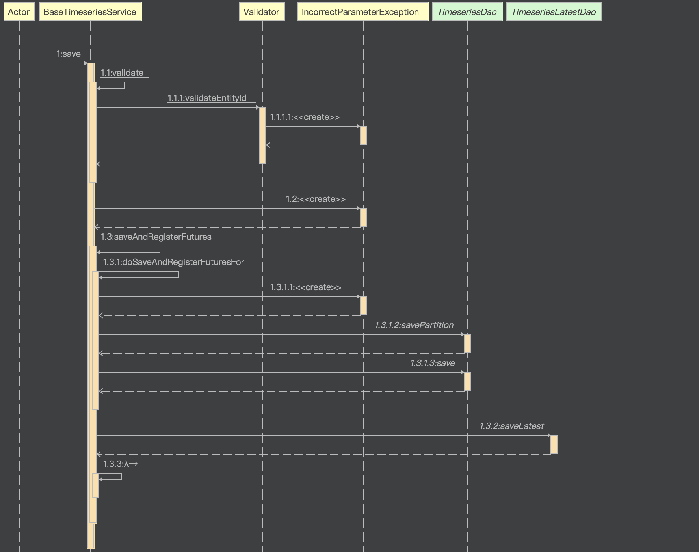

#### 环境准备

- release-3.3分支源码
- InfluxDB 2.4镜像或安装包

#### 描述
研究如何使用InfluxDB作为thingsboard读取和写入的时序数据库，可提高查询和写入性能（相较于Cassandra和TimescaleDB）。

#### 分析

需要考虑时序数据的读和写，目前官方已经已经支持两种数据库：`Cassandra`和`TimescaleDB`，可参考这两种数据库的读写实现。

时序保存使用规则节点`TbMsgTimeseriesNode`，可以通过此节点追踪到需要实现`TimeseriesDao`和`TimeseriesLatestDao`。



#### 开发

##### InfluxDB初始化（如有环境可跳过）

```
docker run -d -p 8086:8086 \
      -v /path/to/data:/var/lib/influxdb2 \
      -v /path/to/config:/etc/influxdb2 \
      -e DOCKER_INFLUXDB_INIT_MODE=setup \
      -e DOCKER_INFLUXDB_INIT_USERNAME=thingsboard \
      -e DOCKER_INFLUXDB_INIT_PASSWORD=thingsboard \
      -e DOCKER_INFLUXDB_INIT_ORG=thingsboard \
      -e DOCKER_INFLUXDB_INIT_BUCKET=tb-bucket \
      influxdb:2.0
```

`/path/to/`为具体的目录.


#### TIPS

- [InfluxDB Image](https://hub.docker.com/_/influxdb)

