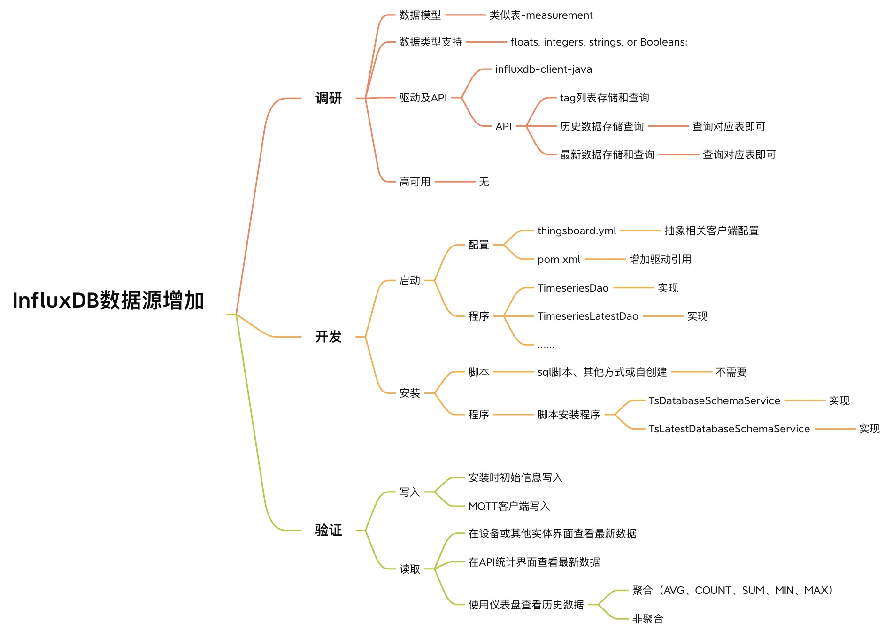
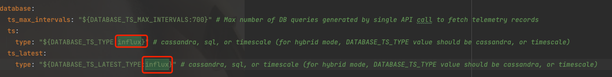
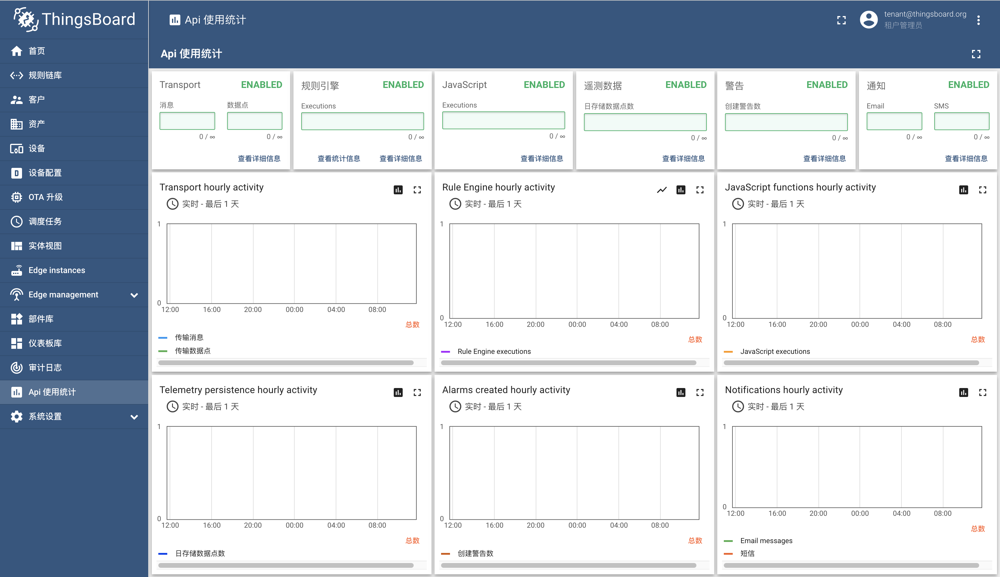
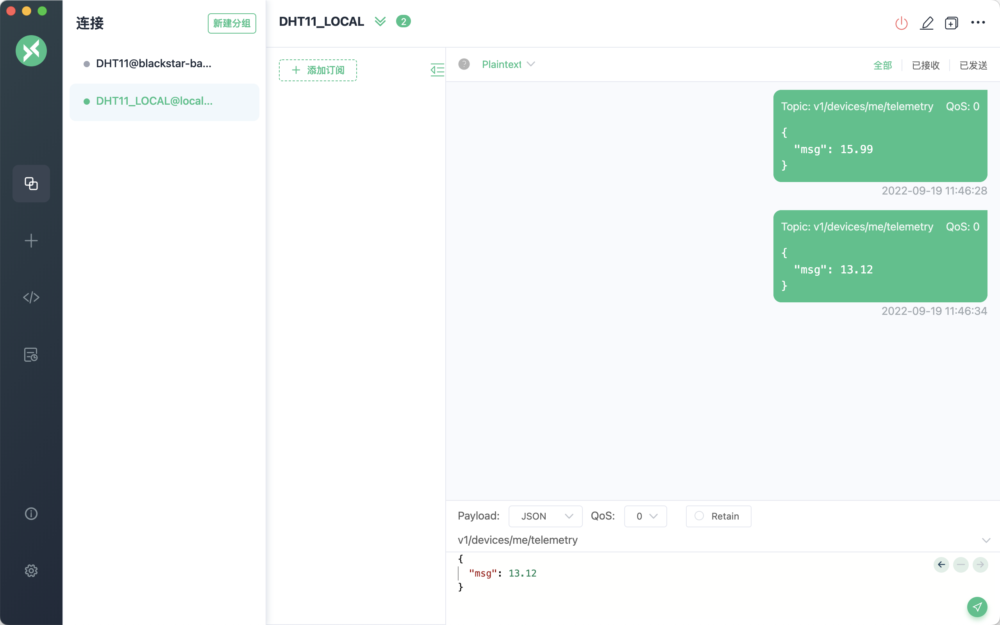
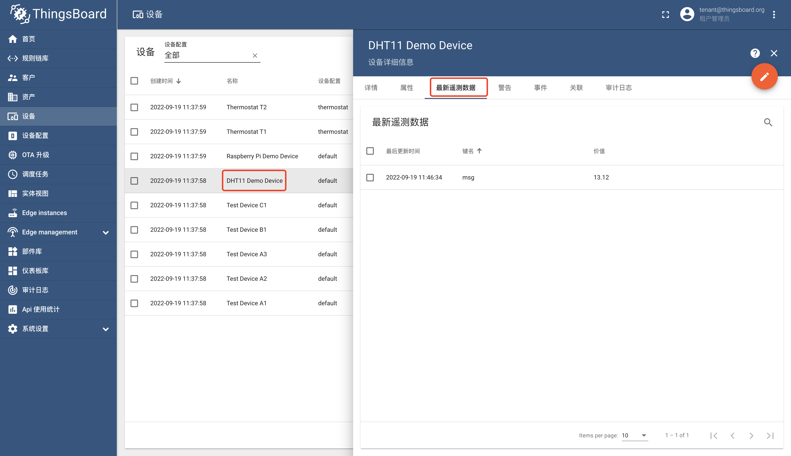
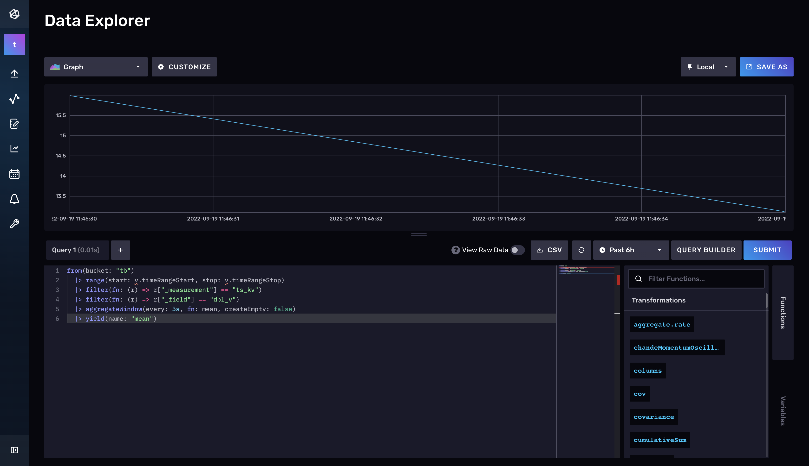
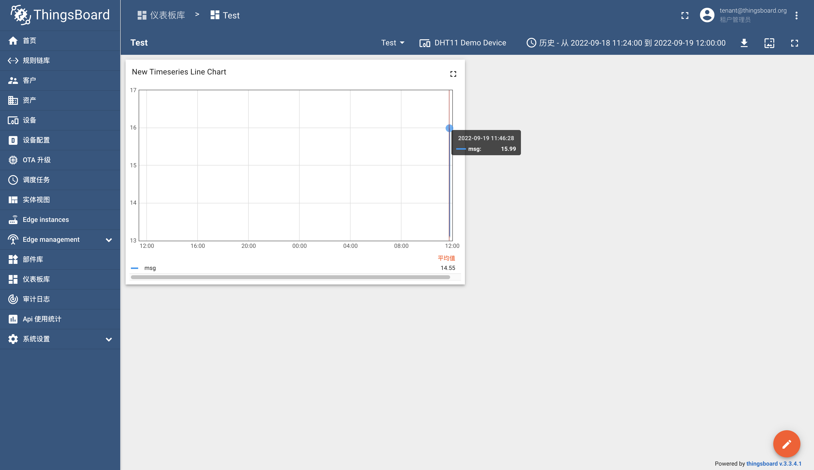

#### 环境准备

- release-3.3分支源码
- InfluxDB 2.4镜像或安装包
- Mqtt客户端

#### 描述

研究如何使用`InfluxDB`作为时序数据库，可稍提高查询和写入性能（相较于`Cassandra`和`TimescaleDB`，毕竟是专业的时序数据库）。

#### 分析

- 先考虑时序读写，目前官方已经已经支持两种数据库：`Cassandra`和`TimescaleDB`，可参考这两种数据库的读写实现时序保存使用规则节点`TbMsgTimeseriesNode`，可以通过此节点追踪到需要实现`TimeseriesDao`和`TimeseriesLatestDao`。


- 还应考虑如何安装（进行相关数据库、表和数据的初始化），安装入口类为`ThingsboardInstallApplication`，通过通过此类追踪到需要实现`TsDatabaseSchemaService`和`TsLatestDatabaseSchemaService`。

#### 设计
##### 总体

应先进行初步调研，然后开发，最后进行测试验证，如下思维导图为我考虑的一些细节：



#### 初始化

考虑到`InfluxDB`的可以不创建表（measurement），因此创建组织机构（Organization）、桶（Bucket，2.x系列替代DB和RP的概念和验证Token（用于访问接口）即可。
为了简化逻辑，将初始化和验证和二为一，验证相关实体是否存在，如果不存在则创建。

#### 数据模型

考虑到`InfluxDB` limit 1读取效率不高，因此还是存储两个表：ts_kv（历史数据）和ts_kv_latest（最新数据）。且每个数据模型都需要支持`bool`、`json`、 `string`、 `double`和`long`数据模型。

#### 数据TTL

`InfluxDB`不支持数据级别的TTL，只能和`TimescaleDB`一样做定期清除。

#### 写入
和`Cassandra`写入类似，使用Write API正常写入即可，可使用异步API。

#### 读取

和`Cassandra`读取类似，使用Query API正常读取写入即可，可使用异步API。

#### 开发

##### InfluxDB初始化（如有环境可跳过）

```
docker run -d -p 8086:8086 \
      -v /path/to/data:/var/lib/influxdb2 \
      -v /path/to/config:/etc/influxdb2 \
      -e DOCKER_INFLUXDB_INIT_MODE=setup \
      -e DOCKER_INFLUXDB_INIT_USERNAME=thingsboard \
      -e DOCKER_INFLUXDB_INIT_PASSWORD=thingsboard \
      -e DOCKER_INFLUXDB_INIT_ORG=thingsboard \
      -e DOCKER_INFLUXDB_INIT_BUCKET=tb-bucket \
      influxdb:2.0
```
`/path/to/`为具体存储目录.

#####  数据表（measument）
- ts_kv
```
@Measurement(name = INFLUX_TS_KV_MEASUREMENT)
public class InfluxDataEntity {

    @Column(name = INFLUX_ENTITY_TYPE_COLUMN, tag = true)
    String entityType;

    @Column(name = INFLUX_ENTITY_ID_COLUMN, tag = true)
    String entityId;

    @Column(name = INFLUX_KEY_COLUMN, tag = true)
    String key;

    @Column(name = BOOLEAN_VALUE_COLUMN)
    Boolean booleanValue;

    @Column(name = STRING_VALUE_COLUMN)
    String strValue;

    @Column(name = LONG_VALUE_COLUMN)
    Long longValue;

    @Column(name = DOUBLE_VALUE_COLUMN)
    Double doubleValue;

    @Column(name = JSON_VALUE_COLUMN)
    String jsonValue;

    @Column(timestamp = true)
    Instant time;

    @Override
    public String toString() {
        return "InfluxDataEntity{" +
                "entityType='" + entityType + '\'' +
                ", entityId='" + entityId + '\'' +
                ", key='" + key + '\'' +
                ", booleanValue=" + booleanValue +
                ", strValue='" + strValue + '\'' +
                ", longValue=" + longValue +
                ", doubleValue=" + doubleValue +
                ", jsonValue='" + jsonValue + '\'' +
                ", time=" + time +
                '}';
    }
}
```
- ts_kv_latest
```
@Measurement(name = INFLUX_TS_KV_LATEST_MEASUREMENT)
public class InfluxDataLatestEntity {

    @Column(name = INFLUX_ENTITY_TYPE_COLUMN, tag = true)
    String entityType;

    @Column(name = INFLUX_ENTITY_ID_COLUMN, tag = true)
    String entityId;

    @Column(name = INFLUX_KEY_COLUMN, tag = true)
    String key;

    @Column(name = BOOLEAN_VALUE_COLUMN)
    Boolean booleanValue;

    @Column(name = STRING_VALUE_COLUMN)
    String strValue;

    @Column(name = LONG_VALUE_COLUMN)
    Long longValue;

    @Column(name = DOUBLE_VALUE_COLUMN)
    Double doubleValue;

    @Column(name = JSON_VALUE_COLUMN)
    String jsonValue;

    @Column(name = TS_VALUE_COLUMN)
    Long ts;

    @Column(timestamp = true)
    Instant time = Instant.EPOCH;

    @Override
    public String toString() {
        return "InfluxDataLatestEntity{" +
                "entityType='" + entityType + '\'' +
                ", entityId='" + entityId + '\'' +
                ", key='" + key + '\'' +
                ", booleanValue=" + booleanValue +
                ", strValue='" + strValue + '\'' +
                ", longValue=" + longValue +
                ", doubleValue=" + doubleValue +
                ", jsonValue='" + jsonValue + '\'' +
                ", ts=" + ts +
                ", time=" + time +
                '}';
    }
}
```

实现细节较多，具体可参考我的3.3扩展分支：[release-3.3-x](https://github.com/CodeIsBeatiful/thingsboard/tree/release-3.3-x) 。


#### 验证

##### 准备
- 设置thingsboard.yml的`DATABASE_TS_TYPE`和`DATABASE_TS_LATEST_TYPE`的值为`influx`



- 进行安装，可参考[安装](../../doc/运行/运行.md)或[官方](https://thingsboard.io/docs/user-guide/install/rhel/)，能正常安装代表正常。
```
2022-09-19 11:37:50,294 [main] INFO  org.owasp.validator.html.Policy - Attempting to load AntiSamy policy from an input stream.
2022-09-19 11:37:54,916 [main] INFO  o.t.s.i.ThingsboardInstallService - Loading demo data...
2022-09-19 11:37:59,791 [main] INFO  o.t.s.i.ThingsboardInstallService - Installation finished successfully!
2022-09-19 11:38:00,797 [sql-log-1-thread-1] INFO  o.t.s.dao.sql.TbSqlBlockingQueue - Queue-0 [Attributes] queueSize [0] totalAdded [2] totalSaved [2] totalFailed [0]
2022-09-19 11:38:00,797 [sql-log-1-thread-1] INFO  o.t.s.dao.sql.TbSqlBlockingQueue - Queue-1 [Attributes] queueSize [0] totalAdded [3] totalSaved [3] totalFailed [0]
2022-09-19 11:38:00,798 [sql-log-1-thread-1] INFO  o.t.s.dao.sql.TbSqlBlockingQueue - Queue-2 [Attributes] queueSize [0] totalAdded [16] totalSaved [16] totalFailed [0]
2022-09-19 11:38:00,952 [main] INFO  o.s.i.endpoint.EventDrivenConsumer - Removing {logging-channel-adapter:_org.springframework.integration.errorLogger} as a subscriber to the 'errorChannel' channel
2022-09-19 11:38:00,953 [main] INFO  o.s.i.c.PublishSubscribeChannel - Channel 'application.errorChannel' has 0 subscriber(s).
2022-09-19 11:38:00,953 [main] INFO  o.s.i.endpoint.EventDrivenConsumer - stopped bean '_org.springframework.integration.errorLogger'
2022-09-19 11:38:00,954 [main] INFO  o.s.s.c.ThreadPoolTaskScheduler - Shutting down ExecutorService 'taskScheduler'
2022-09-19 11:38:00,993 [sql-queue-0-attributes-8-thread-1] INFO  o.t.s.dao.sql.TbSqlBlockingQueue - [Attributes] Queue polling was interrupted
2022-09-19 11:38:00,993 [sql-queue-2-attributes-10-thread-1] INFO  o.t.s.dao.sql.TbSqlBlockingQueue - [Attributes] Queue polling was interrupted
2022-09-19 11:38:01,005 [sql-queue-0-events-2-thread-1] INFO  o.t.s.dao.sql.TbSqlBlockingQueue - [Events] Queue polling was interrupted
2022-09-19 11:38:01,006 [sql-queue-1-events-3-thread-1] INFO  o.t.s.dao.sql.TbSqlBlockingQueue - [Events] Queue polling was interrupted
2022-09-19 11:38:01,006 [sql-queue-2-events-4-thread-1] INFO  o.t.s.dao.sql.TbSqlBlockingQueue - [Events] Queue polling was interrupted
2022-09-19 11:38:01,028 [main] INFO  o.s.o.j.LocalContainerEntityManagerFactoryBean - Closing JPA EntityManagerFactory for persistence unit 'default'
2022-09-19 11:38:01,034 [main] INFO  com.zaxxer.hikari.HikariDataSource - HikariPool-1 - Shutdown initiated...
2022-09-19 11:38:01,049 [main] INFO  com.zaxxer.hikari.HikariDataSource - HikariPool-1 - Shutdown completed.
```

启动系统，使用`tenant@thingsboard.org`账号，进入API使用界面，观察是否正常显示。




使用mqtt客户端写入数据至设备`DHT11 Demo Device`，查看该设备时序数据是否发生变化。






创建仪表盘，使用曲线图组件，绑定数据源，调整聚合类型`NONE`、`AVG`、`MIN`、`MAX`、`COUNT`、`SUM`，观察显示是否正常。




还可以使用Influxdb自带UI查看时序数据是否正常。





#### TODO

- 可用考虑，当前`InfluxDB`不支持集群，如果有高并发读写请求以及大量数据存储请求，建议尝试实现其他时序数据源。
- 性能考虑，可以用异步API进一步优化性能，本文主要用来`抛砖引玉`。
- 时间有限，未覆盖所有场景进行测试，比如同一key写入`string`类型数据后，再写入`double`类型数据，然后进行聚合查询。

#### TIPS

- InfluxDB Image:  https://hub.docker.com/_/influxdb
- InfluxDB delete data: https://docs.influxdata.com/influxdb/cloud/write-data/delete-data/
- InfluxDB keywords: https://docs.influxdata.com/flux/v0.x/spec/lexical-elements/#keywords
- InfluxDB1.8 keywords: https://docs.influxdata.com/influxdb/v1.8/query_language/spec/#keywords
- InfluxDB query fields and tags: https://docs.influxdata.com/influxdb/v2.4/query-data/flux/#query-fields-and-tags
- InfluxDB explore schema: https://docs.influxdata.com/influxdb/v2.4/query-data/flux/#explore-your-schema
- InfluxDB client java: https://github.com/influxdata/influxdb-client-java/tree/master/client

