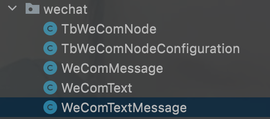
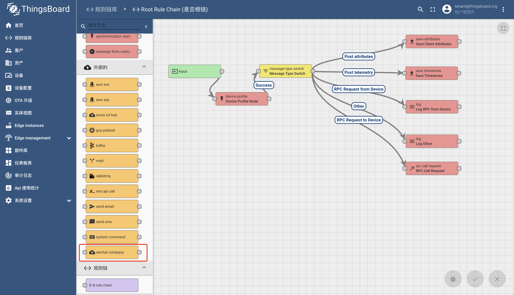
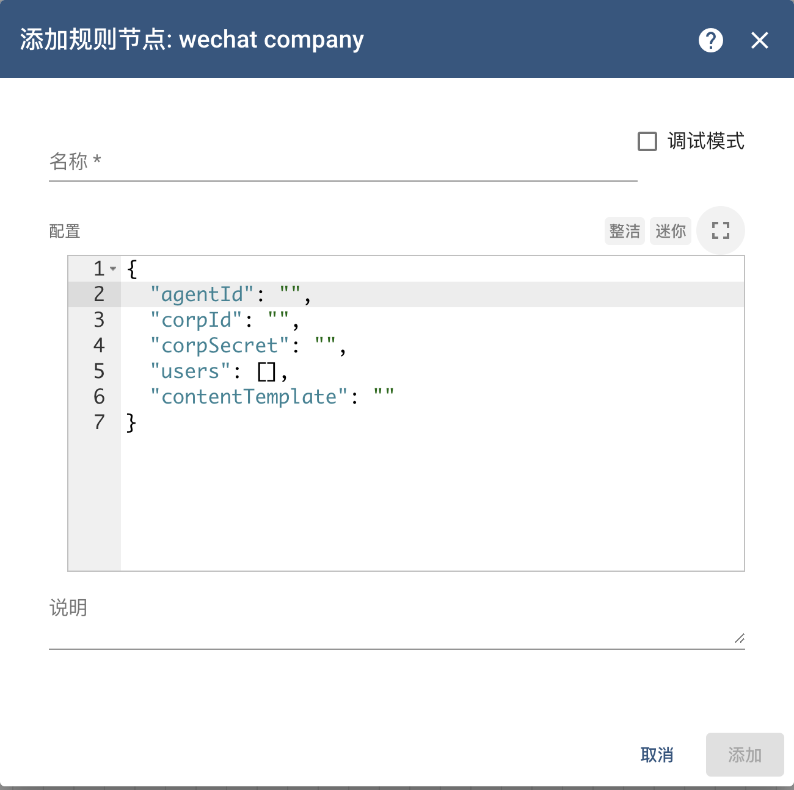
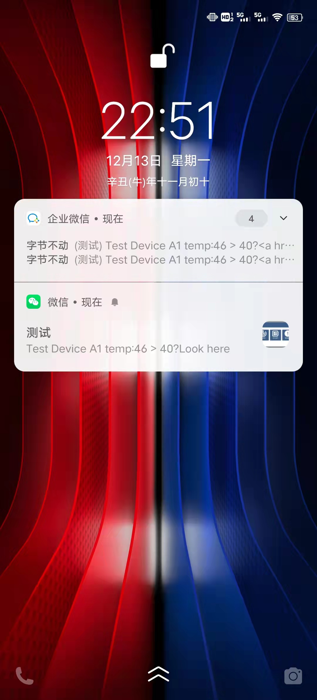
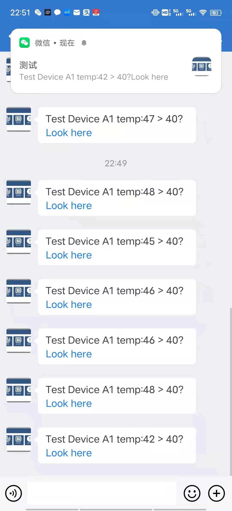

#### 环境准备

- release-3.3分支源码
- 企业微信：包含一个企业和一个测试应用。

#### 描述

增加用于发送消息到企业微信的节点，当前使用笔者已经创建好的企业：**字节不动**以及创建的应用：**测试**。

#### 开发

阅读本文前，请先了解如何进行[后端调试](../调试/后端.md)和[前端调试](../调试/前端.md)，建议也先阅读官方的[规则节点开发](https://thingsboard.io/docs/user-guide/contribution/rule-node-development/)。

##### 后端开发 

注意**并发访问控制**。

打开源码工程，进入`rule-engine-components`子工程，然后进入`src\main\java\org\thingsboard\rule\engine`下。


新建`wechat`文件夹，在`wechat`文件夹下新建以下Java文件：

- TbWeComNode

  ```java
  package org.thingsboard.rule.engine.wechat;
  
  import com.fasterxml.jackson.core.JsonProcessingException;
  import com.fasterxml.jackson.databind.JsonNode;
  import com.fasterxml.jackson.databind.ObjectMapper;
  import lombok.extern.slf4j.Slf4j;
  import org.springframework.http.HttpEntity;
  import org.springframework.http.ResponseEntity;
  import org.springframework.util.StringUtils;
  import org.springframework.util.concurrent.ListenableFuture;
  import org.springframework.util.concurrent.ListenableFutureCallback;
  import org.springframework.web.client.AsyncRestTemplate;
  import org.thingsboard.rule.engine.api.*;
  import org.thingsboard.rule.engine.api.util.TbNodeUtils;
  import org.thingsboard.server.common.data.plugin.ComponentType;
  import org.thingsboard.server.common.msg.TbMsg;
  
  import java.util.HashMap;
  import java.util.Map;
  import java.util.concurrent.ExecutionException;
  import java.util.concurrent.TimeUnit;
  import java.util.concurrent.atomic.AtomicBoolean;
  
  @Slf4j
  @RuleNode(
          type = ComponentType.EXTERNAL,
          name = "wechat company",
          configClazz = TbWeComNodeConfiguration.class,
          nodeDescription = "use wechat-company to send message",
          nodeDetails = "use wechat-company to send message,use js to process message and send to ",
  //        uiResources = {"static/rulenode/custom-nodes-config.js"},//指定前端资源文件
  //        configDirective = "tbActionNodeCompanyWxConfig",//指定前端资源文件中的组件
          icon = "")
  public class TbWeComNode implements TbNode {
  
  
      private volatile String accessToken;
  
      private TbWeComNodeConfiguration config;
  
      protected AsyncRestTemplate asyncRestTemplate;
  
      private static final ObjectMapper mapper = new ObjectMapper();
  
      private static final String WE_COM_API_URL = "https://qyapi.weixin.qq.com/cgi-bin/";
  
      private static final String WE_COM_ACCESS_TOKEN_GET_URL = WE_COM_API_URL + "gettoken?corpid={corpId}&corpsecret={corpSecret}";
  
      private static final String WE_COM_MESSAGE_SEND_URL = WE_COM_API_URL + "message/send?access_token={accessToken}";
  
      private AtomicBoolean accessTokenExpired = new AtomicBoolean(true);
  
  
      @Override
      public void init(TbContext ctx, TbNodeConfiguration configuration) throws TbNodeException {
          this.config = TbNodeUtils.convert(configuration, TbWeComNodeConfiguration.class);
          this.asyncRestTemplate = new AsyncRestTemplate();
          setAccessToken(true);
      }
  
      public String getAccessToken() {
          while (accessTokenExpired.get()) {
              try {
                  TimeUnit.MILLISECONDS.sleep(100);
              } catch (InterruptedException e) {
                  log.warn("get access token sleep interrupt");
              }
          }
          return accessToken;
      }
  
      private void setAccessToken(boolean sync) throws TbNodeException {
          Map<String, String> vars = new HashMap<>();
          vars.put("corpId", config.getCorpId());
          vars.put("corpSecret", config.getCorpSecret());
          ListenableFuture<ResponseEntity<JsonNode>> future = asyncRestTemplate.getForEntity(WE_COM_ACCESS_TOKEN_GET_URL, JsonNode.class, vars);
          if (sync) {
              ResponseEntity<JsonNode> jsonNodeResponseEntity;
              try {
                  jsonNodeResponseEntity = future.get();
                  if (!jsonNodeResponseEntity.hasBody()) {
                      throw new TbNodeException("get access token failed");
                  }
                  JsonNode body = jsonNodeResponseEntity.getBody();
                  if (body.get("errcode").asInt() != 0) {
                      throw new TbNodeException("get access token failed, errCode is not zero, errMsg:" + body.get("errmsg").asText());
                  }
                  if (accessTokenExpired.compareAndSet(true, false)) {
                      accessToken = body.get("access_token").asText();
                  }
              } catch (InterruptedException e) {
                  throw new TbNodeException(e);
              } catch (ExecutionException e) {
                  throw new TbNodeException(e);
              }
          } else {
              future.addCallback(new ListenableFutureCallback<>() {
                  @Override
                  public void onSuccess(ResponseEntity<JsonNode> jsonNodeResponseEntity) {
                      if (!jsonNodeResponseEntity.hasBody()) {
                          throw new RuntimeException("get access token failed");
                      }
                      JsonNode body = jsonNodeResponseEntity.getBody();
                      if (body.get("errcode").asInt() != 0) {
                          throw new RuntimeException("get access token failed, errCode is not zero, errMsg:" + body.get("errmsg").asText());
                      }
                      if (accessTokenExpired.compareAndSet(true, false)) {
                          accessToken = body.get("access_token").asText();
                      }
                  }
  
                  @Override
                  public void onFailure(Throwable throwable) {
                      throw new RuntimeException(throwable);
                  }
              });
          }
  
      }
  
      @Override
      public void onMsg(TbContext ctx, TbMsg msg) throws ExecutionException, InterruptedException, TbNodeException {
          send(ctx, msg, fromTemplate(config.getContentTemplate(), msg));
          ctx.ack(msg);
      }
  
      private void send(TbContext ctx, TbMsg msg, String content) throws TbNodeException {
          WeComTextMessage weComTextMessage = WeComTextMessage.builder()
                  .agentId(config.getAgentId())
                  .toUser(String.join(",", config.getUsers()))
                  .msgType("text")
                  .text(WeComText.builder().content(content).build())
                  .build();
          Map<String, String> vars = new HashMap<>();
          vars.put("accessToken", getAccessToken());
          HttpEntity<String> httpEntity;
          try {
              TbMsg newMsg = ctx.newMsg(msg.getQueueName(), msg.getType(), msg.getOriginator(), msg.getCustomerId(), msg.getMetaData(), mapper.writeValueAsString(weComTextMessage));
              httpEntity = new HttpEntity<>(newMsg.getData());
              ListenableFuture<ResponseEntity<JsonNode>> responseEntityListenableFuture = asyncRestTemplate.postForEntity(WE_COM_MESSAGE_SEND_URL, httpEntity, JsonNode.class, vars);
              responseEntityListenableFuture.addCallback(new ListenableFutureCallback<>() {
  
                  @Override
                  public void onSuccess(ResponseEntity<JsonNode> responseEntity) {
                      if (!responseEntity.hasBody()) {
                          ctx.tellFailure(newMsg, new Throwable("send message failed"));
                          return;
                      }
                      JsonNode body = responseEntity.getBody();
                      int errCode = body.get("errcode").asInt();
                      //access token expired
                      if (errCode == 42001) {
                          try {
                              if (accessTokenExpired.get()) {
                                  setAccessToken(false);
                              }
                              send(ctx, msg, content);
                          } catch (TbNodeException e) {
                              ctx.tellFailure(newMsg, new Throwable(e));
                              return;
                          }
                      } else if (errCode != 0) {
                          ctx.tellFailure(newMsg, new Throwable("send message failed, errCode:" + errCode + " errMsg:" + body.get("errmsg").asText()));
                      } else {
                          ctx.tellSuccess(newMsg);
                      }
                  }
  
                  @Override
                  public void onFailure(Throwable throwable) {
                      ctx.tellFailure(newMsg, throwable);
                  }
              });
          } catch (JsonProcessingException e) {
              throw new TbNodeException(e);
          }
  
      }
  
      private String fromTemplate(String template, TbMsg msg) {
          if (!StringUtils.isEmpty(template)) {
              return TbNodeUtils.processPattern(template, msg);
          } else {
              return null;
          }
      }
  
  
      @Override
      public void destroy() {
  
      }
  }
  ```

- TbWeComNodeConfiguration

  ```java
  package org.thingsboard.rule.engine.wechat;
  
  import lombok.Data;
  import org.thingsboard.rule.engine.api.NodeConfiguration;
  
  import java.util.Collections;
  import java.util.List;
  
  @Data
  public class TbWeComNodeConfiguration implements NodeConfiguration {
  
  
      private String agentId;
  
      private String corpId;
  
      private String corpSecret;
  
      private List<String> users;
  
      private String contentTemplate;
  
      @Override
      public NodeConfiguration defaultConfiguration() {
          TbWeComNodeConfiguration configuration = new TbWeComNodeConfiguration();
          configuration.setCorpId("");
          configuration.setCorpSecret("");
          configuration.setAgentId("");
          configuration.setUsers(Collections.emptyList());
          configuration.setContentTemplate("");
          return configuration;
      }
  }
  ```

  

- WeComMessage

  ```
  package org.thingsboard.rule.engine.wechat;
  
  import lombok.AllArgsConstructor;
  import lombok.Data;
  import lombok.NoArgsConstructor;
  
  @Data
  @AllArgsConstructor
  @NoArgsConstructor
  public class WeComMessage {
  
      private String touser;
  
      private String msgtype;
  
      private String agentid;
  
      private int safe;
  
  }
  ```

- WeComText

  ```
  package org.thingsboard.rule.engine.wechat;
  
  import lombok.Builder;
  import lombok.Data;
  
  @Data
  @Builder
  public class WeComText {
  
      private String content;
  }
  ```

- WeComTextMessage

  ```
  package org.thingsboard.rule.engine.wechat;
  
  
  import lombok.Builder;
  import lombok.Data;
  
  @Data
  public class WeComTextMessage extends WeComMessage{
  
      private WeComText text;
  
      public WeComTextMessage() {
          super();
      }
  
      @Builder
      public WeComTextMessage(String toUser, String msgType, String agentId, WeComText text, int safe) {
          super(toUser, msgType, agentId, safe);
          this.text = text;
      }
  
  }
  ```

在左侧代码树上我们应该能看到如下结构：



找到`ThingsboardServerApplication`运行工程，点击左侧菜单`规则链库`，随意进入一条规则链，在左侧菜单中可以找到`wechat co mpany`规则节点。



将其拖拽到画布，可以看到如下信息：




##### 前端开发（暂未实现）

可参考[系统命令节点](系统命令节点,md)文档UI部分进行开发。


#### 效果
结合其他节点，可以达到推送消息效果：




#### TIPS
- 如果遇到UI加载异常，可以删除数据库表`omponent_descriptor`关于`TbWeComNode`的一行记录，然后重启程序。
- [**官方**]规则节点开发： https://thingsboard.io/docs/user-guide/contribution/rule-node-development/
- [**官方**] 规则节点后端扩展工程地址：https://github.com/thingsboard/rule-node-examples.git
cd rule-node-examples
- [**官方**] 规则节点前端扩展工程地址：https://github.com/thingsboard/rule-node-examples-ui-ngx.git
- [**Fork**] 规则节点前端扩展工程地址：https://github.com/blackstar-baba/rule-node-examples-ui-ngx.git
- [**官方**] 规则节点UI地址：https://github.com/thingsboard/thingsboard-rule-config-ui-ngx
- [**官方**]企业微信：https://work.weixin.qq.com/
- [**官方**]企业微信消息发送API：https://open.work.weixin.qq.com/api/doc/90000/90135/90236

