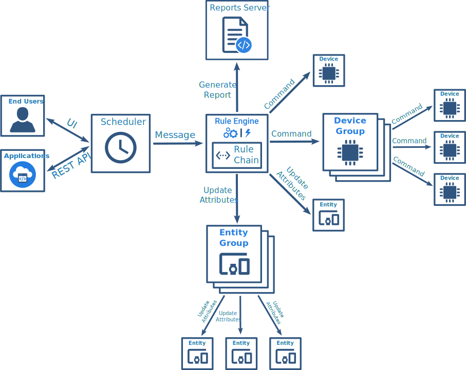

#### 环境准备

- release-3.3分支源码

#### 描述

增加定时任务，用于定时触发某些机制，比如消息、控制指令等。

#### 分析

官方介绍如下：

ThingsBoard 允许您通过灵活的时间表配置来安排各种类型的事件。ThingsBoard 调度器根据它们的调度触发配置的调度器事件。当调度程序事件被触发时，[规则引擎消息](https://thingsboard.io/docs/pe/user-guide/rule-engine-2-0/overview/#rule-engine-message)从具有与规则引擎消息相似结构的事件配置中生成。然后将生成的消息转发到[规则引擎](https://thingsboard.io/docs/pe/user-guide/rule-engine-2-0/re-getting-started/)并从[根规则链](https://thingsboard.io/docs/pe/user-guide/rule-engine-2-0/overview/#rule-chain)开始处理。

任务处理流程如下：



因此可以得到功能性需求：

- 任务调度器（调度任务，任务交给规则引擎处理）
- 可视化界面（列表以及日历）

从可用性角度出发，还需考虑以下非功能性需求：

- 性能
- 可靠性（尽可能不丢失任务，以及补偿）
- 可扩展性（支持集群）


官方调度事件结构：

```json
{
    "id": { //事件编号
        "entityType": "SCHEDULER_EVENT",
        "id": "8b47f8d0-6a15-11ec-89c2-2f343e6c262d" 
    },
    "createdTime": 1640940130525,
    "additionalInfo": null,
    "tenantId": {//租户
        "entityType": "TENANT",
        "id": "827a2e50-6333-11ec-a919-556e8dbef35c"
    },
    "customerId": {//客户
        "entityType": "CUSTOMER",
        "id": "13814000-1dd2-11b2-8080-808080808080"
    },
    "name": "test-update-attribute",//事件名称
    "type": "updateAttributes", //事件类型
    "schedule": { //调度时间配置
        "timezone": "Asia/Shanghai",//时区
        "startTime": 1640880000000, //开始时间
        "repeat": {
            "type": "TIMER", //重复类型
            "endsOn": 1641312000000, //结束时间
            "repeatInterval": 5,
            "timeUnit": "SECONDS" //时间单位
        }
    },
    "configuration": { //调度消息配置
        "originatorId": {
            "entityType": "DEVICE",
            "id": "65195820-6a15-11ec-89c2-2f343e6c262d"
        },
        "msgType": "POST_ATTRIBUTES_REQUEST", //消息类型
        "msgBody": { //消息内容
            "test": "123"
        },
        "metadata": { //元数据
            "scope": "SERVER_SCOPE"
        }
    },
    "ownerId": { //事件归属
        "entityType": "TENANT",
        "id": "827a2e50-6333-11ec-a919-556e8dbef35c"
    }
}
```


**调度时间配置**支持多时区和重复调度，重复调度类型包含：Daily（天）、Weekly（星期）、Monthly（月）、Yearly（年）以及Time-Based（自定义时间），Weekly支持选择周一到周日，Time-Based支持选择间隔时间粒度：秒、分钟、小时。

**调度消息配置**支持以下几种消息类型：General Report（报表生成）、Update Attribute（属性更新）、Send RPC Request to Device（发送RPC请求给设备）、Update Firmware（更新固件）、Update Software（更新软件）。


Update Firmware的配置信息为：

```
"configuration": {
        "originatorId": {
            "entityType": "DEVICE",
            "id": "4e07e0e0-8c0f-11ec-98f9-ff45c37940c6"
        },
        "msgType": "FIRMWARE_UPDATED",
        "msgBody": {
            "entityType": "OTA_PACKAGE",
            "id": "5dc11080-8c0d-11ec-a344-c767c1ab1bb8"
        },
        "metadata": {}
    },
```

Update Software的配置信息为：

```
"configuration": {
        "originatorId": {
            "entityType": "DEVICE",
            "id": "4e07e0e0-8c0f-11ec-98f9-ff45c37940c6"
        },
        "msgType": "SOFTWARE_UPDATED",
        "msgBody": {
            "entityType": "OTA_PACKAGE",
            "id": "a9ea1090-8c0f-11ec-83d0-83ba2015b874"
        },
        "metadata": {}
    },
```

Update Attribute的配置信息为：

```
"configuration": {
        "originatorId": {
            "entityType": "DEVICE",
            "id": "4e07e0e0-8c0f-11ec-98f9-ff45c37940c6"
        },
        "msgType": "POST_ATTRIBUTES_REQUEST",
        "msgBody": {
            "123": "456"
        },
        "metadata": {
            "scope": "SERVER_SCOPE"
        }
    },
```

Send Rpc Request To Device的配置信息为：

```
"configuration": {
        "originatorId": {
            "entityType": "DEVICE",
            "id": "7ae4a550-9ad1-11ec-9260-a327b4f24eda"
        },
        "msgType": "RPC_CALL_FROM_SERVER_TO_DEVICE",
        "msgBody": {
            "method": "setTemperture",
            "params": {
                "temp": 123
            }
        },
        "metadata": {
            "oneway": true
        }
    },
```


#### 实现

调研现有技术，决定使用以下方案：

- 定时任务框架： Quartz
- 日历控件：Angular-calendar（暂时阉割，先提供列表方式）


后端基本完成，需要优化点：

- [x] QuartzSchedulerService检查
- [x] Job读取Configuration(支持更新属性、固件、软件及RPC请求发送)
- [ ] Quartz日志logback适配
- [ ] Quartz Factory配置项增加
- [ ] maxSchedulerJobs配置
- [ ] 时区支持

前端开发：

- [x] 菜单增加
- [x] 路由增加
- [ ] 列表组件增加以及数据源关联
  - [x] 调度组件
    - [x] 无法修改名称
  - [ ] 配置组件（优化中）
    - [x] 框架调整
    - [x] 固件升级组件
    - [x] 软件升级组件
    - [x] 属性更新组件，metadata为空
    - [ ] RPC请求发送组件
- [x] 详情页增加
- [ ] 国际化
- [ ] 表单检查
- [x] tb-ota-package-autocomplete无法根据输入deviceProfileId
- [x] 切换entityType package不清除
- [x] 点开详情页，类似为device时，package被刷掉
- [x] 切换JobType，EntityId未被刷新掉
- [x] 新建任务，编辑的调度器和配置没有保存成功
- [x] 切换列表项时，会写入上一个组件，然后再写入当前组件，因为根据ngswitch或者ngif 判断jobType切换。当前将子组件进行设置，不是自己的消息类型不进行处理。


##### 文件列表

```
//todo
```


#### TIPS

- 因Thingsboard支持分布式部署，所以定时任务也需要支持分布式。