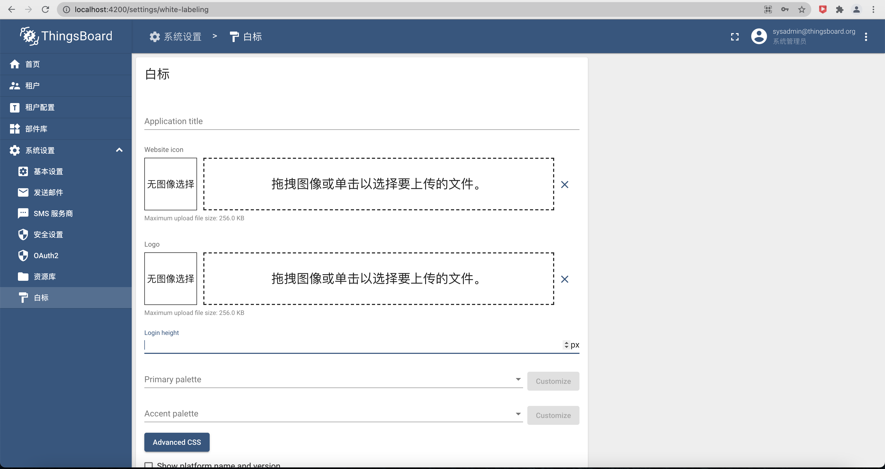

#### 环境准备

- release-3.3分支源码

#### 描述

白标（White-Labeling）是专业版中一项重要的功能，可用于设置标题、图片、配置、配色、名称以及版本，本文研究如何实现系统管理员级别的系统名称、logo、icon设置。

#### 分析

官方文档介绍：

- 系统管理员级别可配置配色方案、图标和收藏图标；

- 租户和客户管理员UI默认继承配置更改；

- 租户和客户管理员可以设置自己的白标配置；

- 系统及租户管理员可设置自定义电子邮件服务器设置和客户电子邮件模板，与用户进行交互；

- 允许系统管理员为每个租户启用/禁用白标签；

- 允许租户管理员为每个客户启用/禁用白标；

- 允许租户管理员配置系统组件和最终用户仪表板元素的自定义翻译。

  

以租户管理员角色试用云端专业版白标功能，填写信息如下：


通过预览（**Preview**）请求，可以获取以下信息：

- 请求地址：https://thingsboard.cloud/api/whiteLabel/previewWhiteLabelParams

- 请求方法：POST

- 请求内容：

  ```
  {
    "logoImageUrl": "data:image/png;base64,xxxwAAAABJRU5ErkJggg==",
    "logoImageChecksum": null,
    "logoImageHeight": 50,
    "appTitle": "abc",
    "favicon": {
      "url": "data:image/png;base64,xxxwAAAABJRU5ErkJggg==",
      "type": null
    },
    "faviconChecksum": null,
    "paletteSettings": {
      "primaryPalette": {
        "type": "red",
        "colors": null,
        "extends": null
      },
      "accentPalette": {
        "type": "pink",
        "colors": null,
        "extends": null
      }
    },
    "helpLinkBaseUrl": "https://thingsboard.io",
    "enableHelpLinks": true,
    "whiteLabelingEnabled": true,
    "showNameVersion": true,
    "platformName": "ThingsBoard",
    "platformVersion": "3.3.1PAAS",
    "customCss": null
  }
  ```

- 返回内容：

  ```
  {
  	"logoImageUrl": "data:image/png;base64,AAAAASUVORK5CYII=",
  	"logoImageChecksum": null,
  	"logoImageHeight": 50,
  	"appTitle": "abc",
  	"favicon": {
  		"url": "data:image/png;base64,AAAAASUVORK5CYII=",
  		"type": null
  	},
  	"faviconChecksum": null,
  	"paletteSettings": {
  		"primaryPalette": {
  			"type": "red",
  			"colors": null,
  			"extends": null
  		},
  		"accentPalette": {
  			"type": "pink",
  			"colors": null,
  			"extends": null
  		}
  	},
  	"helpLinkBaseUrl": "https://thingsboard.io",
  	"enableHelpLinks": true,
  	"whiteLabelingEnabled": true,
  	"showNameVersion": false,
  	"platformName": "ThingsBoard",
  	"platformVersion": "3.3.1PAAS",
  	"customCss": null
  }
  ```

  请求内容与返回内容完全一致，可能上传相关内容在后台做了一次check。

通过保存（**Save**）请求，可以获取以下信息：

- 请求地址：https://thingsboard.cloud/api/whiteLabel/whiteLabelParams

- 请求方法：POST

- 请求内容：

  ```
  {
    "logoImageUrl": "data:image/png;base64,xxAAAABJRU5ErkJggg==",
    "logoImageChecksum": null,
    "logoImageHeight": 50,
    "appTitle": "abc",
    "favicon": {
      "url": "data:image/png;base64,xxAAAABJRU5ErkJggg==",
      "type": null
    },
    "faviconChecksum": null,
    "paletteSettings": {
      "primaryPalette": {
        "type": "red"
      },
      "accentPalette": {
        "type": "pink"
      }
    },
    "helpLinkBaseUrl": "https://thingsboard.io",
    "enableHelpLinks": true,
    "whiteLabelingEnabled": true,
    "showNameVersion": true,
    "platformName": null,
    "platformVersion": null,
    "customCss": null
  }
  ```

- 返回内容：

  ```
  {
  	"message": "White Labeling feature is disabled!",
  	"errorCode": 40,
  	"status": 403,
  	"subscriptionErrorCode": 2,
  	"subscriptionEntry": 30,
  	"subscriptionValue": {
  		"value": 0
  	},
  	"timestamp": "2021-08-11T15:19:00.288+00:00"
  }
  ```

  因为官方云版本禁用了租户管理员的设置白标功能，正常情况应返回成功信息。


#### 开发

结合分析，前后端需要修改或增加的内容如下：

- 前端
  - 菜单 增加白标菜单（修改menu.service.ts）
  - 组件 增加 whiteLabeling组件、配色组件（Angular Component）
  - 服务 设置服务（标题、图片、配置、配色、名称以及版本）以及获取后端数据服务（Angular Service）
  - 汉化（Angular Translate）
- 后端
  - 白标配置的增删查改（Spring Boot）
  - 配色生成（JASS）


实现细节较多，具体可参考我的3.3扩展分支：[release-3.3-x](https://github.com/CodeIsBeatiful/thingsboard/tree/release-3.3-x) 。


#### 验证
最终效果示意图：



#### TIPS

- 白标官方视频：https://youtu.be/4dkbVASJ1JU
- Thingsboard云端官网（需要账号）：https://thingsboard.cloud/settings/whiteLabel

