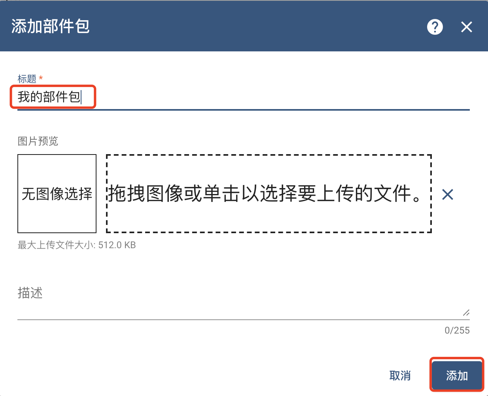
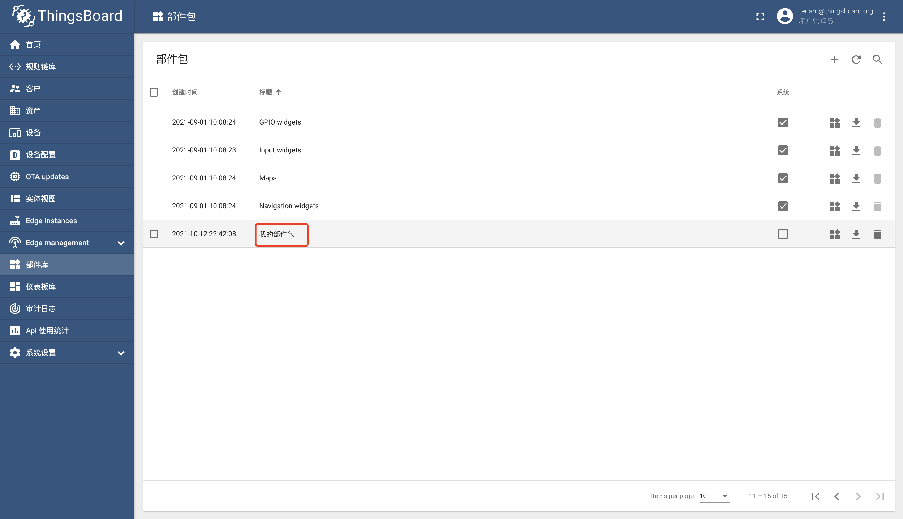
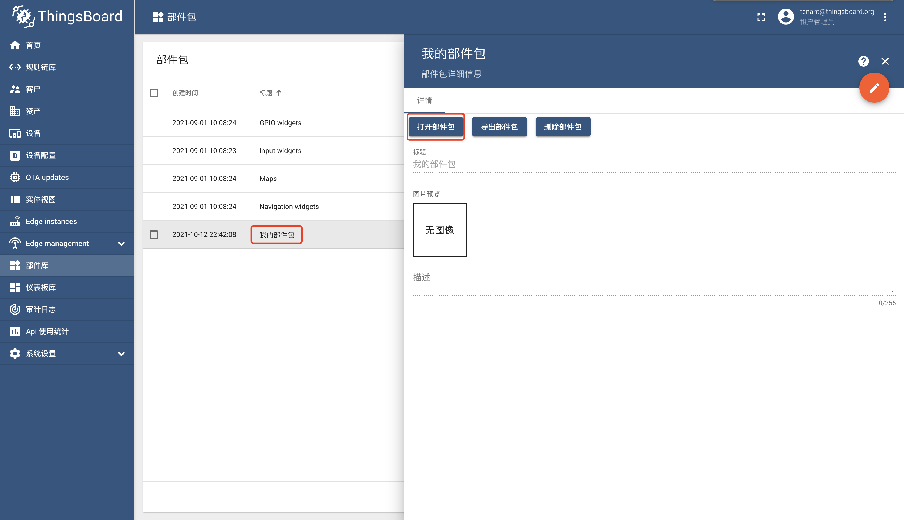
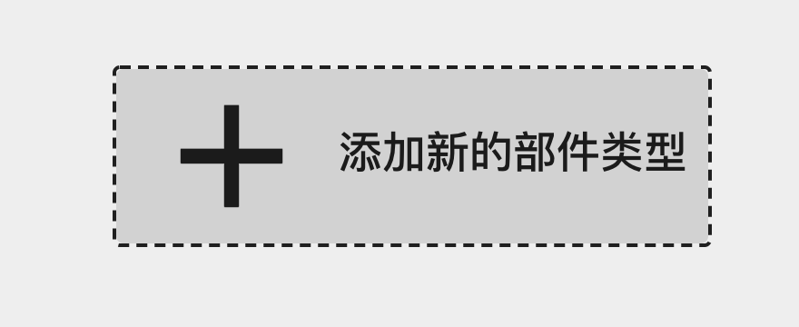
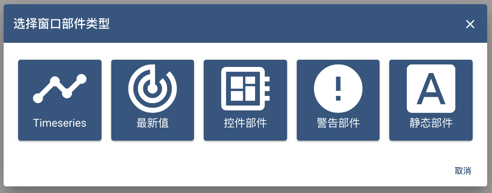
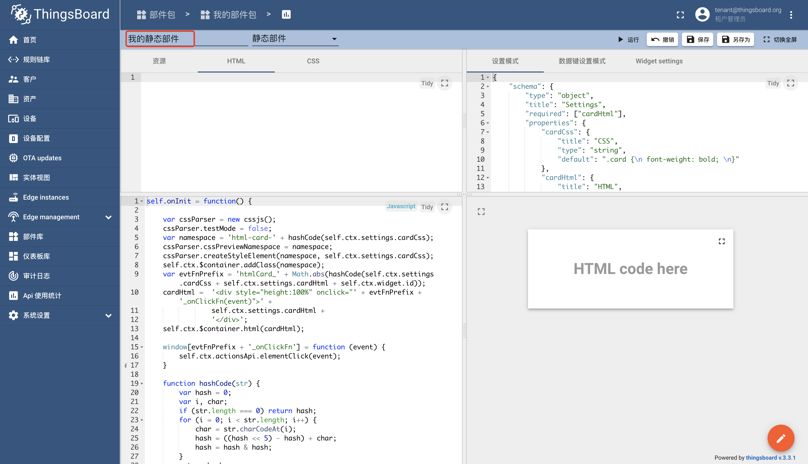
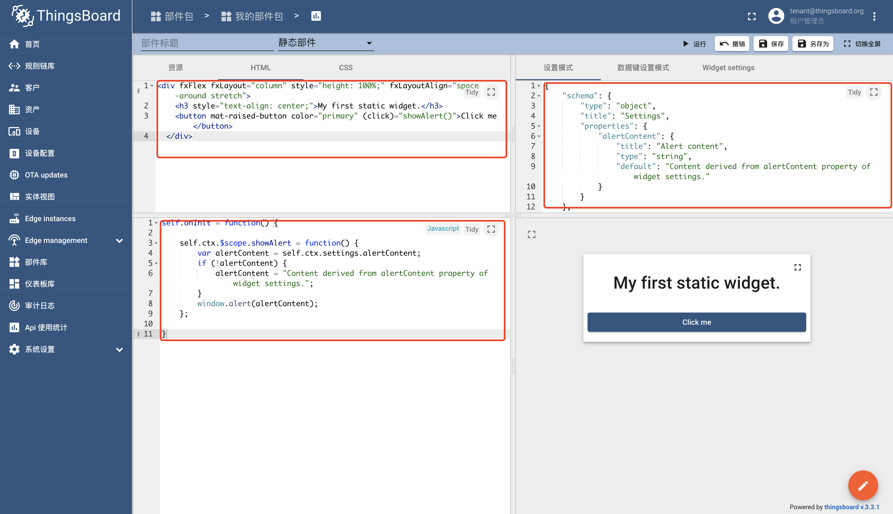
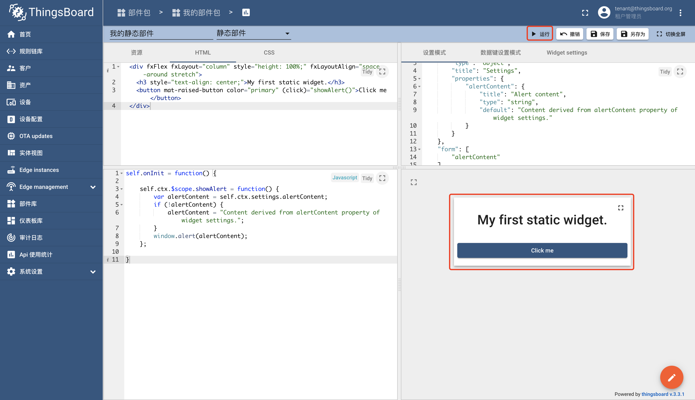
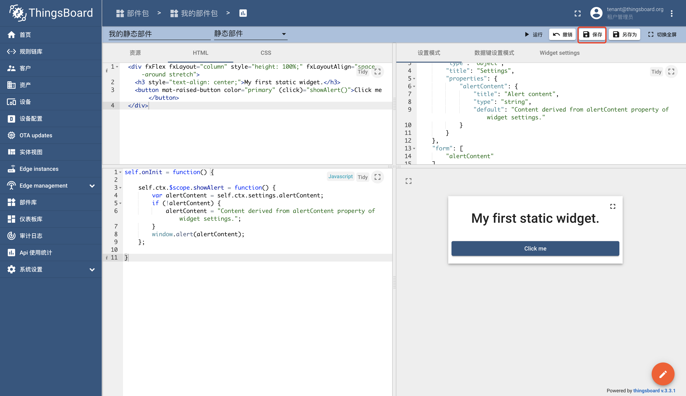

#### 环境准备

- release-3.3分支源码

#### 描述

跟随官方文档开发第一个属于自己的组件。

#### 开发

使用`系统管理员`或`租户管理员`登录系统，这里以`租户管理员`为例。

点击菜单`部件库`，点击右上角`+`号，点击`创建新的部件包`。


新建名为`我的部件包`的部件库，点击`添加`按钮。



点击`我的部件包`。


点击`打开部件包`按钮。


点击`添加新的部件类型`。



点击`静态部件`按钮。



输入部件名称：`我的静态部件`。




增加内容到相应位置。



HTML：

```html
<div fxFlex fxLayout="column" style="height: 100%;" fxLayoutAlign="space-around stretch">
<h3 style="text-align: center;">My first static widget.</h3>
<button mat-raised-button color="primary" (click)="showAlert()">Click me</button>
</div>
```

JavaScript:

```
self.onInit = function() {

    self.ctx.$scope.showAlert = function() {
        var alertContent = self.ctx.settings.alertContent;
        if (!alertContent) {
            alertContent = "Content derived from alertContent property of widget settings.";
        }
        window.alert(alertContent);  
    };

}
```

设置模式：

```json
{
    "schema": {
        "type": "object",
        "title": "Settings",
        "properties": {
            "alertContent": {
                "title": "Alert content",
                "type": "string",
                "default": "Content derived from alertContent property of widget settings."
            }
        }
    },
    "form": [
        "alertContent"
    ]
}
```

点击`运行`按钮进行测试。



点击`保存`按钮进行保存。



恭喜你拥有了一个静态部件，可以在仪表盘中使用该部件。

#### TIPS

- [**官方**]组件开发： https://thingsboard.io/docs/user-guide/contribution/widgets-development/
- [**官方**]静态组件开发：https://thingsboard.io/docs/user-guide/contribution/widgets-development/#static-widget