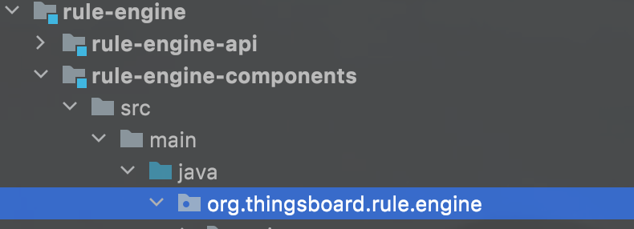
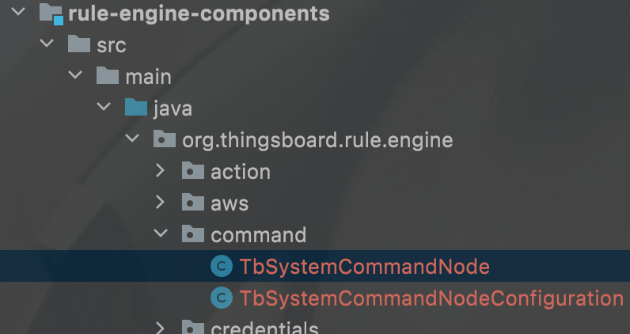
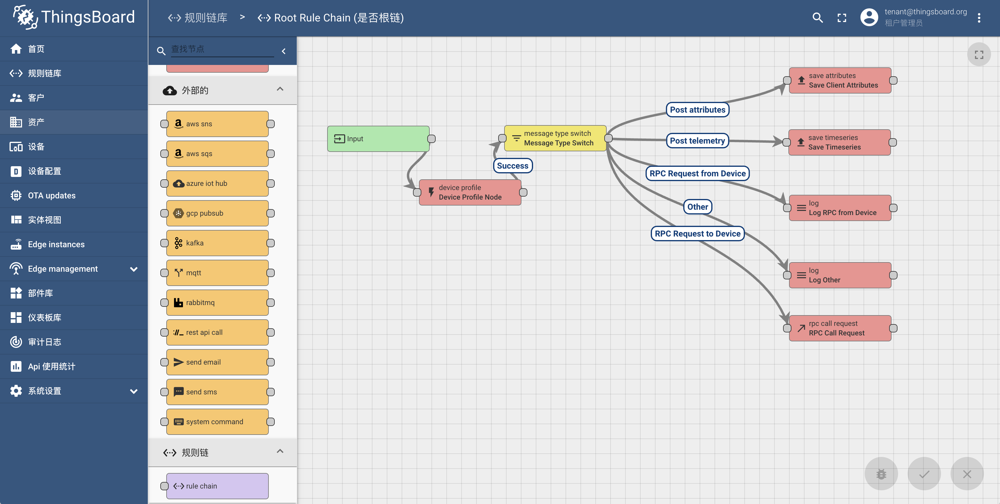
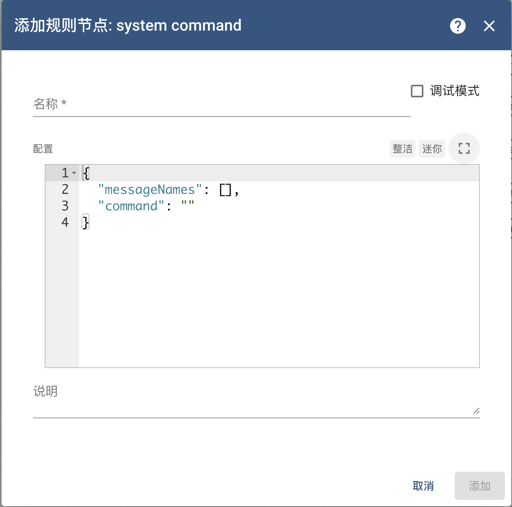
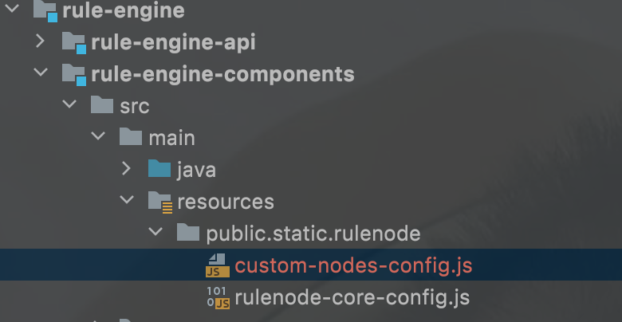
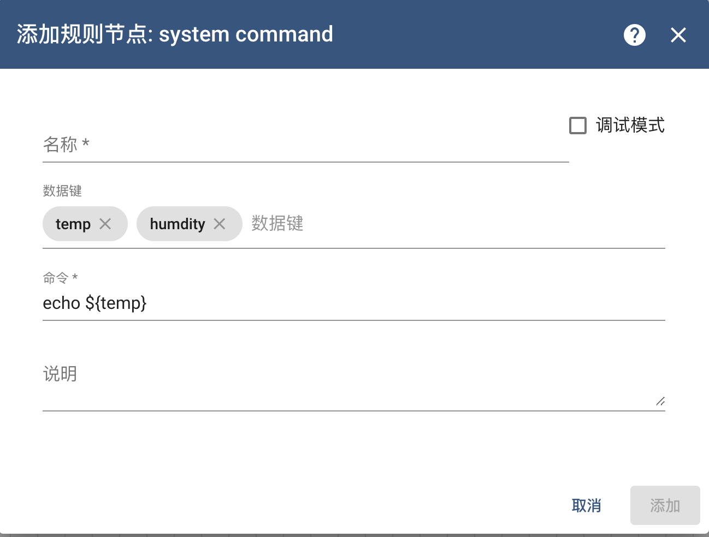

#### 环境准备

- release-3.3分支源码

  

#### 描述

官方提供了扩展机制，可以无侵入式的开发节点后端以及前端（可选），本文提供另外一种方式，直接在源码工程上增加规则节点，以增加一个**执行系统命令**的节点为例。

#### 开发

阅读本文前，请先了解如何进行[后端调试](../调试/后端.md)和[前端调试](../调试/前端.md)，建议也先阅读官方的[规则节点开发](https://thingsboard.io/docs/user-guide/contribution/rule-node-development/)。

##### 后端开发 

打开源码工程，进入`rule-engine-components`子工程，然后进入`src\main\java\org\thingsboard\rule\engine`下。



新建`command`文件夹，在`command`文件夹下新建Java文件TbSystemCommandNode用于处理消息

```java
package org.thingsboard.rule.engine.command;


import com.fasterxml.jackson.core.JsonProcessingException;
import com.fasterxml.jackson.databind.JsonNode;
import com.fasterxml.jackson.databind.ObjectMapper;
import lombok.extern.slf4j.Slf4j;
import org.thingsboard.rule.engine.api.*;
import org.thingsboard.rule.engine.api.util.TbNodeUtils;
import org.thingsboard.server.common.data.plugin.ComponentType;
import org.thingsboard.server.common.msg.TbMsg;

import java.io.BufferedReader;
import java.io.IOException;
import java.io.InputStream;
import java.io.InputStreamReader;
import java.util.HashMap;
import java.util.List;
import java.util.Map;


@Slf4j
@RuleNode(
        type = ComponentType.EXTERNAL,
        name = "system command",
        configClazz = TbSystemCommandNodeConfiguration.class,
        nodeDescription = "run system command",
        nodeDetails = "run system command, you can config data keys which used for system environments,if success, <code>result</code> must in data",
        icon = "")
public class TbSystemCommandNode implements TbNode {

    private static final ObjectMapper mapper = new ObjectMapper();

    private TbSystemCommandNodeConfiguration config;

    private List<String> messageNamesList;
    private String command;


    @Override
    public void init(TbContext tbContext, TbNodeConfiguration configuration) throws TbNodeException {
        this.config = TbNodeUtils.convert(configuration, TbSystemCommandNodeConfiguration.class);
        messageNamesList = config.getMessageNames();
        command = config.getCommand();

    }

    @Override
    public void onMsg(TbContext ctx, TbMsg msg) {
        try {
            Map<String, Object> dataMap = genDataMap(msg);
            String result = execCommand(dataMap, command);
            //new msg and tell
            String data = "{\"result\":\"" + result + "\"}";
            TbMsg tbMsg = ctx.newMsg(msg.getQueueName(), msg.getType(), msg.getOriginator(), msg.getCustomerId(), msg.getMetaData(),data);
            ctx.tellSuccess(tbMsg);
            //need ack old msg
            ctx.ack(msg);
        } catch (IOException e) {
            ctx.tellFailure(msg, e);
        } catch (RuntimeException e) {
            ctx.tellFailure(msg,e);
        }
    }

    private Map<String, Object> genDataMap(TbMsg msg) throws JsonProcessingException {
        HashMap<String, Object> dataMap = new HashMap<>();
        JsonNode dataJsonNode = mapper.readTree(msg.getData());
        for (String messageName : messageNamesList) {
            JsonNode jsonNode = dataJsonNode.get(messageName);
            if (jsonNode != null && !jsonNode.isNull()) {
                if (jsonNode.isBoolean()) {
                    dataMap.put(messageName, jsonNode.asBoolean());
                } else if (jsonNode.isNumber()) {
                    dataMap.put(messageName, jsonNode.asDouble());
                } else {
                    dataMap.put(messageName, jsonNode.asText());
                }
            }
        }
        return dataMap;
    }

    private static String execCommand(Map<String, Object> dataMap, String command) {
        ProcessBuilder processBuilder = new ProcessBuilder("/bin/sh", "-c", command);
        dataMap.forEach((String key,Object obj)->{
            processBuilder.environment().put(key,String.valueOf(obj));
        });
        Process process = null;
        String result = "";
        String errorResult = "";
        try {
            process = processBuilder.start();
            //get input stream
            InputStream in = process.getInputStream();
            BufferedReader br = new BufferedReader(new InputStreamReader(in));
            //get error stream
            InputStream error = process.getErrorStream();
            BufferedReader errorBr = new BufferedReader(new InputStreamReader(error));
            String lineStr;
            while ((lineStr = br.readLine()) != null) {
                result += lineStr + "\n";
            }
            if(result.length() > 0){
                result = result.substring(0,result.length()-1);
            }
            br.close();
            in.close();
            while ((lineStr = errorBr.readLine()) != null) {
                errorResult += lineStr + "\n";
            }
            if(errorResult.length() > 0){
                errorResult = errorResult.substring(0,errorResult.length()-1);
            }
            errorBr.close();
            error.close();
            int exitCode = process.waitFor();
            if(exitCode != 0){
                throw new RuntimeException(errorResult);
            }
        } catch (IOException e) {
            throw new RuntimeException(e.getMessage());
        } catch (InterruptedException e) {
            throw new RuntimeException(e.getMessage());
        } finally {
            if(process != null) {
                process.destroy();
            }
        }
        return result;
    }

    @Override
    public void destroy() {
    }
}
```

在`command`文件夹下新建Java文件TbSystemCommandNodeConfiguration如下:

```java
package org.thingsboard.rule.engine.command;

import lombok.Data;
import org.thingsboard.rule.engine.api.NodeConfiguration;

import java.util.Collections;
import java.util.List;

@Data
public class TbSystemCommandNodeConfiguration implements NodeConfiguration {

    private List<String> messageNames;
    private String command;


    @Override
    public NodeConfiguration defaultConfiguration() {
        TbSystemCommandNodeConfiguration tbSystemCommandNodeConfiguration = new TbSystemCommandNodeConfiguration();
        tbSystemCommandNodeConfiguration.setMessageNames(Collections.emptyList());
        tbSystemCommandNodeConfiguration.setCommand("");
        return tbSystemCommandNodeConfiguration;
    }
}
```

在左侧代码树上我们应该能看到如下结构：



找到`ThingsboardServerApplication`运行工程，点击左侧菜单`规则链库`，随意进入一条规则链，在左侧菜单中可以找到`system command`规则节点。



将其拖拽到画布，可以看到如下信息：



虽然丑，但不影响正常使用。如果需要UI，接着往下看。

##### 前端开发（可选）

如果需要界面，还需要进行以下操作：

- 在`TbSystemCommandNode`的`@RuleNode`注解中增加如下配置：

```
uiResources = {"static/rulenode/custom-nodes-config.js"},//指定前端资源文件
configDirective = "tbActionNodeSystemCommandConfig",//指定前端资源文件中的组件
```

- 克隆官方提供的UI扩展工程：https://github.com/thingsboard/rule-node-examples-ui-ngx.git ，增加组件文件、包说明文件以及国际化文件，因修改较多，这里贴出修改的文件，具体的内容可以参考我的fork工程：https://github.com/blackstar-baba/rule-node-examples-ui-ngx.git，切换至`customer`分支。

```
M       projects/custom-nodes-config/src/lib/custom-nodes-config.module.ts
M       projects/custom-nodes-config/src/lib/locale/custom-nodes-locale.constant.ts
A       projects/custom-nodes-config/src/lib/components/action/custom-nodes-config-action.module.ts
A       projects/custom-nodes-config/src/lib/components/action/system-command-config.component.html
A       projects/custom-nodes-config/src/lib/components/action/system-command-config.component.ts
```

使用`yarn build`打包后，将custom-nodes-config.js文件从`target/generated-resources/public/static`拷贝至thingsboard工程`rule-engine/rule-engine-components/src/main/resources/public/static/rulenode`目录下



重启应用程序，再次拖拽系统命令节点，查看UI。




#### TIPS
- 在修改前端时，遇到了两个问题：
  - 官方UI扩展工程有一段时间未更新，运行时异常，因此fork了工程进行了修改，然后提交了PR。
  - 调试不方便，需要在两个工程中拷贝文件。
- 如果遇到UI加载异常，可以删除数据库表`omponent_descriptor`关于··`TbSystemCommandNode`的一行记录，然后重启程序。

- [**官方**]规则节点开发： https://thingsboard.io/docs/user-guide/contribution/rule-node-development/
- [**官方**] 规则节点后端扩展工程地址：https://github.com/thingsboard/rule-node-examples.git
cd rule-node-examples
- [**官方**] 规则节点前端扩展工程地址：https://github.com/thingsboard/rule-node-examples-ui-ngx.git
- [**Fork**] 规则节点前端扩展工程地址：https://github.com/blackstar-baba/rule-node-examples-ui-ngx.git
- [**官方**] 规则节点UI地址：https://github.com/thingsboard/thingsboard-rule-config-ui-ngx
- [**Github**] SSH Key生成：https://docs.github.com/en/authentication/connecting-to-github-with-ssh
- [**官方**]ICON查找：https://fonts.google.com/icons?selected=Material+Icons

