#### 环境准备

- 已经编译且能成功运行的代码环境，可参考前作
- IDE Idea或Eclipse，本文使用Idea
- [MqttBox](http://workswithweb.com/mqttbox.html)，一个Mqtt客户端
- 支持Html5的浏览器，本文使用Chrome

#### 描述

仪表盘用于数据展示，使用部件库中部件或自定义部件（需遵循部件开发规范）形成灵活可定制化页面。

#### 新建

运行程序，使用`tenant@thingsboard.org`账号登录系统，点击左侧菜单`仪表盘库`，点击右上角`+`号，选择`创建新的仪表盘`。
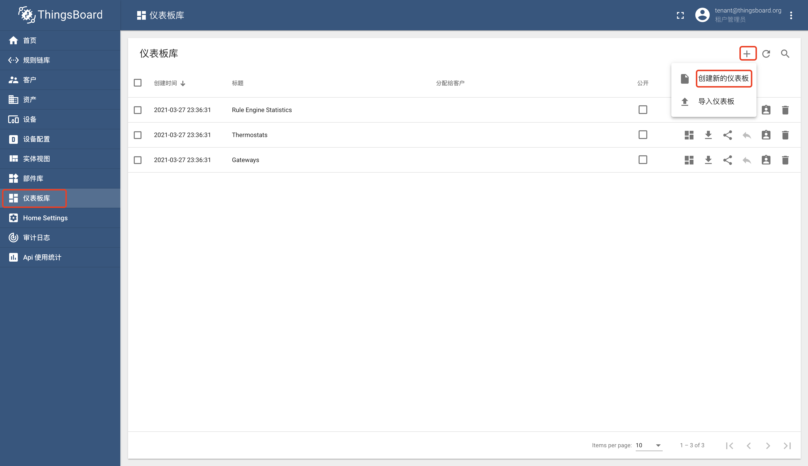

输入标题`我的仪表盘`，点击`添加`按钮。
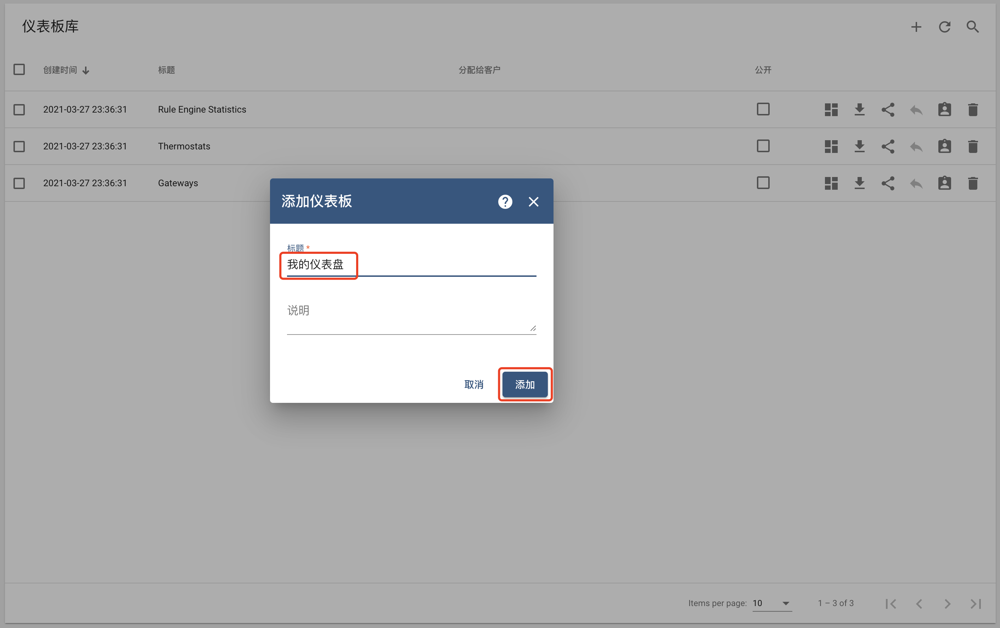

在仪表盘列表中可以找到仪表盘`我的仪表盘`。
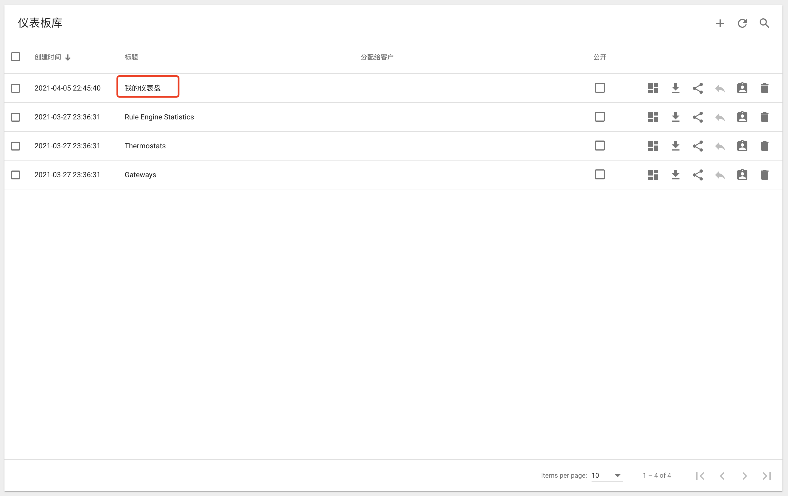

#### 编辑

单击仪表盘`我的仪表盘`，点击`打开仪表盘`按钮。
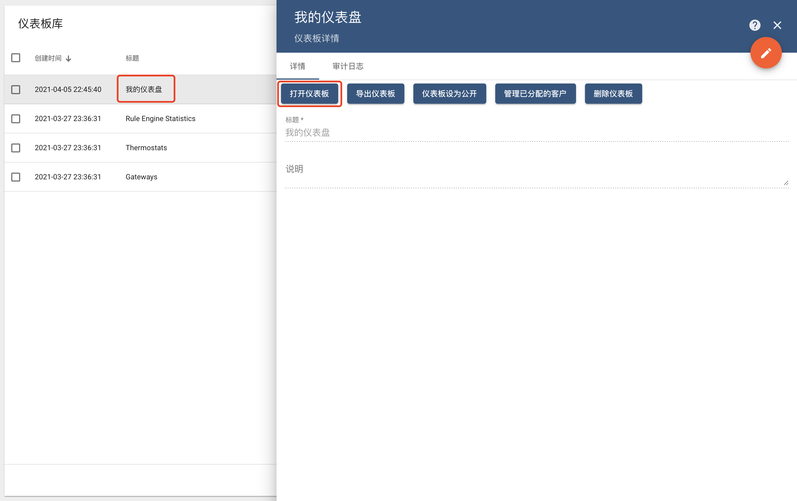
点击右下角`笔形`按钮进入编辑模式。
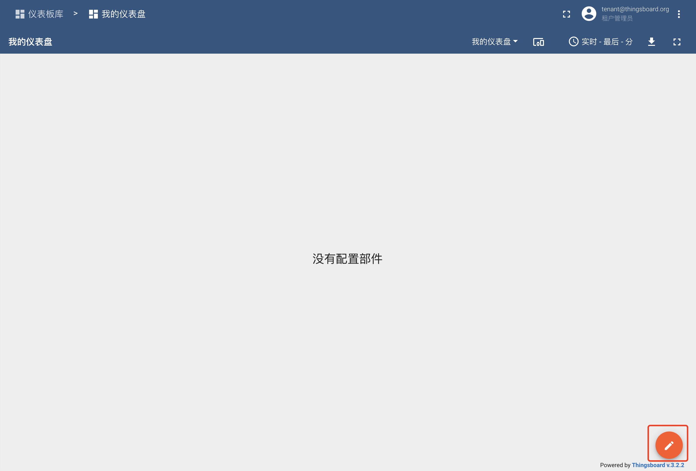

##### 数据源添加

参考前作[普通设备](普通设备.md)创建设备`我的设备`，并上传一条时序数据`{temperature:40.21}`。

点击右上角`多终端`按钮，点击`添加别名`按钮，输入别名`我的设备`，选择筛选器类型`单个实体`，选择类型`设备`，选择设备`我的设备`，点击`添加`按钮。
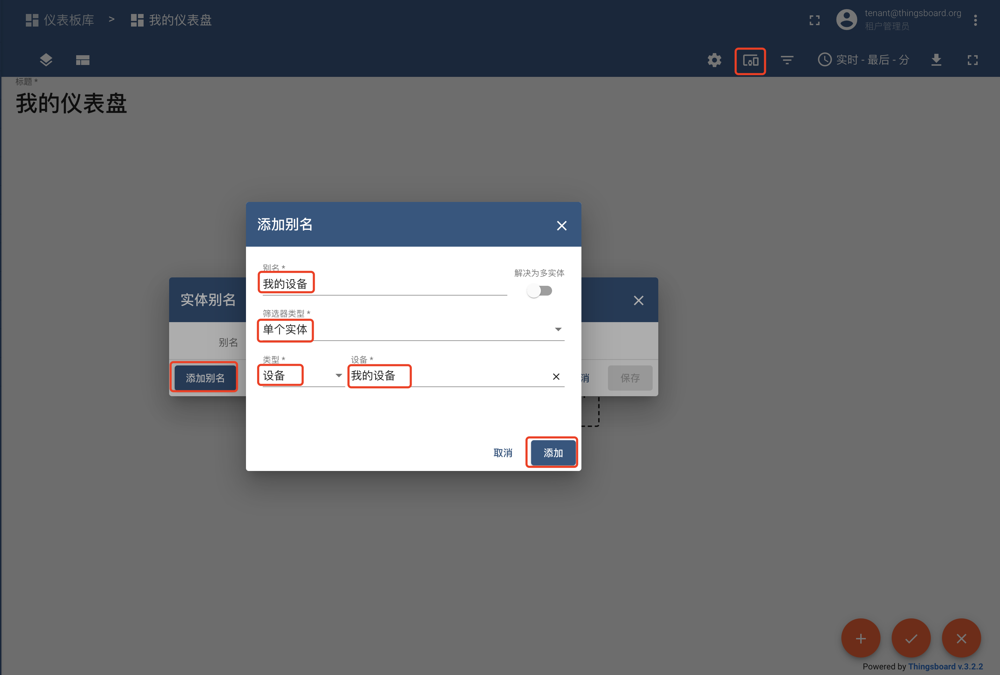

点击`保存`按钮进行保存。
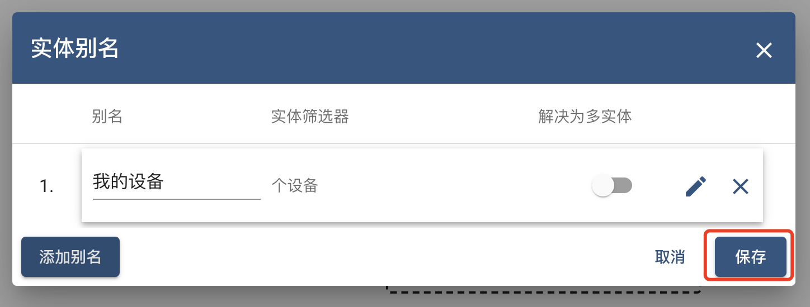

##### 部件添加

点击`添加新的部件`按钮
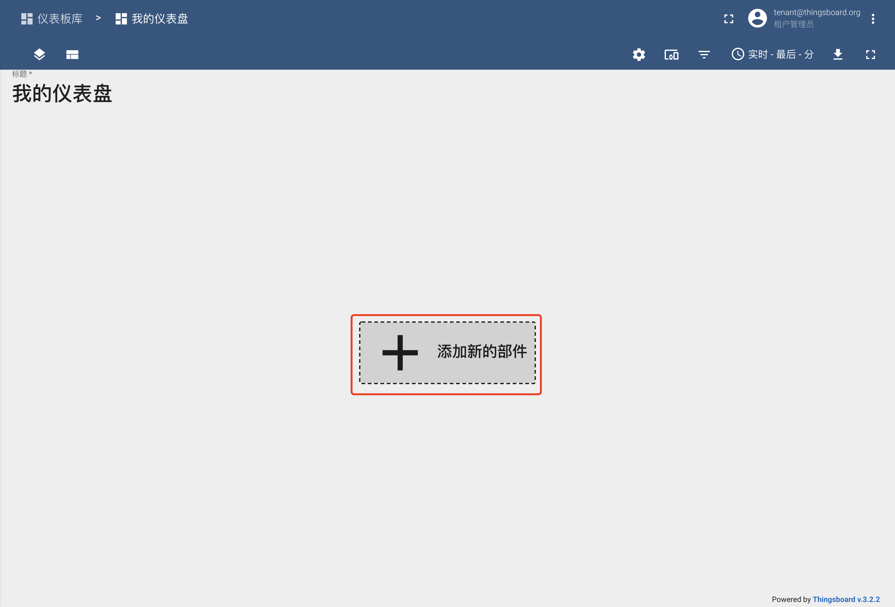

在弹出的部件组列表中，选择模拟仪表（Analogue gauges）
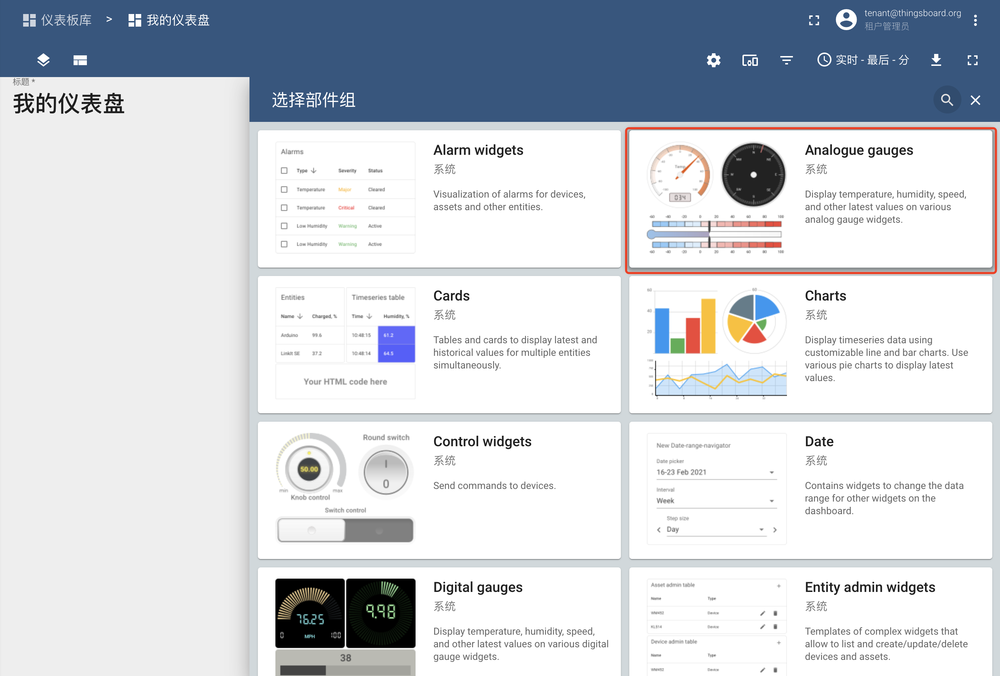

选择温度径向计量器Temperature radial gauge
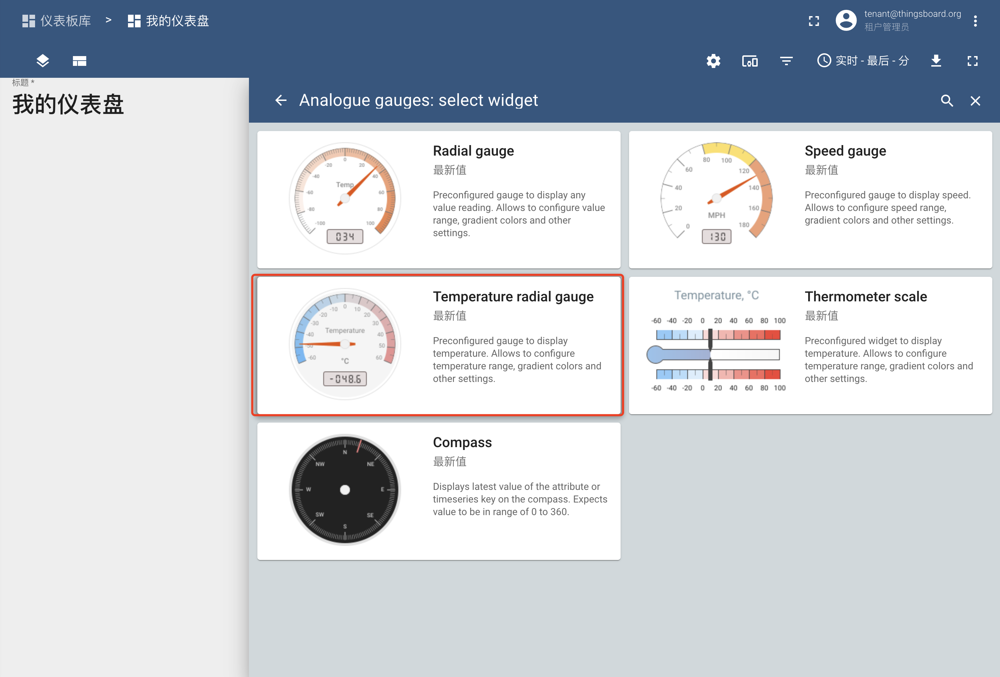

选择实体别名`我的设备`，选择时序数据点`temperature`，点击`添加`按钮。
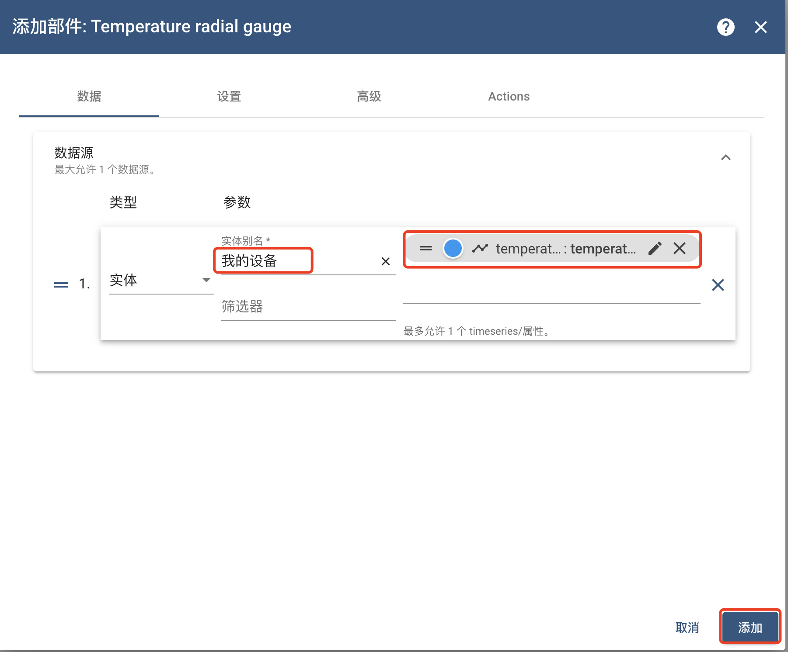

点击右下角`勾形`按钮进行保存。
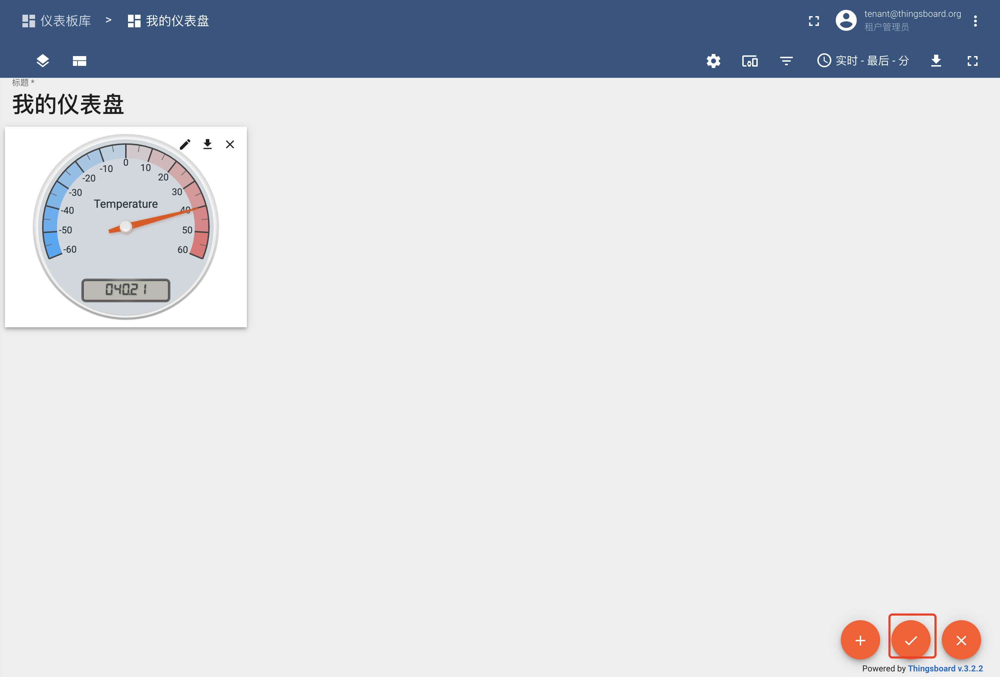

现在已经拥有一个展示温度的仪表盘。

#### 授权
默认情况下，只有租户管理员能看到当前租户下的仪表盘，通过授权，可以给当前租户下的普通客户使用。
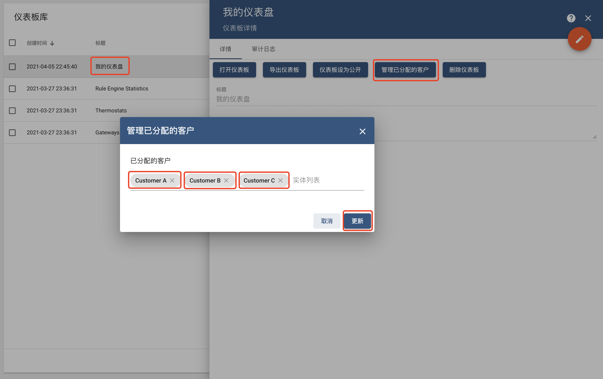

#### 公开
仪表盘可以设置为公开，通过公开链接，可以让无系统访问权限的用户使用仪表盘。
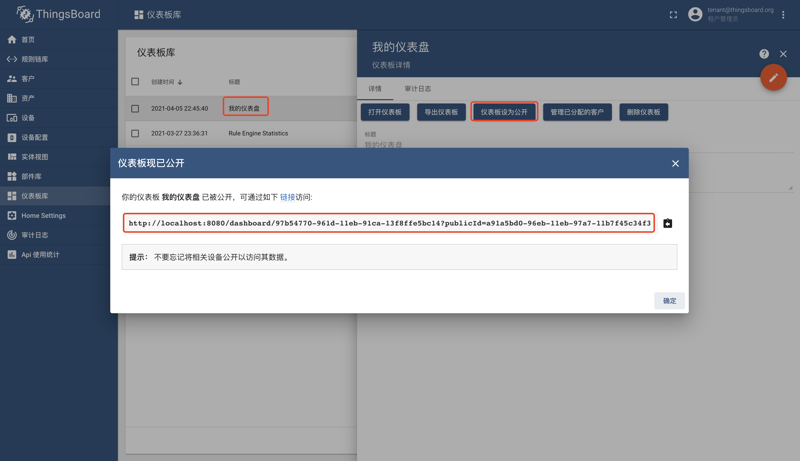

#### 删除
通过`删除仪表盘`按钮，可以完成仪表盘删除。

TIPS

- 仪表盘可以导入导出，格式为json
- 官方 [仪表盘介绍](https://thingsboard.io/docs/user-guide/dashboards/#introduction)