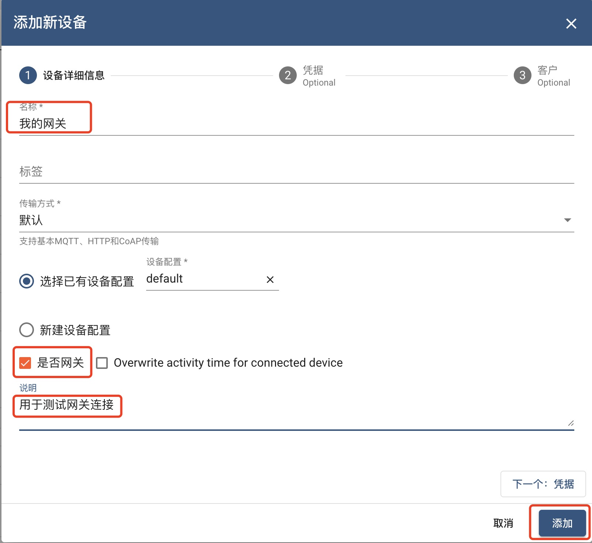
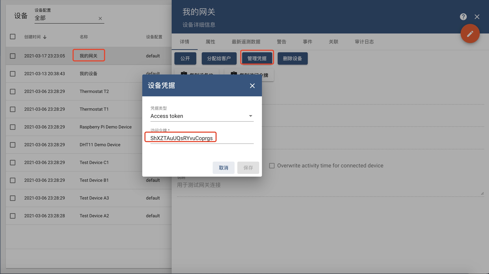
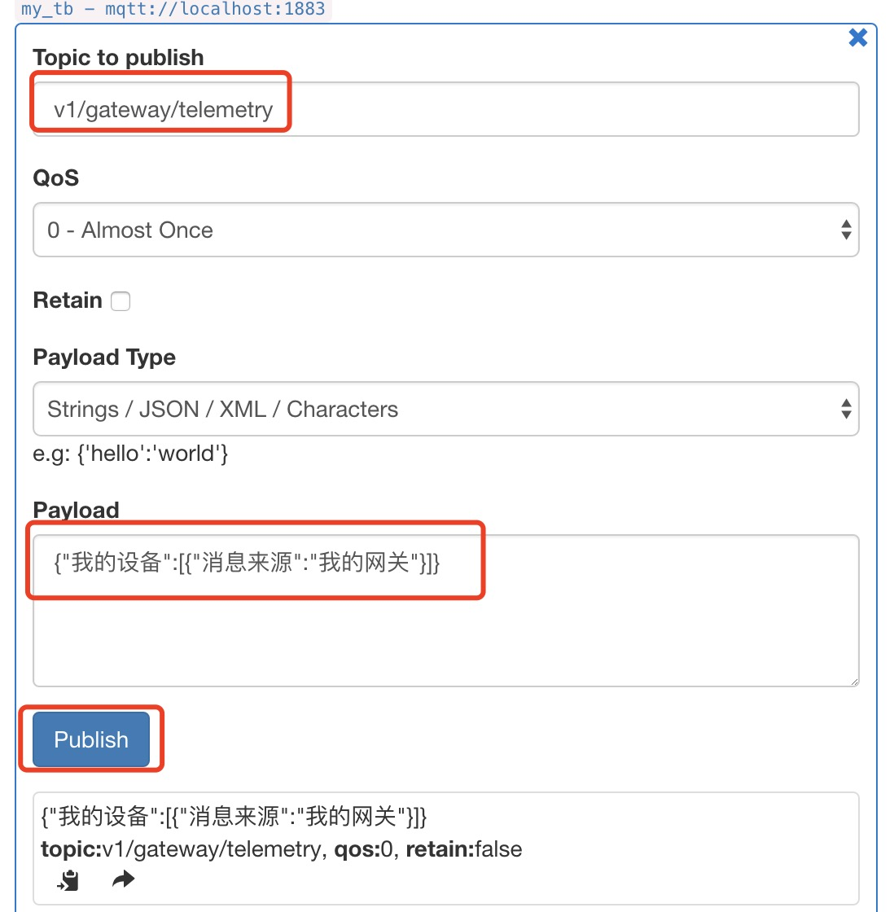
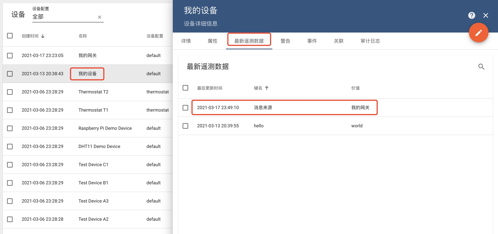

#### 环境准备

- 已经编译且能成功运行的代码环境，可参考前作。
- IDE Idea或Eclipse，本文使用Idea
- [MqttBox](http://workswithweb.com/mqttbox.html)，一个Mqtt客户端
- 支持Html5的浏览器，本文使用Chrome


#### 创建

网关在系统中也是作为`设备`管理，启动程序，使用`tenant@thingsboard.org`账号登录系统，进入设备页面


点击右侧`+`号，选择`添加新设备`菜单


输入`名称`（必须），勾上`是否网关`多选框（必须），填写`说明`(可选)，点击`添加`按钮


可以看到设备列表中出现了设备`我的网关`，点击`我的网关，查看`管理凭据`，默认系统为网关生成了`Access token`


#### 连接
网关通过Mqtt协议向平台转发设备数据，本文使用MqttBox模拟。

MqttClient配置如下，其中`Host`填写本机1883端口，`Username`填写访问令牌内容


点击`save`按钮进行保存,观察最上方连接状态，绿色代表连接成功


#### 数据上传

模拟转发设备名为`我的设备`的数据，数据内容为

```
{"消息来源":"我的网关"}
```

在Mqttbox中指定topic

```
v1/gateway/telemetry
```

以及消息内容（Json格式）

```
{"我的设备":[{"消息来源":"我的网关"}]}
```

点击`Publish`按钮进行发布


在平台上`我的设备`的`最新遥测数据`Tab页中查看数据，能查到`"消息来源":"我的网关"`数据代表成功。



#### TIPS

- 在平台上，网关也作为设备进行管理，因此设备基础使用方法网关也具备，可参考前作[普通设备](普通设备.md)
- 因篇幅有限，本文只是使用MqttBox模拟网关进行数据上传，真正的网关功能更加强大，官方网关文档 [Getting Stated](https://thingsboard.io/docs/iot-gateway/getting-started/)
- 真实生产环境下，网关转发设备数据的场景更加普遍。