#### 环境准备

- 已经编译且能成功运行的代码环境，可参考前作。
- IDE Idea或Eclipse，本文使用Idea
- [MqttBox](http://workswithweb.com/mqttbox.html)，一个Mqtt客户端
- 支持Html5的浏览器，本文使用Chrome

#### 根规则链

每个租户都会创建一条名为`Root Rule Chain`(根规则链)的规则链，用来处理该租户下的设备数据
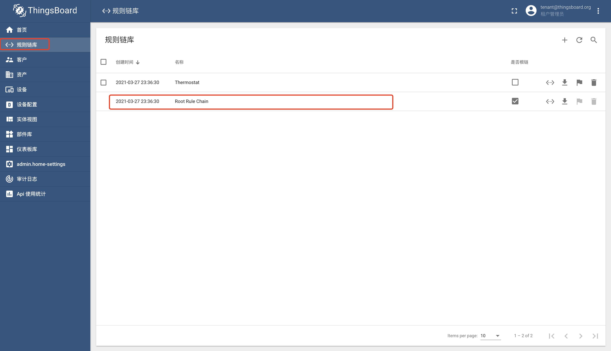
默认所有的设备数据都会先经过根规则链进行处理
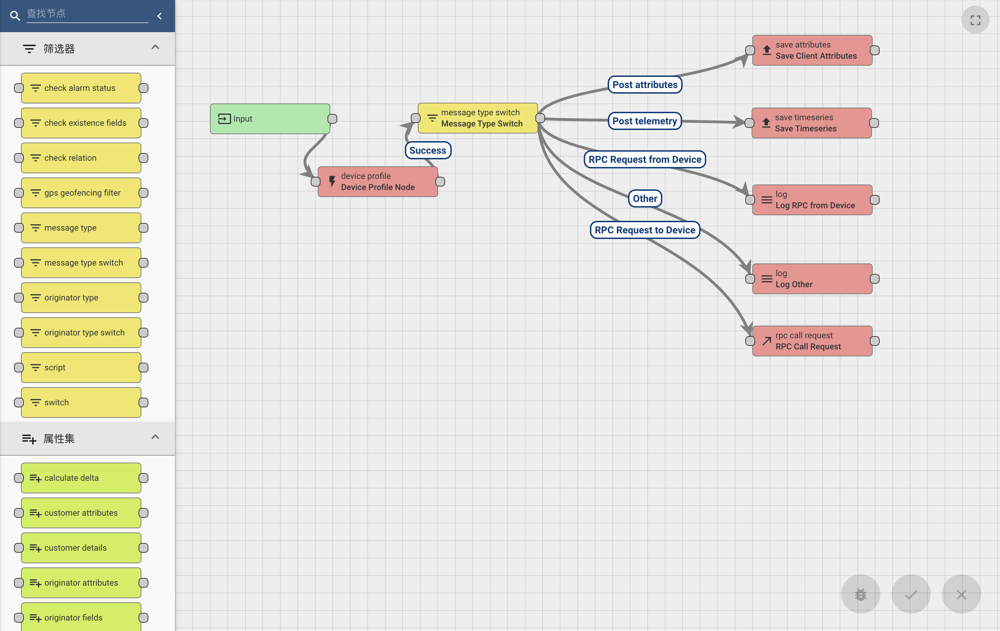

#### 新建

启动程序，使用`tenant@thingsboard.org`账号登录系统，进入规则链库页面，点击右上角`+`号，选择`创建新的规则链`
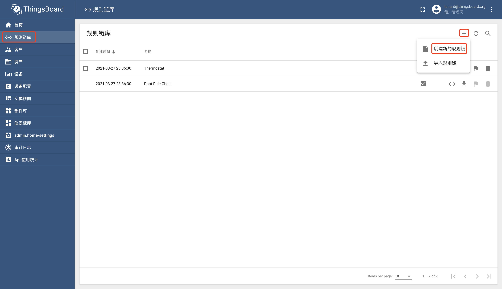
填写名称`我的规则`以及说明（不是必须），点击`添加`按钮
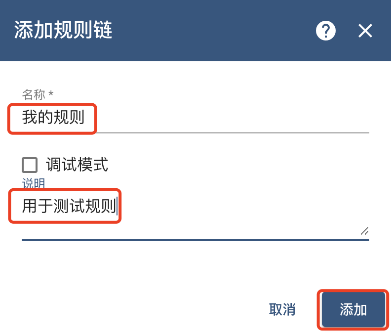
在规则链列表中查看`我的规则`是否存在
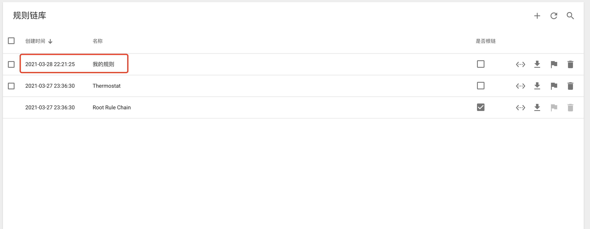

#### 编辑
点击规则链`我的规则`,在右侧弹出页中点击`打开规则链`按钮
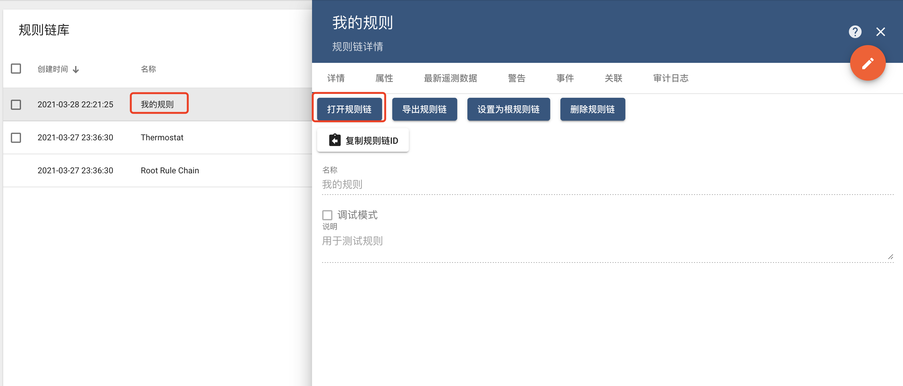

##### 节点增加
在左侧规则节点列表中拖拽节点`script`（注意是变换列表下的script）,填写名称`消息变换`，点击`添加`按钮
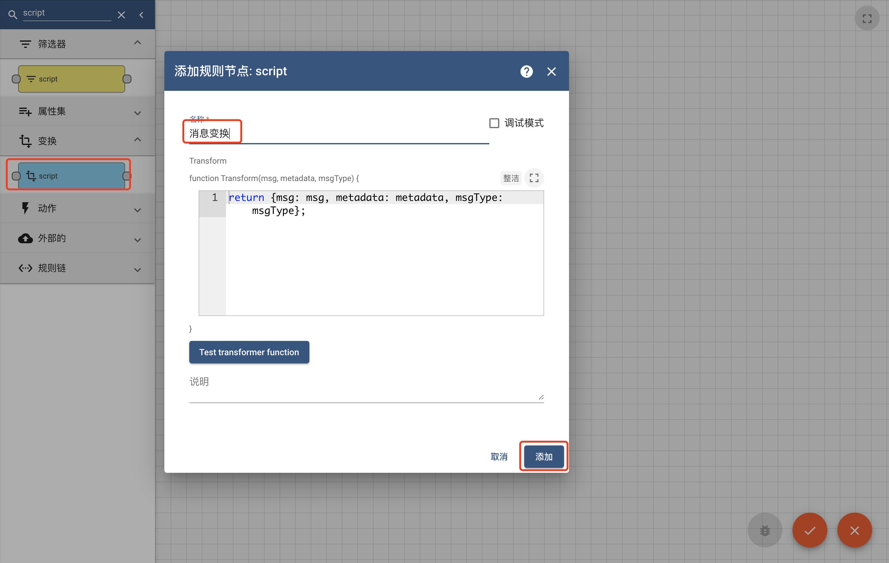
将规则节点`input`和节点`message count`连接上，点击右下角`勾`进行保存。
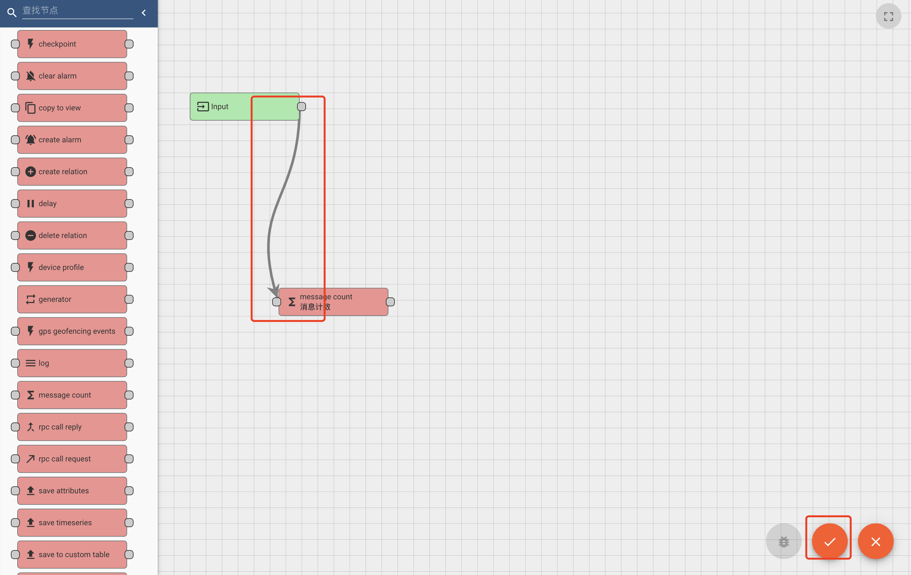

##### 节点修改

双击面板中的节点`消息变换`（或单击节点，然后在节点右上角，点击笔形按钮）在右侧弹出页中增加脚本`msg.temp = 15.36;`(修改消息中key为`temp`的值为15.36)，点击`勾`进行保存
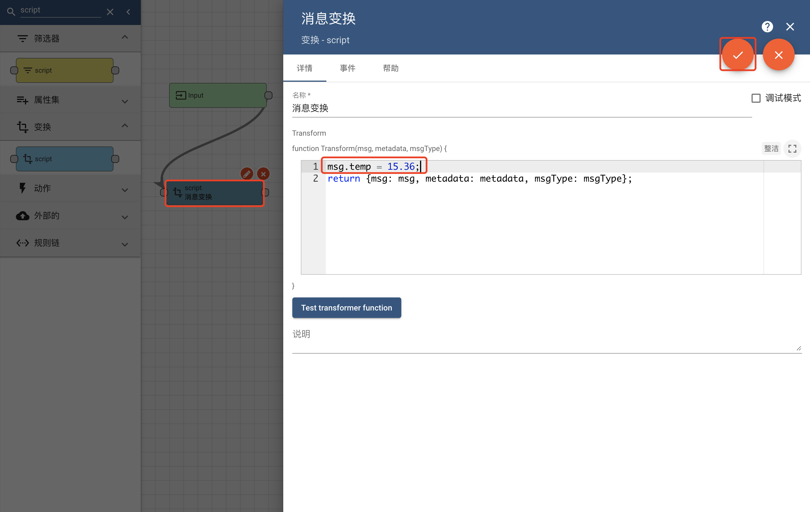
节点修改后，必须点击右下角`勾`进行规则链的保存

##### 节点删除

点击面板中的节点`消息变换`，点击节点右上角`x`按钮，即可删除该节点
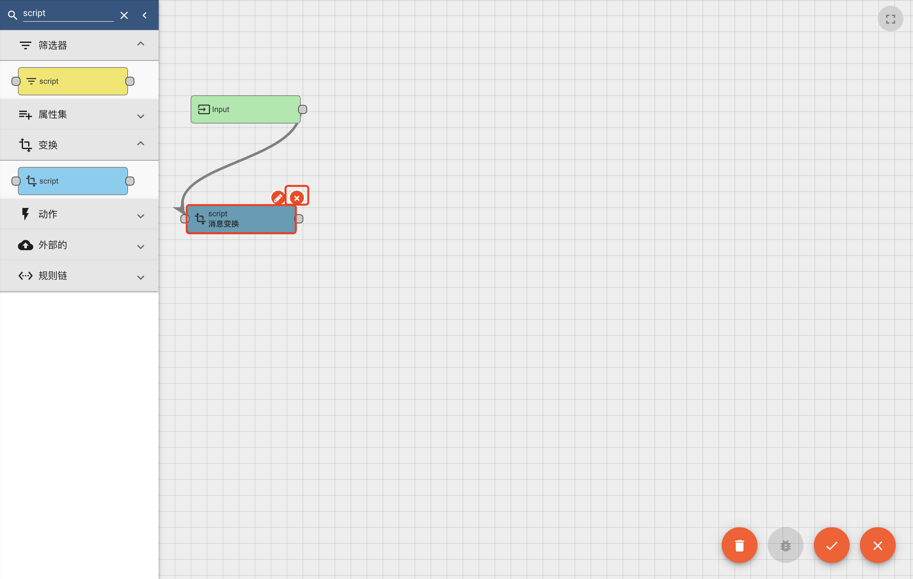
节点删除后，必须点击右下角`勾`进行规则链的保存

#### 链接

规则链与规则链通过链接，可以将一条链的处理结果传输到另一条链继续处理，点击规则链`Root Rule Chain`并打开规则链
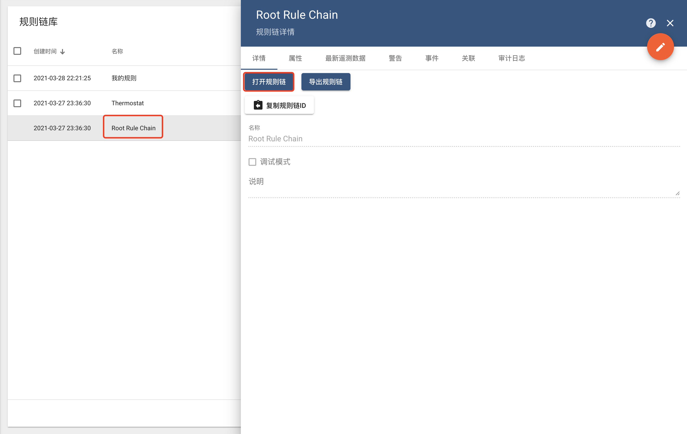
在左侧节点列表中找到节点`规则链`，拖拽到右侧面板，选择规则链`我的规则`，点击`添加`按钮

连接时序节点与规则链节点，选择链接标签`Success`（表明时序保存成功后，进入规则链`我的规则`）
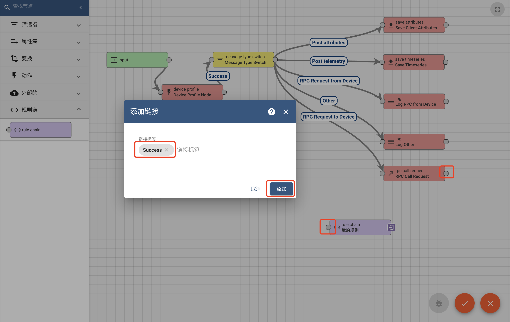
点击右下角`勾`进行规则链的保存

#### 调试
可以打开规则节点中的调试开关用于调试规则，以规则链`我的规则`为例，打开规则链`我的规则`，双击节点`消息变换`，点击`调试模式`单选框，点击右上角`勾`进行保存。

点击右下角`勾`进行规则链的保存

参考前作[普通设备](普通设备.md)创建设备`我的设备`，使用MqttBox发送数据`{"temp":40.21}`
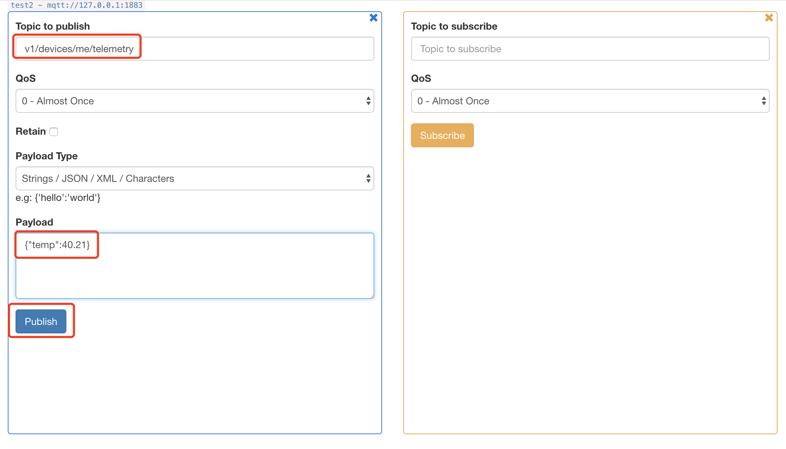
再次打开规则链`我的规则`，双击节点`消息变换`，切换到`事件`tab页
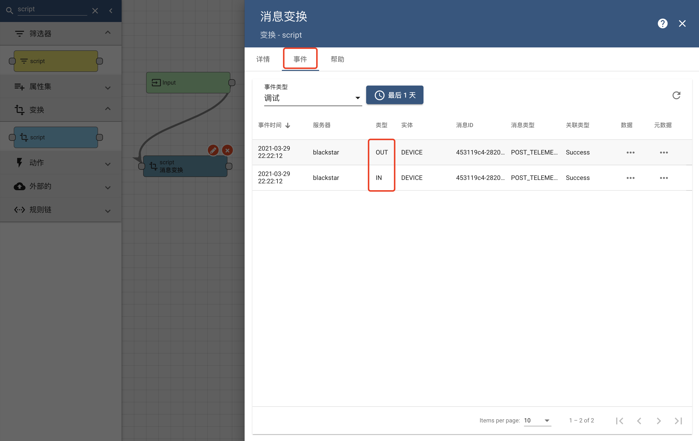
点击列表中的条目，可以查看具体输出（IN）和输出（OUT）信息，点击类型为`IN`数据列`...`按钮，可以查看输入的具体信息

点击类型为`OUT`数据列`...`按钮，可以查看输出的具体信息
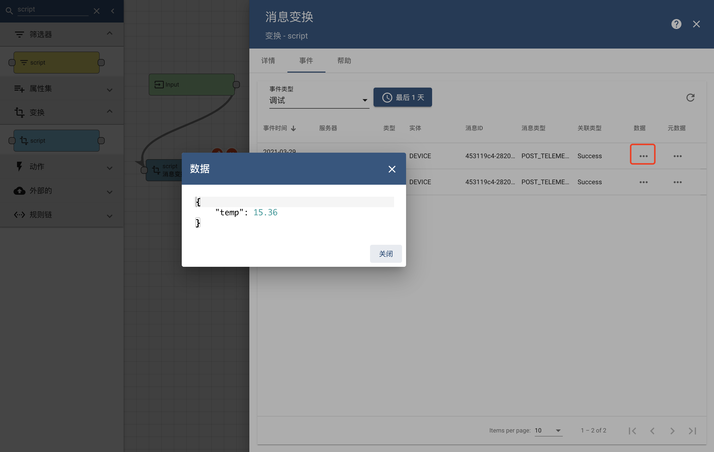

#### TIPS
- 通常物联网平台都会具有规则引擎，规则引擎用途是进行实时数据的流式处理
- 规则链调试完成后，切记关闭调试，否则会对数据库造成一定压力
- 更多细节见官方文档 [Rule Engine](https://thingsboard.io/docs/user-guide/rule-engine-2-0/re-getting-started/)、[规则链操作](https://thingsboard.io/docs/user-guide/ui/rule-chains/)

