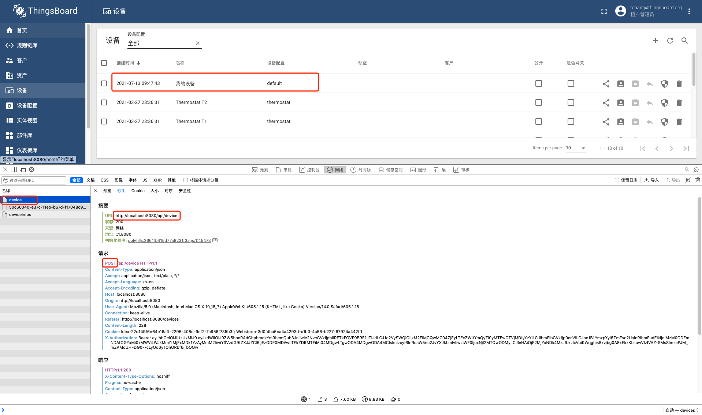
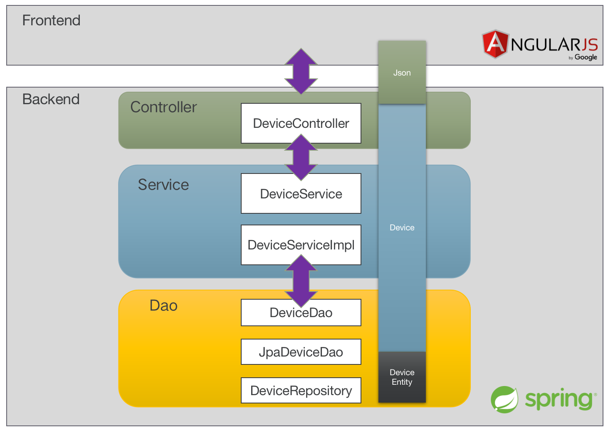

#### 环境准备

- release-3.2分支源码
- 支持Html5的浏览器，本文使用Chorme

#### 描述

传统的MVC分为 `Model-View-Controller` 3层，用于解耦前后端，相关实现技术经过一定时间的发展逐渐专业化，于是有了前后端分离，其中`View`层通常由前端技术实现，比如AngularJs、Vue，`Controller`层由后端技术实现，比如Java、Go等，`Model`通常定义为通用数据交换格式，比如Json。 本文主要研究Thingsboard后端的分层结构。

#### 分析

以后端数据库为PG，创建设备为例，通过调试模式抓取创建设备的请求连接获取到后端入口。



后端入口为`DeviceController`，核心流程为：

```
//DeviceController 119
Device savedDevice = checkNotNull(deviceService.saveDeviceWithAccessToken(device, accessToken));


//DeviceServiceImpl 172
return doSaveDevice(device, accessToken);

//DeviceServiceImpl 203
savedDevice = deviceDao.save(device.getTenantId(), device);

//DeviceDao 53
Device save(TenantId tenantId, Device device);

//JpaAbstractDao 65
entity = getCrudRepository().save(entity);

```

从流程上来看，主要分为了`Controller`层、`Service`层和`Dao`层，其中`Service`层和`Dao`层又提取出了接口层方便扩展，示意图如下：



#### TIPS

- ORM框架方面，国外软件大多喜欢使用JPA，国内软件大多偏好MyBatis以及MyBatisPlus，Thingsboard `Dao`层使用了JPA。

