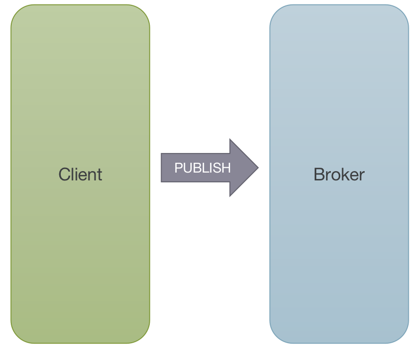
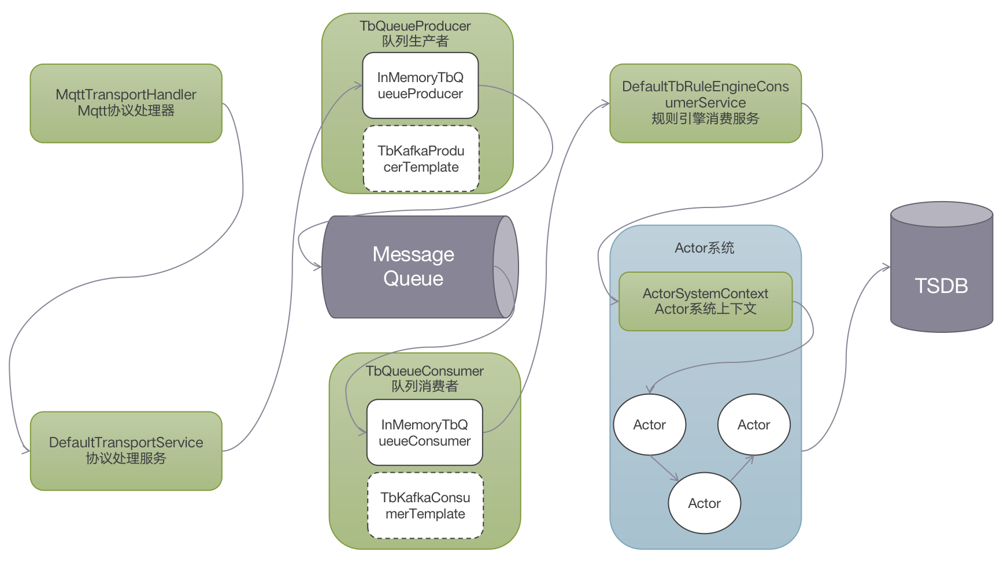
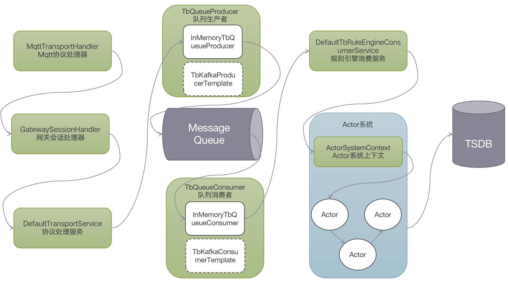

#### 环境准备
- release-3.2分支源码

#### 描述
以MQTT协议接入为例，分析设备如何传输数据到Thingsboard。在一般情况下（服务质量等级Qos为0，不保证消息一定到达），使用Mqtt客户端向云端发送PUBLISH消息即可完成传输，不用处理PUBACK



#### 分析

与设备连接类似，入口类：`MqttTransportService`，核心处理类为`MqttTransportHandler`

#### 数据传输
##### 普通设备
在MqttTransportHandler中进行Mqtt消息处理，以一个的普通设备上传数据`{"temp":31.23}`为例，核心处理流程如下：
```
//MqttTransportHandler 132
processMqttMsg(ctx, (MqttMessage) msg);

//MqttTransportHandler 158
processRegularSessionMsg(ctx, msg);

//MqttTransportHandler 207
processPublish(ctx, (MqttPublishMessage) msg);

//MqttTransportHandler 245
//调用processDevicePublish方法处理设备消息 
processDevicePublish(ctx, mqttMsg, topicName, msgId);

//MqttTransportHandler 288
//转换为遥测消息，调用transportService进行处理
TransportProtos.PostTelemetryMsg postTelemetryMsg = payloadAdaptor.convertToPostTelemetry(deviceSessionCtx, mqttMsg);
transportService.process(deviceSessionCtx.getSessionInfo(), postTelemetryMsg, getPubAckCallback(ctx, msgId, postTelemetryMsg));

//DefaultTransportService 382
//调用sendToRuleEngine方法处理消息
sendToRuleEngine(tenantId, deviceId, sessionInfo, json, metaData, SessionMsgType.POST_TELEMETRY_REQUEST, packCallback);

//DefaultTransportService 797
//转换消息类型为TbMsg，调用sendToRuleEngine方法处理消息
TbMsg tbMsg = TbMsg.newMsg(queueName, sessionMsgType.name(), deviceId, metaData, gson.toJson(json), ruleChainId, null);
sendToRuleEngine(tenantId, tbMsg, callback);

//DefaultTransportService 776
//调用ruleEngineMsgProducer（类型为TbQueueProducer）发送消息
//TbQueueProducer有多种实现，常见的是InMemoryTbQueueProducer和TbKafkaProducerTemplate
ruleEngineMsgProducer.send(tpi, new TbProtoQueueMsg<>(tbMsg.getId(), msg), wrappedCallback);

//MqttTransportHandler 324
//调用ack方法准备ack消息
ack(ctx, msgId);

//MqttTransportHandler 315
//channel上下文中写入并刷新PUBACK消息。
ctx.writeAndFlush(createMqttPubAckMsg(msgId));

//DefaultTbRuleEngineConsumerService 165
List<TbProtoQueueMsg<ToRuleEngineMsg>> msgs = consumer.poll(pollDuration);

//DefaultTbRuleEngineConsumerService 185
forwardToRuleEngineActor(configuration.getName(), tenantId, toRuleEngineMsg, callback);

//DefaultTbRuleEngineConsumerService 300
msg = new QueueToRuleEngineMsg(tenantId, tbMsg, relationTypes, toRuleEngineMsg.getFailureMessage());
actorContext.tell(msg);
```
示意图如下：



##### 网关
以一个的网关上传设备数据`{{"设备1":[{"temp":18}]}`为例，核心处理流程如下：
```
//MqttTransportHandler 132 同普通设备

//MqttTransportHandler 158 同普通设备

//MqttTransportHandler 207 同普通设备

//MqttTransportHandler 241
handleGatewayPublishMsg(ctx, topicName, msgId, mqttMsg);

//MqttTransportHandler 253
gatewaySessionHandler.onDeviceTelemetry(mqttMsg);

//GatewaySessionHandler 122
onDeviceTelemetryJson(msgId, payload);

//GatewaySessionHandler 346
TransportProtos.PostTelemetryMsg postTelemetryMsg = JsonConverter.convertToTelemetryProto(deviceEntry.getValue().getAsJsonArray());
processPostTelemetryMsg(deviceCtx, postTelemetryMsg, deviceName, msgId);

//GatewaySessionHandler 400
transportService.process(deviceCtx.getSessionInfo(), postTelemetryMsg, getPubAckCallback(channel, deviceName, msgId, postTelemetryMsg));

//DefaultTransportService 382 同普通设备

//DefaultTransportService 797 同普通设备

//DefaultTransportService 776 同普通设备

//GatewaySessionHandler 726
ctx.writeAndFlush(MqttTransportHandler.createMqttPubAckMsg(msgId))

//DefaultTbRuleEngineConsumerService 165 同普通设备

//DefaultTbRuleEngineConsumerService 185 同普通设备

//DefaultTbRuleEngineConsumerService 300 同普通设备
```
示意图如下：



#### TIPS

- 网关的实体类型也是设备，通过附加信息`additional_info`属性`gateway`为`true`来标记设备为网关。

- TOPIC信息：请求TOPIC：`tb_rule_engine`，可配置`TB_QUEUE_RULE_ENGINE_TOPIC`进行修改。
