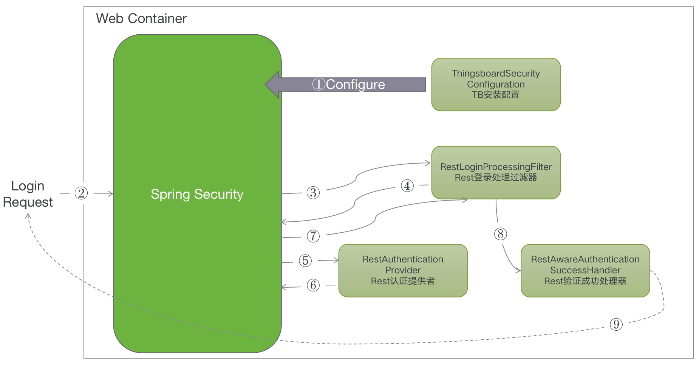
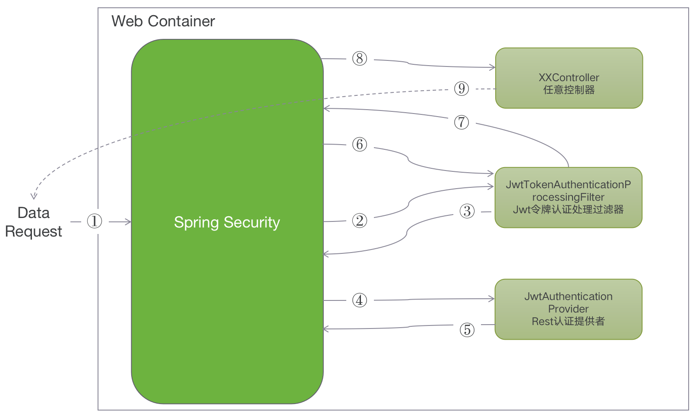

#### 环境准备

- release-3.2分支源码

#### 描述

使用JWT登录认证的系统，通常需要先通过认证信息访问认证服务器获取JWT令牌，然后再使用JWT Token访问真实系统接口获取数据，如图所示：


1. 应用程序或客户端向授权服务器请求授权将`/oauth/authorize`使用[授权代码流](http://openid.net/specs/openid-connect-core-1_0.html#CodeFlowAuth)通过端点。
2. 当授权被授予时，授权服务器向应用程序返回一个访问令牌。
3. 应用程序使用访问令牌来访问受保护的资源（如 API）

#### 分析
入口类为：`ThingsboardSecurityConfiguration`，在该类的`configure`方法中定义了认证以及过滤的处理流程。
以登录为例，定义登录进行的处理类为RestLoginProcessingFilter
```
.addFilterBefore(buildRestLoginProcessingFilter(), UsernamePasswordAuthenticationFilter.class)
```
核心处理流程为：
```
//RestLoginProcessingFilter 71
//从request中获取登录请求信息，包含username和password
loginRequest = objectMapper.readValue(request.getReader(),LoginRequest.class);

//RestLoginProcessingFilter 80
//封装UserPrincipal对象
UserPrincipal principal = new UserPrincipal(UserPrincipal.Type.USER_NAME, loginRequest.getUsername());
//封装UsernamePasswordAuthenticationToken对象
UsernamePasswordAuthenticationToken token = new UsernamePasswordAuthenticationToken(principal, loginRequest.getPassword());
token.setDetails(authenticationDetailsSource.buildDetails(request));
//使用AuthenticationManager验证Token
return this.getAuthenticationManager().authenticate(token);

//RestAuthenticationProvider 74
从authentication（实际上是UsernamePasswordAuthenticationToken对象）中获取Principal
Object principal = authentication.getPrincipal();

//RestAuthenticationProvider 81
//从userPrincipal获取用户名密码，调用authenticateByUsernameAndPassword进行验证
String username = userPrincipal.getValue();
String password = (String) authentication.getCredentials();
return authenticateByUsernameAndPassword(authentication, userPrincipal, username, password);

//RestAuthenticationProvider 91
//根据username获取用户信息
User user = userService.findUserByEmail(TenantId.SYS_TENANT_ID, username);

//RestAuthenticationProvider 98
//根据用户编号获取用户凭证
UserCredentials userCredentials = userService.findUserCredentialsByUserId(TenantId.SYS_TENANT_ID, user.getId());

//RestAuthenticationProvider 104
//调用systemSecurityService验证用户凭证与密码是否一致
 systemSecurityService.validateUserCredentials(user.getTenantId(), userCredentials, username, password);

//RestAuthenticationProvider 113
//封装userPrincipal到SecurityUser对象
SecurityUser securityUser = new SecurityUser(user, userCredentials.isEnabled(), userPrincipal);

//RestAuthenticationProvider 115
//新建UsernamePasswordAuthenticationToken并返回
return new UsernamePasswordAuthenticationToken(securityUser, null, securityUser.getAuthorities());

//RestLoginProcessingFilter 90
//调用successHandler（类型为）AuthenticationSuccessHandler处理结果（结果实际上是UsernamePasswordAuthenticationToken）
successHandler.onAuthenticationSuccess(request, response, authResult);

//RestAwareAuthenticationSuccessHandler 55
//从authentication中获取securityUser
SecurityUser securityUser = (SecurityUser) authentication.getPrincipal();
//根据securityUser生成accessToken（用于访问系统接口）refreshToken（用于请求制定API刷新Token）
JwtToken accessToken = tokenFactory.createAccessJwtToken(securityUser);
JwtToken refreshToken = refreshTokenRepository.requestRefreshToken(securityUser);
//创建tokenMap
Map<String, String> tokenMap = new HashMap<String, String>();
tokenMap.put("token", accessToken.getToken());
tokenMap.put("refreshToken", refreshToken.getToken());
//写入tokenMap到response中
response.setStatus(HttpStatus.OK.value());
response.setContentType(MediaType.APPLICATION_JSON_VALUE);
mapper.writeValue(response.getWriter(), tokenMap);
```

如果将Spring Security相关流程看作黑盒，示意图如下：



登录完成后，通过JWT访问需要认证的接口，以获取设备列表为例，访问的接口地址为：`http://localhost:8080/devices`，核心处理流程为：
```
//JwtTokenAuthenticationProcessingFilter 51
RawAccessJwtToken token = new RawAccessJwtToken(tokenExtractor.extract(request));
return getAuthenticationManager().authenticate(new JwtAuthenticationToken(token));

//JwtAuthenticationProvider 41
RawAccessJwtToken rawAccessToken = (RawAccessJwtToken) authentication.getCredentials();
SecurityUser securityUser = tokenFactory.parseAccessJwtToken(rawAccessToken);
return new JwtAuthenticationToken(securityUser);

//JwtTokenAuthenticationProcessingFilter 58
SecurityContext context = SecurityContextHolder.createEmptyContext();
context.setAuthentication(authResult);
SecurityContextHolder.setContext(context);
chain.doFilter(request, response);
```
如果将Spring Security相关流程看作黑盒，示意图如下：




#### TIPS

- JWT认证 [jwt.io](https://jwt.io/introduction)
- Spring Security [官方Demo](https://spring.io/guides/gs/securing-web/) 

