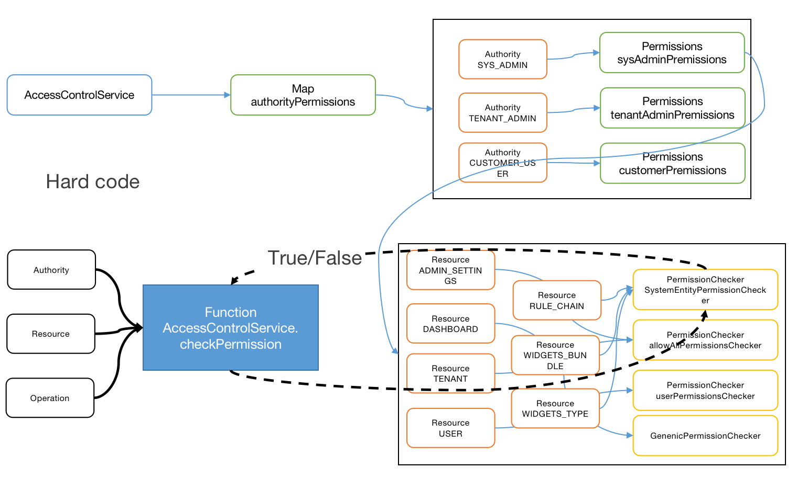

#### 环境准备

- release-3.2分支源码

#### 描述

//todo

#### 分析
以角色、资源权限、数据权限三种角度进行分析。

##### 角色

系统限定角色分为三类`SYSADMIN`、 `TENANT_ADMIN`、`CUSTOMER_USER`，在每个用于接受前端访问的接口方法上，均加上`@PreAuthorize`注解检查当前用户是否有访问权限，以获取设备详情为例，源码为：

```
//DeviceController 83
@PreAuthorize("hasAnyAuthority('TENANT_ADMIN', 'CUSTOMER_USER')")
@RequestMapping(value = "/device/{deviceId}", method = RequestMethod.GET)
@ResponseBody
public Device getDeviceById(@PathVariable(DEVICE_ID) String strDeviceId) throws ThingsboardException {
    checkParameter(DEVICE_ID, strDeviceId);
    try {
        DeviceId deviceId = new DeviceId(toUUID(strDeviceId));
        return checkDeviceId(deviceId, Operation.READ);
    } catch (Exception e) {
        throw handleException(e);
    }
}
```

说明角色为`TENANT_ADMIN`或`CUSTOMER_USER`才能访问该接口。

##### 资源权限

系统内置了（或者说叫Hard Code）一套针对具体角色的资源权限集合，入口类为`DefaultAccessControlService`，以角色为`TENANT_ADMIN`的用户通过设备编号获取设备详情为例，核心流程为：

```
//DeviceController 90
//调用checkDeviceId方法，操作为读取
return checkDeviceId(deviceId, Operation.READ);

//BaseController 473
//调用accessControlService的checkPermission方法，传递参数包含用户、资源类型、操作、设备编号等
accessControlService.checkPermission(getCurrentUser(), Resource.DEVICE, operation, deviceId, device);

//DefaultAccessControlService 53
//根据用户角色和资源获取PermissionChecker
//调用PermissionChecker的hasPermission检查用户的操作权限
PermissionChecker permissionChecker = getPermissionChecker(user.getAuthority(), resource);
if (!permissionChecker.hasPermission(user, operation)) {
		permissionDenied();
}

//TenantAdminPermissions 51
//判断用户租与实体（这里是设备）是否为统一租户编号
if (!user.getTenantId().equals(entity.getTenantId())) {
    return false;
}
return true;

```

关于AccessControlService访问流程的示意图如下：



##### 数据权限

//todo

#### TIPS
- 认证权限使用了Spring Security，
- 资源可查看枚举类：Resource,路径为`application/src/main/java/org/thingsboard/server/service/security/permission/Resource.java`