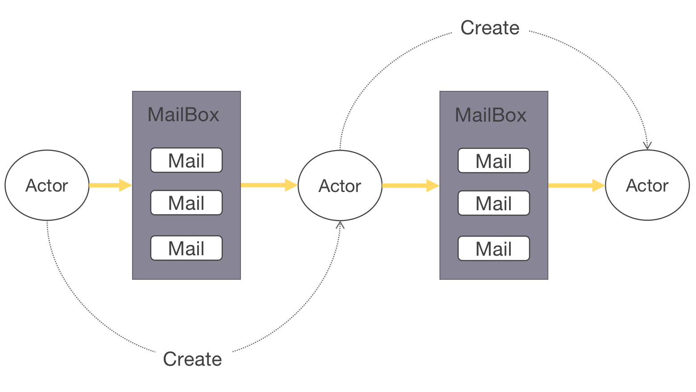
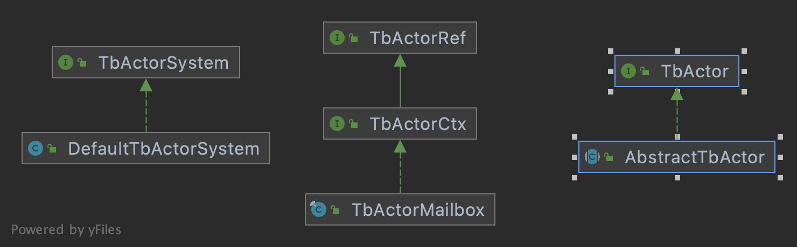
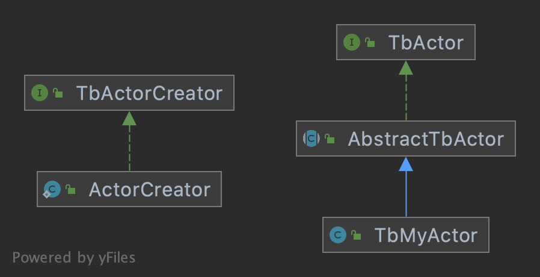
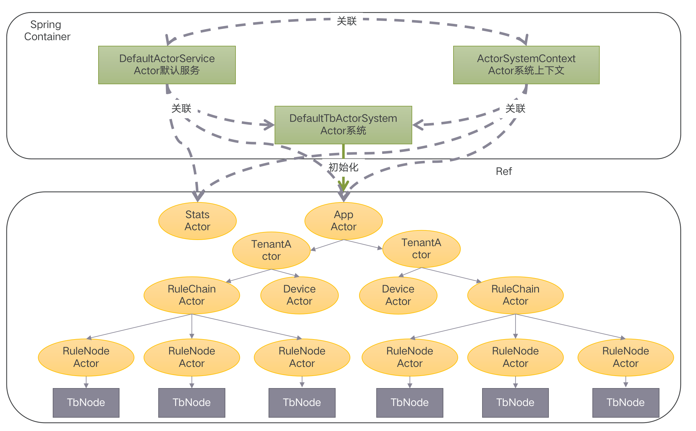

#### 环境准备

- release-3.2分支源码，可参考[编译](../编译/编译.md)


#### 描述

规则引擎是Thingsboard的核心部分，实时数据经过规则引擎进行处理并送至目的地。规则引擎的核心是Actor模型，在2.x版本中，Actor模型使用Akka实现，在3.x中官方自行实现。


##### 模型
开始分析之前，有必要先了解下Actor模型，维基百科的定义如下：

演员模型推崇的哲学是“一切皆是演员”，这与[面向对象编程](https://zh.wikipedia.org/wiki/面向对象编程)的“一切皆是对象”类似。
演员是一个运算实体，响应接收到的消息，相互间是[并发](https://zh.wikipedia.org/wiki/并发计算)的：
- 发送有限数量的消息给其他演员；
- 创建有限数量的新演员；
- 指定接收到下一个消息时要用到的行为。


系统中与Actor模型相关类都在工程`common/actor`下，几个核心类说明如下：
- TbActorSystem Actor系统接口，Actor系统类实现该接口
- TbActor Actor接口，所有Actor需直接或间接实现该接口
- TbActorCreator Actor创建接口，所有Actor创建器直接或间接实现该接口
- TbActorRef Actor句柄接口，使用TbActorCreator创建Actor后返回此句柄，通常指向Actor的邮箱。
- TbActorCtx Actor上下文接口，继承TbActorRef接口。
- AbstractTbActor 抽象Actor，实现TbActor接口。
- DefaultTbActorSystem Actor系统，用于Dispatcher的创建删除、Actor的创建查找和Actor之间消息传递等。
- Dispatcher 调度器，用于调度Actor的创建或消息分发。
- TbActorMailbox 邮箱，实现TbActorCtx接口，存储消息到队列并使用调度器处理队列中的消息。

类继承关系图如下：


基于以上类，实现一个Actor代码如下：
```
public class TbMyActor extends AbstractTbActor {

    public TbMyActor() {
    }
    
    @Override
    public boolean process(TbActorMsg msg) {
        //process some message
        return false;
    }
    /**
     * use this to create Actor
     */
    public static class ActorCreator implements TbActorCreator {

        public ActorCreator() {
        }

        @Override
        public TbActorId createActorId() {
            return new TbEntityActorId(new TenantId(EntityId.NULL_UUID));
        }

        @Override
        public TbActor createActor() {
            return new TbMyActor();
        }
    }

}
```
类继承关系如下：


##### 初始化
回到正题，`DefaultActorService`构造一个使用Actor模型系统的规则引擎，分为两个阶段：  
1. 类初始化，方法：`initActorSystem`
```
//DefaultActorService 84
log.info("Initializing actor system.");
actorContext.setActorService(this);
TbActorSystemSettings settings = new TbActorSystemSettings(actorThroughput, schedulerPoolSize, maxActorInitAttempts);
//新建DefaultTbActorSystem对象
system = new DefaultTbActorSystem(settings);
//创建线程池用于后续异步处理消息
system.createDispatcher(APP_DISPATCHER_NAME, initDispatcherExecutor(APP_DISPATCHER_NAME, appDispatcherSize));
system.createDispatcher(TENANT_DISPATCHER_NAME, initDispatcherExecutor(TENANT_DISPATCHER_NAME, tenantDispatcherSize));
system.createDispatcher(DEVICE_DISPATCHER_NAME, initDispatcherExecutor(DEVICE_DISPATCHER_NAME, deviceDispatcherSize));
system.createDispatcher(RULE_DISPATCHER_NAME, initDispatcherExecutor(RULE_DISPATCHER_NAME, ruleDispatcherSize));

actorContext.setActorSystem(system);
//创建整个Actor模型的根
appActor = system.createRootActor(APP_DISPATCHER_NAME, new AppActor.ActorCreator(actorContext));
actorContext.setAppActor(appActor);
//创建状态Actor，也是一个根，用于统计状态
TbActorRef statsActor = system.createRootActor(TENANT_DISPATCHER_NAME, new StatsActor.ActorCreator(actorContext, "StatsActor"));
actorContext.setStatsActor(statsActor);

log.info("Actor system initialized.");
```

2. 应用准备完成，方法为`onApplicationEvent`
```
//DefaultActorService 120
log.info("Received application ready event. Sending application init message to actor system");
//给顶层AppActor邮箱发送消息AppInitMsg
appActor.tellWithHighPriority(new AppInitMsg());
```
AppActor收到消息后，在doProcess方法中进行处理
```
//AppActor 67
if (!ruleChainsInitialized) {
  //初始化多个租户Actors
  initTenantActors();
  ruleChainsInitialized = true;
  if (msg.getMsgType() != MsgType.APP_INIT_MSG) {
    log.warn("Rule Chains initialized by unexpected message: {}", msg);
  }
}
```
TenantActor在init阶段进行租户下规则链RuleChainActor的创建
```
// TenantActor 88
if (isRuleEngineForCurrentTenant) {
    try {
        if (isolatedTenantId.map(id -> id.equals(tenantId)).orElseGet(() -> !tenantProfile.isIsolatedTbRuleEngine())) {
            if (apiUsageState.isReExecEnabled()) {
                log.info("[{}] Going to init rule chains", tenantId);
                //规则链节点初始化
                initRuleChains();
            } else {
                log.info("[{}] Skip init of the rule chains due to API limits", tenantId);
            }
        } else {
            isRuleEngineForCurrentTenant = false;
        }
    } catch (Exception e) {
        cantFindTenant = true;
    }
}
```

RuleChainActor在init阶段，创建RuleChainActorMessageProcessor并调用其start，进行规则节点RuleNodeActor的创建
```
//RuleChainActorMessageProcessor 100
if (!started) {
    RuleChain ruleChain = service.findRuleChainById(tenantId, entityId);
    if (ruleChain != null) {
        List<RuleNode> ruleNodeList = service.getRuleChainNodes(tenantId, entityId);
        log.trace("[{}][{}] Starting rule chain with {} nodes", tenantId, entityId, ruleNodeList.size());
        // Creating and starting the actors;
        for (RuleNode ruleNode : ruleNodeList) {
            log.trace("[{}][{}] Creating rule node [{}]: {}", entityId, ruleNode.getId(), ruleNode.getName(), ruleNode);
            //创建规则节点
            TbActorRef ruleNodeActor = createRuleNodeActor(context, ruleNode);
            //加入到节点集合中
            nodeActors.put(ruleNode.getId(), new RuleNodeCtx(tenantId, self, ruleNodeActor, ruleNode));
        }
        //初始化节点路由
        initRoutes(ruleChain, ruleNodeList);
        started = true;
    }
} else {
    onUpdate(context);
}
```

RuleNodeActor在init阶段，创建RuleNodeActorMessageProcessor并调用其start，进行TbNode的创建

```
//RuleNodeActorMessageProcessor 62
//根据类型创建TbNode实例
tbNode = initComponent(ruleNode);
if (tbNode != null) {
    state = ComponentLifecycleState.ACTIVE;
}
```

当与设备相关消息开始上传时，TenantActor还会初始化DeviceActor

```
//TenantActor 153
case TRANSPORT_TO_DEVICE_ACTOR_MSG:
    //传递消息给DeviceActor，如果没有则创建
    onToDeviceActorMsg((DeviceAwareMsg) msg, false);
    break;
```

形成的结构如下：



##### 消息传输
完成规则初始化后，规则引擎接受消息传输，以普通设备上传时序数据存储进时序数据为例，规则引擎处理的核心处理流程如下：
```
//ActorSystemContext 561
//传递消息到AppActor邮箱中
appActor.tell(tbActorMsg);

//AppActor 84
//根据消息类型转换消息为QueueToRuleEngineMsg，调用onQueueToRuleEngineMsg方法
onQueueToRuleEngineMsg((QueueToRuleEngineMsg) msg);

//AppActor 140
//创建或获取租户Actor邮箱，并传递消息
getOrCreateTenantActor(msg.getTenantId()).tell(msg);

//TenantActor 150
//根据消息类型转换消息为QueueToRuleEngineMsg，调用onQueueToRuleEngineMsg方法
onQueueToRuleEngineMsg((QueueToRuleEngineMsg) msg);

//TenantActor 185
//获取根规则链Actor邮箱，并传递消息
getRootChainActor().tell(msg);

//RuleChainActor 55
//根据消息类型转换消息为QueueToRuleEngineMsg，使用处理器RuleChainActorMessageProcessor处理消息
processor.onQueueToRuleEngineMsg((QueueToRuleEngineMsg) msg);

//RuleChainActorMessageProcessor 215
//如果消息中未指定规则节点，targetCtx为第一个节点邮箱，否则为指定节点邮箱
pushMsgToNode(targetCtx, msg, "");

//RuleChainActorMessageProcessor 338
//新建RuleChainToRuleNodeMsg消息，并向规则节点邮箱发送消息
nodeCtx.getSelfActor().tell(new RuleChainToRuleNodeMsg(new DefaultTbContext(systemContext, ruleChainName, nodeCtx), msg, fromRelationType));

//RuleNodeActor 60
//根据消息类型转换消息为RuleChainToRuleNodeMsg，调用onRuleChainToRuleNodeMsg处理该消息
onRuleChainToRuleNodeMsg((RuleChainToRuleNodeMsg) msg);

//RuleNodeActor 94 
//使用处理器RuleChainActorMessageProcessor处理消息
//processor.onRuleChainToRuleNodeMsg(msg);

//RuleChainActorMessageProcessor 136
//调用规则节点实例处理消息
tbNode.onMsg(msg.getCtx(), msg.getMsg());
```
//todo 图


#### TIPS

- Actor模型 [wiki](https://en.wikipedia.org/wiki/Actor_model)


