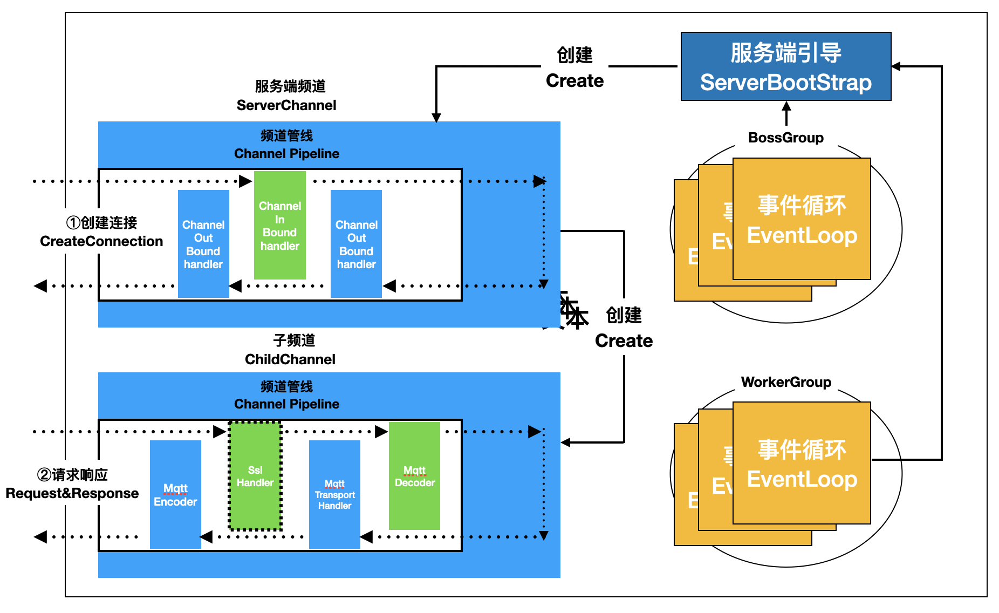

#### 环境准备

- release-3.2分支源码


#### 描述
以MQTT协议接入为例，分析Thingsboard如何完成设备连接，使用Mqtt客户端连接服务端只需发送CONNECT消息，等待服务端返回CONNACK消息即可，示意图如下：


#### 分析
入口：`MqttTransportService`

#### 初始化

##### 服务端
通过 init方法进行初始化，主要是使用Netty构造服务端并完成监听。
```
log.info("Setting resource leak detector level to {}", leakDetectorLevel);
//设置内存泄漏检测级别
ResourceLeakDetector.setLevel(ResourceLeakDetector.Level.valueOf(leakDetectorLevel.toUpperCase()));

log.info("Starting MQTT transport...");
//创建主循环组
bossGroup = new NioEventLoopGroup(bossGroupThreadCount);
//创建工作循环组
workerGroup = new NioEventLoopGroup(workerGroupThreadCount);
//创建服务端引导实例并设置
ServerBootstrap b = new ServerBootstrap();
b.group(bossGroup, workerGroup)
        .channel(NioServerSocketChannel.class)
        .childHandler(new MqttTransportServerInitializer(context))
        .childOption(ChannelOption.SO_KEEPALIVE, keepAlive);
//监听地址和端口
serverChannel = b.bind(host, port).sync().channel();
log.info("Mqtt transport started!");
```
##### 管道
当有客户端连接时，MqttTransportServerInitializer初始化管道处理链
```
//获取channel管道
ChannelPipeline pipeline = ch.pipeline();
String remoteAddress = ch.remoteAddress().toString();
log.info("init channel for address: [{}]",remoteAddress);
SslHandler sslHandler = null;
//如果有SslHandlerProvider，增加ssl handler
if (context.getSslHandlerProvider() != null) {
    sslHandler = context.getSslHandlerProvider().getSslHandler();
    pipeline.addLast(sslHandler);
}
//增加Mqtt解码器到管道
pipeline.addLast("decoder", new MqttDecoder(context.getMaxPayloadSize()));
//增加Mqtt编码器到管道
pipeline.addLast("encoder", MqttEncoder.INSTANCE);
//新建Mqtt处理Handler，用于处理Mqtt消息
MqttTransportHandler handler = new MqttTransportHandler(context, sslHandler);
//增加MqttHandler到管道
pipeline.addLast(handler);
//channel关闭监听增加MqttHandler
ch.closeFuture().addListener(handler);
```

初始化示意图如下：


#### 设备连接
在MqttTransportHandler中进行Mqtt消息处理，以一个认证为AccessToken的设备进行连接举例，核心处理流程如下：
```
//MqttTransportHandler 132
processMqttMsg(ctx, (MqttMessage) msg);


//MqttTransportHandler 154
processConnect(ctx, (MqttConnectMessage) msg);

//MqttTransportHandler 474
processAuthTokenConnect(ctx, msg);

//MqttTransportHandler 492
//调用transportService处理消息，如果成功返回结果，调用onValidateDeviceResponse
transportService.process(DeviceTransportType.MQTT, request.build(),
        new TransportServiceCallback<>() {
            @Override
            public void onSuccess(ValidateDeviceCredentialsResponse msg) {
                onValidateDeviceResponse(msg, ctx, connectMessage);
            }

            @Override
            public void onError(Throwable e) {
                log.trace("[{}] Failed to process credentials: {}", address, userName, e);
                ctx.writeAndFlush(createMqttConnAckMsg(MqttConnectReturnCode.CONNECTION_REFUSED_SERVER_UNAVAILABLE, connectMessage));
                ctx.close();
            }
        });

//todo

//MqttTransportHandler 646
transportService.process(deviceSessionCtx.getSessionInfo(), DefaultTransportService.getSessionEventMsg(SessionEvent.OPEN), new TransportServiceCallback<Void>() {
    @Override
    public void onSuccess(Void msg) {
        SessionMetaData sessionMetaData = transportService.registerAsyncSession(deviceSessionCtx.getSessionInfo(), MqttTransportHandler.this);
        checkGatewaySession(sessionMetaData);
        ctx.writeAndFlush(createMqttConnAckMsg(CONNECTION_ACCEPTED, connectMessage));
        log.info("[{}] Client connected!", sessionId);
    }

    @Override
    public void onError(Throwable e) {
        if (e instanceof TbRateLimitsException) {
            log.trace("[{}] Failed to submit session event", sessionId, e);
        } else {
            log.warn("[{}] Failed to submit session event", sessionId, e);
        }
        ctx.writeAndFlush(createMqttConnAckMsg(MqttConnectReturnCode.CONNECTION_REFUSED_SERVER_UNAVAILABLE, connectMessage));
        ctx.close();
    }
});
        

```
其中transportService有两种实现：`LocalTransportService`和`RemoteTransportService`，分别在单片架构和微服务架构下使用：在单片架构下，`LocalTransportService`调用本地服务类进行验证；在微服务集群架构下`RemoteTransportService`将请求丢进消息中间件（Kafka等），等待其他服务接受请求进行处理后将验证结果丢回中间件。

#### TIPS

- [MQTT协议中文版](https://github.com/mcxiaoke/mqtt)
- [MQTT中文网](http://mqtt.p2hp.com/)
- [Netty官方](https://netty.io/)