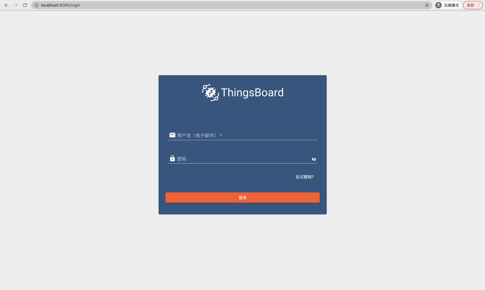
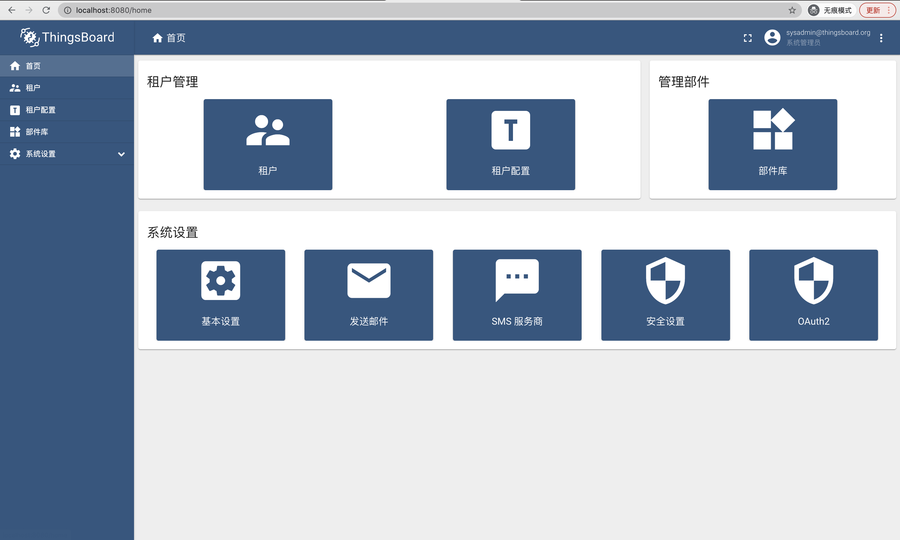

#### 环境准备

- 用于部署的机器，本文使用Centos7.8虚拟机，1核心1G内存
- 支持Html5的浏览器，本文使用Chrome

#### 描述

使用官方Rpm包安装3.2.2版本，数据库使用Postgresql，消息队列使用In Memory。


#### 准备
- Jdk安装（已有可跳过）
```
# install openjdk 11
sudo yum install -y java-11-openjdk
# set default to openjdk 11
sudo update-alternatives --config java
```
检查版本
```
java -version

openjdk version "11.0.xx"
OpenJDK Runtime Environment (...)
OpenJDK 64-Bit Server VM (build ...)
```

- Postgresql安装（已有可跳过）
```
# Update your system
sudo yum update
# Install the repository RPM (for CentOS 7):
sudo yum -y install https://download.postgresql.org/pub/repos/yum/reporpms/EL-7-x86_64/pgdg-redhat-repo-latest.noarch.rpm
# Install packages
sudo yum -y install epel-release yum-utils
sudo yum-config-manager --enable pgdg12
sudo yum install postgresql12-server postgresql12
# Initialize your PostgreSQL DB
sudo /usr/pgsql-12/bin/postgresql-12-setup initdb
sudo systemctl start postgresql-12
# Optional: Configure PostgreSQL to start on boot
sudo systemctl enable --now postgresql-12
```
密码初始化
```
sudo su - postgres
psql
\password
\q
exit
```
修改配置文件
```
sudo vi /var/lib/pgsql/12/data/pg_hba.conf
```
替换内容`ident`--->`md5`
```
# IPv4 local connections:
#host    all             all             127.0.0.1/32            ident
host    all             all             127.0.0.1/32            md5
```
重启
```
sudo systemctl restart postgresql-12.service
```
- 数据库初始化
相关替换${postgres-ip}为真实Postgresql地址，本地可以是`127.0.0.1`
```
sudo su - postgres
psql -U postgres -d postgres -h ${postgres-ip} -W
CREATE DATABASE thingsboard;
\q
exit
```
如果有可视化工具，比如Idea或DataGrip，也可以直接创建数据库`thingsboard`,不用执行以上命令。
- 安装包下载（已有可跳过）
```
yum install -y wget
cd /path/to
wget https://github.com/thingsboard/thingsboard/releases/download/v3.2.2/thingsboard
```

#### 部署
- 安装
```
sudo rpm -Uvh thingsboard-3.2.2.rpm
```
- 配置
```
sudo vi /etc/thingsboard/conf/thingsboard.conf
```
替换`${postgres-ip}`为pg地址，替换`${postgres-password}`为数据库密码
```
# DB Configuration 
export DATABASE_ENTITIES_TYPE=sql
export DATABASE_TS_TYPE=sql
export SPRING_JPA_DATABASE_PLATFORM=org.hibernate.dialect.PostgreSQLDialect
export SPRING_DRIVER_CLASS_NAME=org.postgresql.Driver
export SPRING_DATASOURCE_URL=jdbc:postgresql://${postgres-ip}:5432/thingsboard
export SPRING_DATASOURCE_USERNAME=postgres	
export SPRING_DATASOURCE_PASSWORD=${postgres-password}
export SPRING_DATASOURCE_MAXIMUM_POOL_SIZE=5
# Specify partitioning size for timestamp key-value storage. Allowed values: DAYS, MONTHS, YEARS, INDEFINITE.
export SQL_POSTGRES_TS_KV_PARTITIONING=MONTHS
```
- 初始化
使用示例数据（如果不需要可以去掉 `--loadDemo`）
```
sudo /usr/share/thingsboard/bin/install/install.sh --loadDemo
```
- 启动
```
service thingsboard start
```

#### 验证
默认系统工作在8080端口，使用Chrome打开`http://${ip}:8080`，`${ip}`需要替换为真实IP地址，进入登录页。

使用以下3组账号登录系统
- System Administrator: sysadmin@thingsboard.org / sysadmin

- Tenant Administrator: tenant@thingsboard.org / tenant

- Customer User: customer@thingsboard.org / customer

系统管理员首页如下


#### 其他

- 问题定位
日志目录默认在`/var/log/thingsboard`目录下，通过以下命令查看错误：
```
cat /var/log/thingsboard/thingsboard.log | grep ERROR
```
- 开机启动
```
# Optional: Configure Thingsboard to start on boot
sudo systemctl enable --now thingsboard
```
- 停止
```
sudo service thingsboard stop
```
- 更新
```
sudo rpm -Uvh thingsboard-3.2.2.rpm
```
- 卸载
```
sudo rpm -e thingsboard-0:3.2.2-1
```


#### TIPS
- `tenant@thingsboard.org`、`customer@thingsboard.org`账号的生成需要在执行初始化脚本时，指定`--loadDemo`。
- [官方安装文档](https://thingsboard.io/docs/user-guide/install/installation-options/)
- 生产环境推荐数据存储使用Hybrid模式：Postgresql+Cassandra，Postgresql存储关系数据，Cassandra存储时序数据，[官方说明](https://thingsboard.io/docs/reference/#sql-vs-nosql-vs-hybrid-database-approach)
- 消息队列还支持Kafka、RabbitMQ、AWS SQS、Google Pub/Sub、Azure Service Bus和Confluent Cloud，生产中推荐使用前两者。

