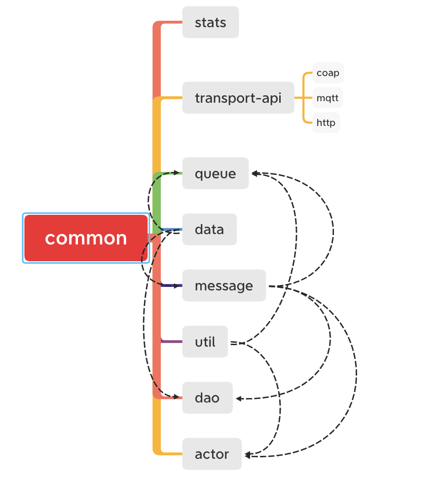

#### 环境准备

- release-3.2分支源码，可参考[编译](../编译/编译.md)获取源码
- IDE Idea或Eclipse，本文使用Idea


#### 准备

使用Idea打开源码工程。


双击`common`文件夹。

#### 分析

通过名称可以判断此工程是通用模块，application等其他模块多少和此工程有依赖关系。

对`pom.xml`进行基础分析

- modules

  ```
  <modules>
    <module>data</module>
    <module>util</module>
    <module>message</module>
    <module>actor</module>
    <module>queue</module>
    <module>transport</module>
    <module>dao-api</module>
    <module>stats</module>
  </modules>
  ```
  common包含`data`、`util`、`message`、`actor`、`queue`、`transport`、`dao-api`、`stats`子工程。
  
- actor
  pom分析如下：
  
  ```
  <dependencies>
    <dependency>
    <groupId>org.thingsboard.common</groupId>
    <artifactId>util</artifactId>
    </dependency>
    <dependency>
    <groupId>org.thingsboard.common</groupId>
    <artifactId>message</artifactId>
    </dependency>
    ......
  </dependencies>
  ```
  内部依赖：`util`、`message`，外部依赖主要是`slf4j`（门面日志）、`logback`（日志框架）、`junit（单元测试）`
  
- dao-api
  pom分析如下：
  ```
  <dependencies>
    <dependency>
    <groupId>org.thingsboard.common</groupId>
    <artifactId>data</artifactId>
    </dependency>
    <dependency>
    <groupId>org.thingsboard.common</groupId>
    <artifactId>message</artifactId>
    </dependency>
    <dependency>
    <groupId>com.google.guava</groupId>
    <artifactId>guava</artifactId>
    </dependency>
    ......
  </dependencies>  
  ```

 内部依赖：`data`、`message`，外部有`guava`（google基础工具类库）、`javax.annotation-api`（java注解支持）、`json-schema-validator（json结构检查）`、`java-driver-core`（Cassandra驱动）、`jackson-databind`（json序列化与反序列化）、`spring-boot-autoconfigure`（spring-boot注解支持）、`metrics-jmx`（JMX实时指标类库）、`slf4j`、`logback`、`junit`。

- data

  pom分析如下：

  ```
  <dependencies>
    <dependency>
    <groupId>org.slf4j</groupId>
    <artifactId>slf4j-api</artifactId>
    </dependency>
    <dependency>
    <groupId>org.slf4j</groupId>
    <artifactId>log4j-over-slf4j</artifactId>
    </dependency>
  	......
  </dependencies>          
  ```

  内部依赖：`protobuf-dynamic`，外部依赖：`java-driver-core`、`jackson-databind`、`slf4j`、`logback`、`junit`。

- message

  pom分析如下：

  ```
  <dependencies>
    <dependency>
    <groupId>org.thingsboard.common</groupId>
    <artifactId>data</artifactId>
    </dependency>
    <dependency>
    <groupId>org.bouncycastle</groupId>
    <artifactId>bcprov-jdk15on</artifactId>
    </dependency>
    ......
  </dependencies>  
  ```
  内部依赖：`data`，外部依赖：`bcprov-jdk15on`（加密算法）、`bucket4j-core`（流量限制）、`protobuf-java`（protobuf序列化与反序列化）、`slf4j`、`logback`、`junit`。

- queue
  pom分析如下：  

  ```
  <dependencies>
    <dependency>
    <groupId>org.thingsboard.common</groupId>
    <artifactId>data</artifactId>
    </dependency>
    <dependency>
    <groupId>org.thingsboard.common</groupId>
    <artifactId>util</artifactId>
    </dependency>
    ......
  </dependencies>  
  ```
  内部依赖：`data`、`util`、`message`、`stats`，外部依赖：`kafka-clients`（kafka客户端）、`aws-java-sdk-sqs`（aws sqs客户端）、`google-cloud-pubsub`（google pubsub客户端）、`azure-servicebus`（azure servicebus客户端）、`amqp-client`（amqp客户端）、`spring-context-support`（Spring上下文支持）、`spring-boot-autoconfigure`（Spring boot注解支持）、`guava`(google基础工具类库)、`gson`(google json序列化与反序列化)、`commons-lang3`（apache 基础类库）、`protobuf-java`（protobuf序列化与反序列化）、`curator-recipes`（zookeeper客户端）、`slf4j`、`logback`、`junit`。
  
- stats
  pom分析如下：
  ```
   <dependencies>
     <dependency>
     <groupId>com.google.guava</groupId>
     <artifactId>guava</artifactId>
     <scope>provided</scope>
     </dependency>
     <dependency>
     <groupId>org.slf4j</groupId>
     <artifactId>slf4j-api</artifactId>
     </dependency>
     ......
  </dependencies>  
  ```
  外部依赖：`guava`(google基础工具类库)、`spring-boot-starter-actuator`（Spring boot健康监控）、`micrometer-core`（指标抽象）、`micrometer-registry-prometheus`（prometheus指标micrometer实现）、`slf4j`、`logback`、`junit`
- transport
  pom分析如下：
  ```
  <modules>
    <module>transport-api</module>
    <module>mqtt</module>
    <module>http</module>
    <module>coap</module>
  </modules>
  ```
  transport包含`transport-api`、`mqtt`、`http`、`coap`子工程。

- transport/transport-api
  pom分析如下：
  ```
   <dependencies>
     <dependency>
     <groupId>org.thingsboard.common</groupId>
     <artifactId>queue</artifactId>
     </dependency>
     <dependency>
     <groupId>org.thingsboard.common</groupId>
     <artifactId>stats</artifactId>
     </dependency>
     ......
  </dependencies>  
  ```
  内部依赖：`queue`、`stats`、`data`、`message`、`util`，外部依赖：`gson`(google json序列化与反序列化)、`fst`（Java对象序列化与反序列化）、`spring-context`（Spring上下文）、`spring-boot-starter-web`（spring boot web starter）、`guava`（google基础工具类库）、`commons-lang3`（apache 基础类库）、`protobuf-java`（protobuf序列化与反序列化）、`slf4j`、`logback`、`junit`
  
- transport/http
  pom分析如下：
  
  ```
   <dependencies>
     <dependency>
     <groupId>org.thingsboard.common.transport</groupId>
     <artifactId>transport-api</artifactId>
     </dependency>
     <dependency>
     <groupId>org.springframework.boot</groupId>
     <artifactId>spring-boot-starter-web</artifactId>
     <scope>provided</scope>
     </dependency>
     ......
  </dependencies>   
  ```
  内部依赖：`transport-api`，外部依赖：`spring-boot-starter-web`（spring boot web starter）、`spring-boot-starter-test`(spring boot测试依赖)、`slf4j`、`logback`、`junit`
- transport/mqtt
  pom分析如下：
  ```
  <dependencies>
    <dependency>
    <groupId>org.thingsboard.common.transport</groupId>
    <artifactId>transport-api</artifactId>
    </dependency>
    <dependency>
    <groupId>io.netty</groupId>
    <artifactId>netty-all</artifactId>
    </dependency>
    ......
  </dependencies> 
          
  ```
  与`transport/http`类似，额外使用了`netty-all`(java网络框架)、`guava`（google基础工具类库）、`jsr305`（代码检查支持）
- transport/coap
  pom分析如下：
  
  ```
   <dependencies>
     <dependency>
     <groupId>org.thingsboard.common.transport</groupId>
     <artifactId>transport-api</artifactId>
     </dependency>
     <dependency>
     <groupId>org.eclipse.californium</groupId>
     <artifactId>californium-core</artifactId>
     </dependency>
     ......
  </dependencies>   
  ```
  与`transport/http`类似，额外使用了`californium-core`(coap协议开源实现)
  
- util
  pom分析如下：
  ```
  dependencies>
    <dependency>
    <groupId>com.google.guava</groupId>
    <artifactId>guava</artifactId>
    <scope>provided</scope>
    </dependency>
    <dependency>
    <groupId>javax.annotation</groupId>
    <artifactId>javax.annotation-api</artifactId>
    </dependency>
    ......
  </dependencies>  
        
  ```
  外部依赖：`guava`（google基础工具类库）、`javax.annotation-api`（java注解支持）、`slf4j`、`logback`、`junit`

#### 结论
通过分析，可以得出以下结论：

- 子工程依赖关系如下：
  

#### TIPS
- thingsboard当前支持3种传输协议：`http`、`mqtt`、`coap`和此子工程有所关联,官方文档[协议](https://thingsboard.io/docs/reference/protocols/)
- thingsboard微服务集群支持多种消息队列和此工程有所关联，官方文档[协议](https://thingsboard.io/docs/reference/#message-queues-are-awesome)

