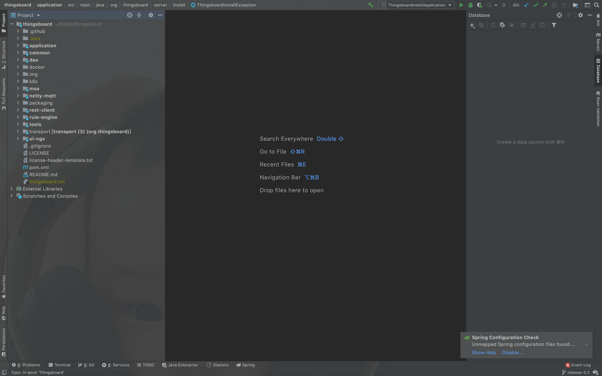

#### 环境准备

- release-3.2分支源码，可参考[编译](编译.md)获取源码
- IDE Idea或Eclipse，本文使用Idea


#### 准备

使用Idea打开源码工程。



双击`rule-engine`文件夹。

#### 分析
通过名称可以得知，该工程与规则引擎相关

`pom.xml`基础分析

```
<modules>
  <module>rule-engine-api</module>
  <module>rule-engine-components</module>
</modules>
```

rule-engine包含`rule-engine-api`、`rule-engine-components`子工程。

- rule-engine-api

  `pom.xml`基础分析

  ```
  <dependencies>
    <dependency>
    <groupId>org.thingsboard.common</groupId>
    <artifactId>message</artifactId>
    <scope>provided</scope>
    </dependency>
    <dependency>
    <groupId>org.thingsboard.common</groupId>
    <artifactId>dao-api</artifactId>
    <scope>provided</scope>
    </dependency>
    ......
   </dependencies>       
  ```

  内部依赖：`message`、`dao-api`、`util`，外部核心依赖：`netty-all`（网络框架）、`guava`（Google基础工具类库）、`java-driver-core`（Cassandra驱动）、`spring-data-redis`（Redis客户端）、`javax.mail`（邮件客户端）、`logback`、`junit`。

- rule-engine-components

  `pom.xml`基础分析

  ```
  <dependencies>
    <dependency>
    <groupId>org.thingsboard.common</groupId>
    <artifactId>util</artifactId>
    <scope>provided</scope>
    </dependency>
    <dependency>
    <groupId>org.thingsboard</groupId>
    <artifactId>dao</artifactId>
    <scope>provided</scope>
    </dependency>
    ......
   </dependencies>   
  ```
  内部依赖：`transport-api`、`dao`、`util`、`rule-engine-api`、`netty-mqtt`，外部核心依赖：`guava`（Google基础工具类库）、`gson`(Json序列化与反序列化)、`kafka-clients`（kafka客户端）、`aws-java-sdk-sqs`（aws sqs客户端）、`google-cloud-pubsub`（google pubsub客户端）、`amqp-client`（amqp客户端）、`proto-google-common-protos`（谷歌通用协议）、`javax.mail`（邮件客户端）、`logback`、`junit`。

#### 结论
通过分析，可以得出以下结论：
- 该子工程与规则引擎相关
- 规则链支持多种消息队列、邮件等。


#### TIPS
- 规则引擎是Thingsboard核心部分，用于实时数据流处理等，文档见[规则引擎架构](https://thingsboard.io/docs/user-guide/rule-engine-2-0/architecture/)