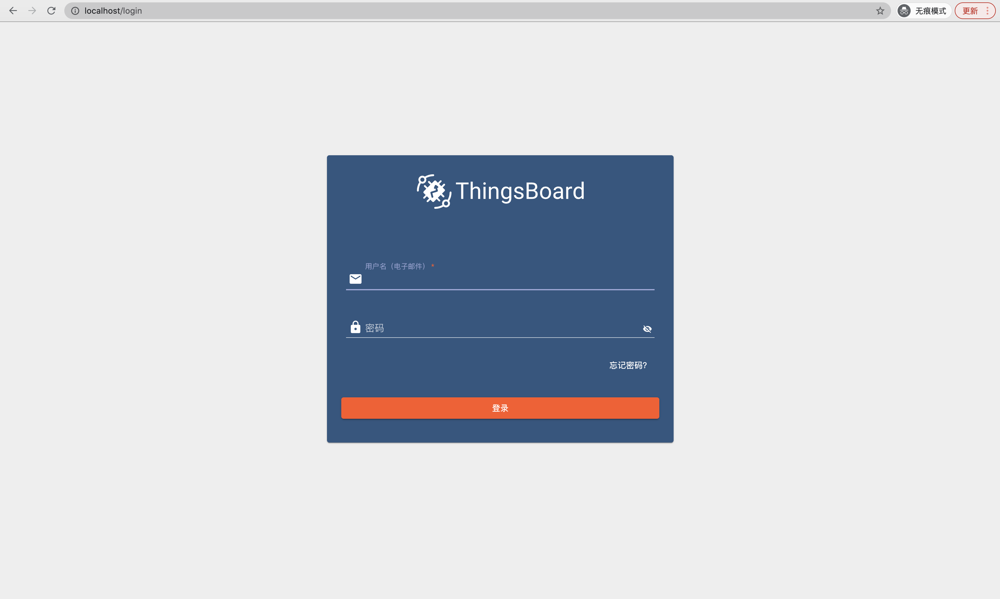
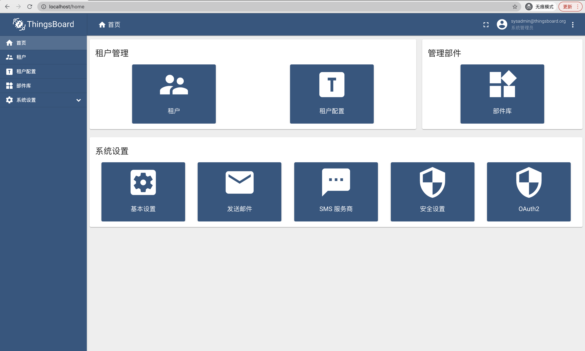

#### 环境准备

- 用于部署的机器，本文使用Centos7.8虚拟机，4核心8G内存
- Docker以及Docker Compose，Docker建议1.19.3+，Docker Compose建议1.27.0+
- 支持Html5的浏览器，本文使用Chrome

#### 描述

使用Docker Compose运行微服务集群，数据库使用Postgresql+Cassandra，消息队列使用Kafka。

#### 准备

- Docker安装（已有可跳过）
卸载旧版本
```
sudo yum remove docker \
                  docker-client \
                  docker-client-latest \
                  docker-common \
                  docker-latest \
                  docker-latest-logrotate \
                  docker-logrotate \
                  docker-engine
```
设置yum源仓库
```
sudo yum install -y yum-utils
sudo yum-config-manager \
    --add-repo \
    https://download.docker.com/linux/centos/docker-ce.repo
```
安装
```
sudo yum install docker-ce docker-ce-cli containerd.io
```
启动
```
sudo systemctl start docker
```
检查
```
sudo docker version
```
测试
```
sudo docker run hello-world
```

- Docker Compose安装（已有可跳过）
下载
```
sudo curl -L "https://github.com/docker/compose/releases/download/1.29.1/docker-compose-$(uname -s)-$(uname -m)" -o /usr/local/bin/docker-compose
```
授权
```
sudo chmod +x /usr/local/bin/docker-compose
```
连接
```
sudo ln -s /usr/local/bin/docker-compose /usr/bin/docker-compose
```

检查
```
sudo docker-compose --version
```

- 启动脚本下载（已有源码工程可跳过）
git安装
```
sudo yum install -y git
```
源码下载（脚本在docker目录下）
```

cd /path/to
sudo git clone https://github.com/thingsboard/thingsboard.git

```

- 镜像获取

基础镜像
```
sudo docker pull postgres:12
sudo docker pull redis:4.0
sudo docker pull zookeeper:3.5
sudo docker pull wurstmeister/kafka:2.13-2.6.0
sudo docker pull xalauc/haproxy-certbot:1.7.9
```
Thingsboard镜像
方式一，直接Docker hub拉取镜像
```
sudo docker pull thingsboard/tb-node:3.2.2
sudo docker pull thingsboard/tb-web-ui:3.2.2
sudo docker pull thingsboard/tb-js-executor:3.2.2
sudo docker pull thingsboard/tb-http-transport:3.2.2
sudo docker pull thingsboard/tb-mqtt-transport:3.2.2
sudo docker pull thingsboard/tb-coap-transport:3.2.2
```
方式二，拉取源码编译镜像（耗时较长，会编译一些额外的Dockerfile，**不推荐**）
```
cd /path/to
sudo git clone https://github.com/thingsboard/thingsboard.git
sudo mvn clean install -DskipTests=true -Ddockerfile.skip=false
```

#### 部署
切换目录
```
cd /path/to/thingsboard/docker
```
修改环境变量
```
sudo vi .env
```
检查以下键值对内容
```
DATABASE=postgres
TB_QUEUE_TYPE=kafka
TB_VERSION=3.2.2
```
生成日志目录（用于日志挂载）
```
./docker-create-log-folders.sh
```
初始化环境
```
sudo ./docker-install-tb.sh --loadDemo
```
启动
```
sudo ./docker-start-services.sh
```
#### 验证
默认系统工作在`80`端口，使用Chrome打开`http://${ip}`，`${ip}`需要替换为真实IP地址，进入登录页。



使用以下3组账号登录系统进行验证

- System Administrator: sysadmin@thingsboard.org / sysadmin
- Tenant Administrator: tenant@thingsboard.org / tenant
- Customer User: customer@thingsboard.org / customer

系统管理员首页如下




#### 其他

- 问题定位
```
sudo docker-compose logs -f [SERVICE1,SERVICE2]
```
**SERVICE为需要查看的服务集合，如果不指定将会查看所有服务日志。**
- 查看容器状态
```
sudo docker-compose ps
```
- 停止
```
sudo ./docker-stop-services.sh
```
- 移除
```
sudo ./docker-remove-services.sh
```
- 更新
```
sudo ./docker-update-service.sh [SERVICE1,SERVICE2]
```
**SERVICE为需要更新的服务集合，如果不指定将会更新所有服务。**

#### TIPS
- 默认启动容器较多，可修改`docker-compose.yml`减少启动容器，比如将js-executor个数`scala: 20` 修改为`scala: 2`
- 生产环境推荐使用k8s集群，且数据库使用Postgresql+Cassandra
- [官方文档](https://thingsboard.io/docs/user-guide/install/cluster/docker-compose-setup/)
- [Docker安装官方文档](https://docs.docker.com/install/)
- [Docker Compose安装官方文档](https://docs.docker.com/compose/install/)