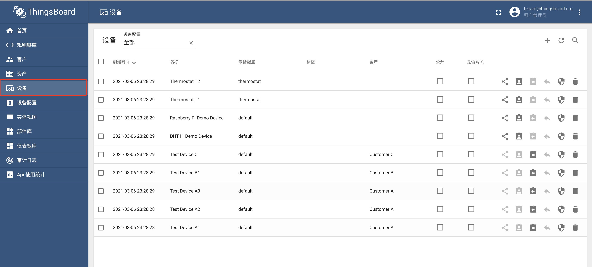
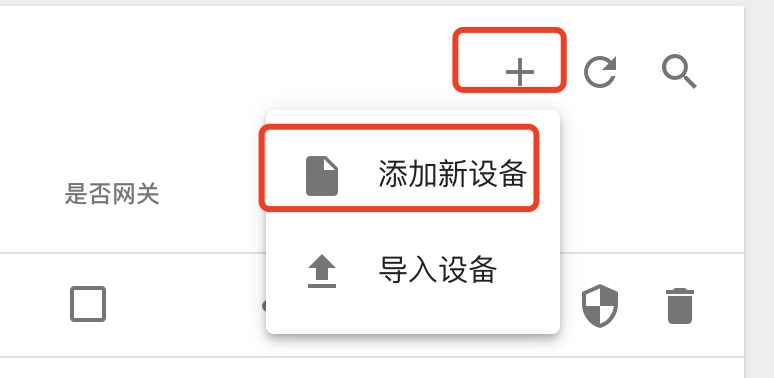
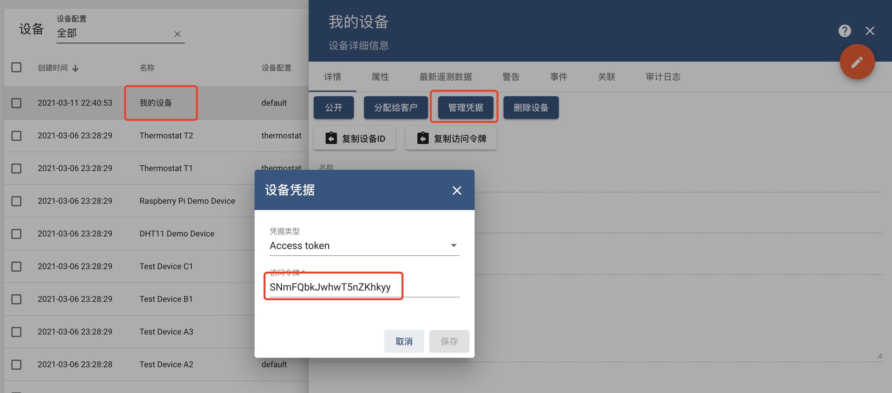
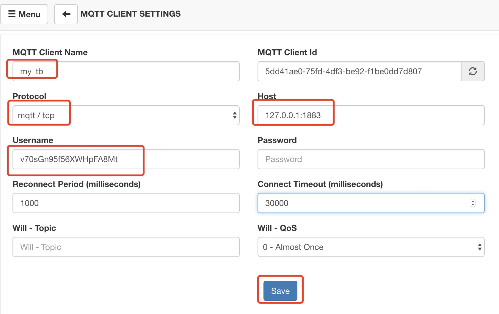
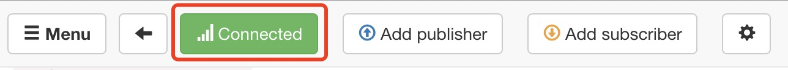
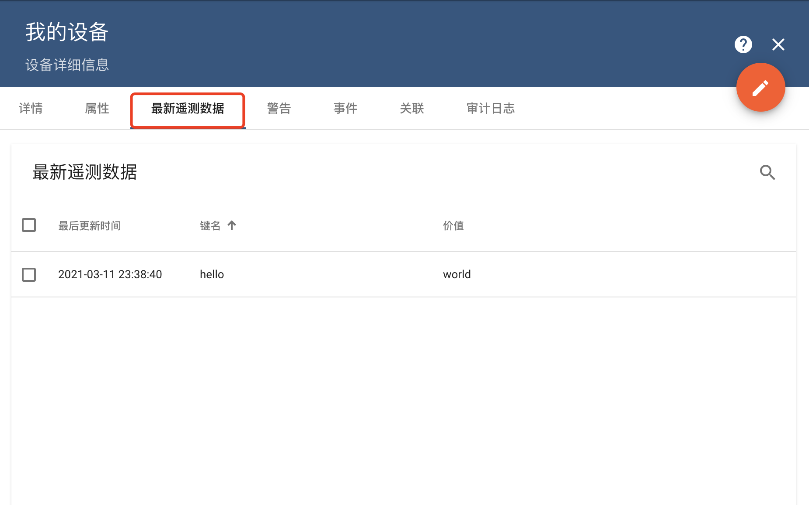

#### 环境准备

- 已经编译且能成功运行的代码环境，可参考前作。
- IDE Idea或Eclipse，本文使用Idea
- [MqttBox](http://workswithweb.com/mqttbox.html)，一个Mqtt客户端
- 支持Html5的浏览器，本文使用Chrome 


#### 设备创建
启动程序，使用`tenant@thingsboard.org`账号登录系统，进入设备页面



点击右侧`+`号，选择`添加新设备`菜单



输入`名称`（必须），填写`说明`(可选)，点击`添加`按钮


可以看到设备列表中出现了新建的设备`我的设备`，点击`我的设备`，查看`管理凭据`，默认系统为设备生成了`Access token`




#### 设备连接

系统默认支持Http、Mqtt、Coap三种协议进行数据接入，本文使用MqttBox模拟设备通过Mqtt协议连接系统。

MqttClient配置如下，其中`Host`填写本机1883端口，`Username`填写访问令牌内容



点击`save`按钮进行保存,观察最上方连接状态，绿色代表连接成功




#### 数据上传

在Mqttbox中指定需要发布消息的topic

```
v1/devices/me/telemetry
```

以及消息内容（Json格式，3.2版本还支持protobuf）

```
{"hello":"world"}
```

点击`Publish`按钮进行发布


在平台上`我的设备`的`最新遥测数据`Tab页中查看数据，能查到上一步发布的数据代表成功。



#### TIPS

* 添加设备时，有更完整的流程可以尝试
* 平台支持多种协议接入： [http](https://thingsboard.io/docs/reference/http-api/)、[mqtt](https://thingsboard.io/docs/reference/mqtt-api/) 、[coap](https://thingsboard.io/docs/reference/coap-api/)
* 平台支持5种数据格式，string、boolean、double、long以及json
* 设备支持多种认证，[Access Tokens](https://thingsboard.io/docs/user-guide/access-token/) 、[Basic MQTT Credentials](https://thingsboard.io/docs/user-guide/basic-mqtt/) 以及[X.509 Certificates](https://thingsboard.io/docs/user-guide/certificates/) 
* 平台支持通过csv批量导入设备 [Bulk Provisioning](https://thingsboard.io/docs/user-guide/bulk-provisioning/)
* 更多信息查看平台官方文档 [Getting Started](https://thingsboard.io/docs/getting-started-guides/helloworld/?connectdevice=mqtt-windows#introduction)、[设备操作](https://thingsboard.io/docs/user-guide/ui/devices/)


