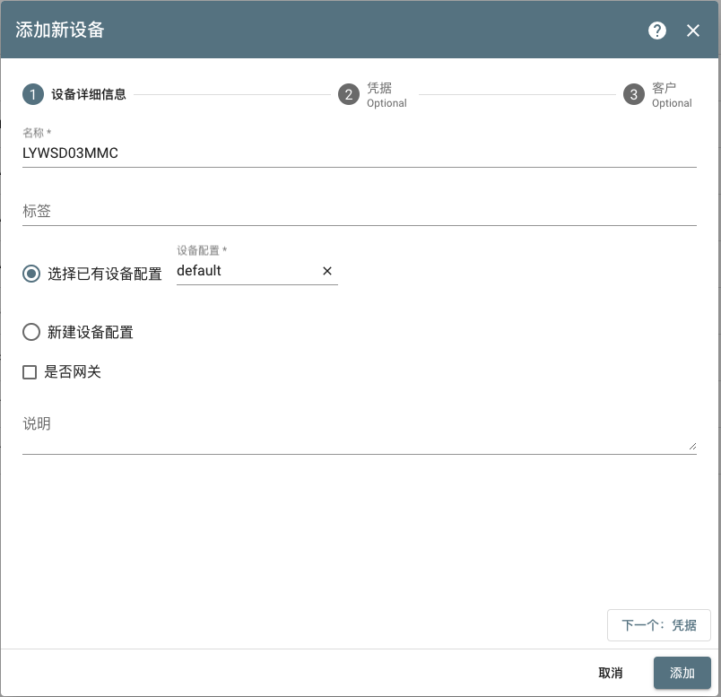
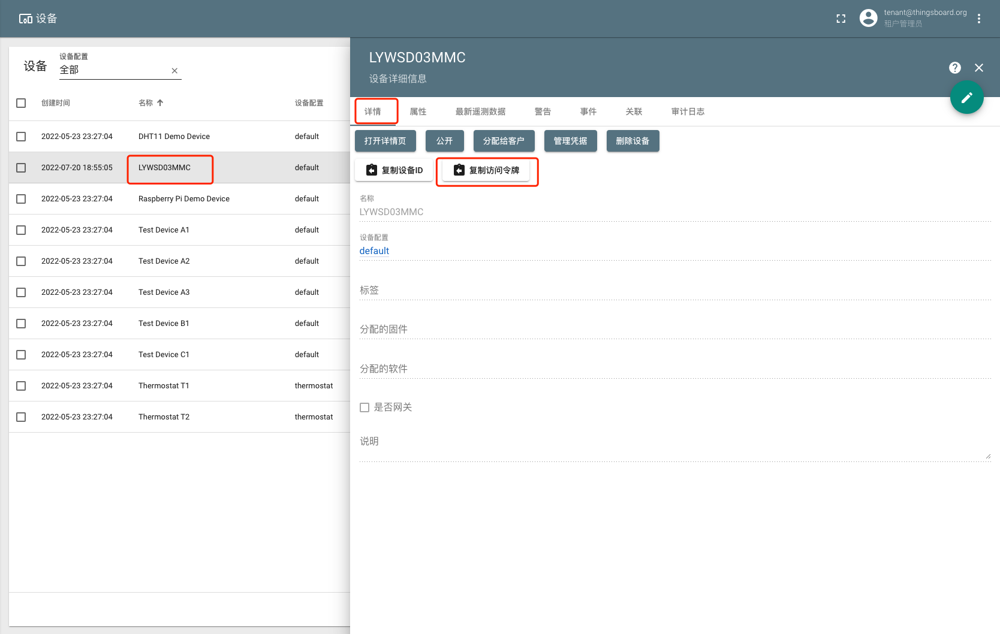
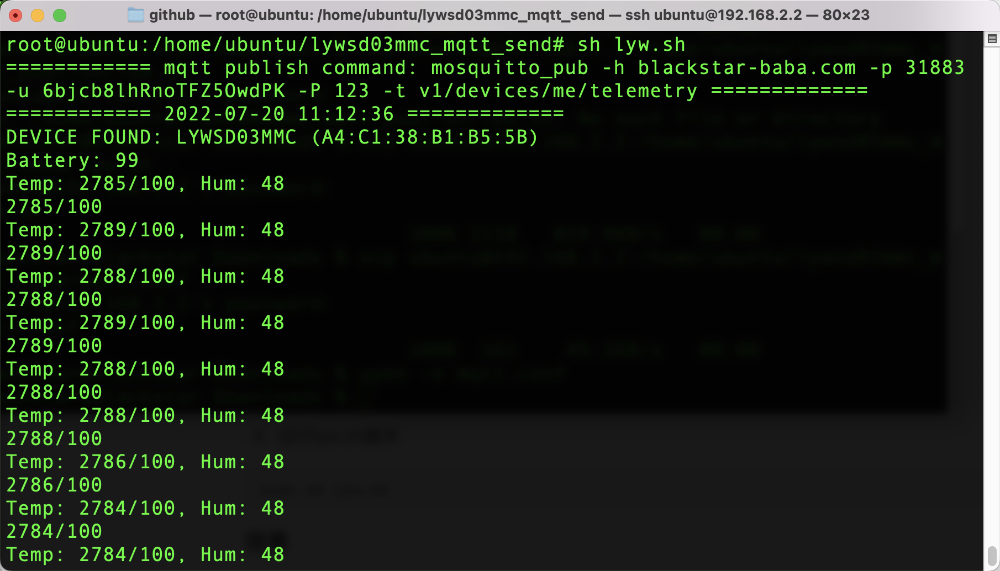
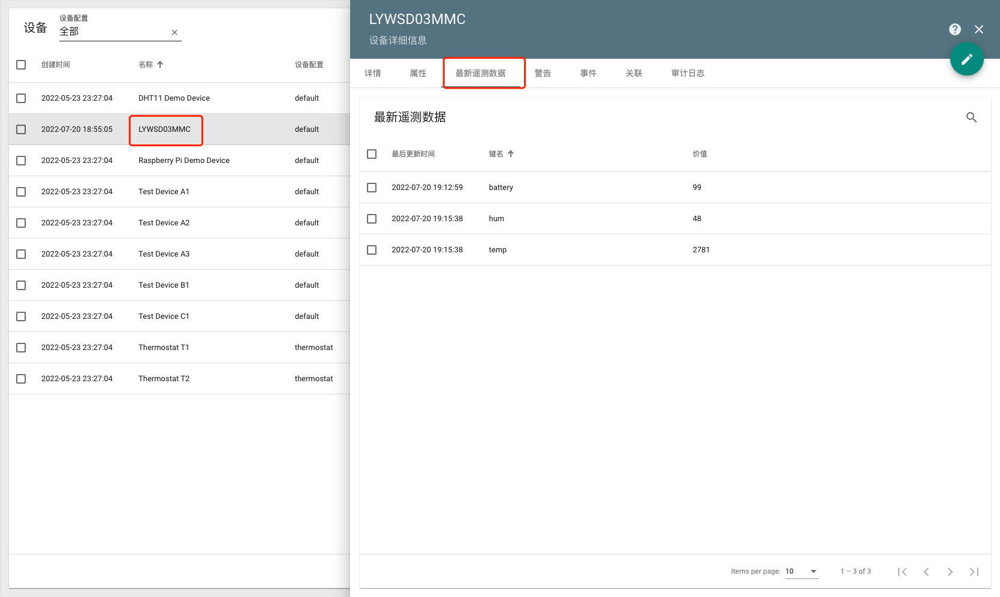

#### 环境准备

- Thingsboard环境
- 树莓派Rashberry Pi，带蓝牙，OS为Ubuntu20.04
- 小米蓝牙温湿度计2，型号为LYWSD03MMC
- 脚本 [lyw.sh](../../file/lywsd03mmc/lyw.sh)和配置文件[mqtt.conf](../../file/lywsd03mmc/mqtt.conf)（下载后放在树莓派Rashberry Pi中）

#### 描述

使用Rashberry Pi作为设备，将小米蓝牙温湿度计2的电量、温度以及湿度上传

#### 步骤

1. 在树莓派安装相应工具

```shell
sudo apt-get install bluez-tools mosquitto-clients unzip bluez pi-bluetooth
```

2. 使用工具获取的MAC地址：
```shell
hcitool lescan

LE Scan ...
A4:C1:38:B1:B5:5B LYWSD03MMC
```

3. 在Thingsboard系统创建设备（LYWSD03MMC），获取访问令牌




4. 配置mqtt.conf

```
sudo vim mqtt.conf

# thingboard地址
host=blackstar-baba.com
# thingboard mqtt端口，默认为1883
port=31883
# 访问令牌
user=6bjcb8lhRnoTFZ5OwdPK
# 忽略
pass=123
# 发布topic，不用修改
topic=v1/devices/me/telemetry
# 蓝牙设备mac地址
mac=A4:C1:38:B1:B5:5B
# 发送间隔时间
step=5
```

4. 运行lyw.sh脚本

```
sudo sh lyw.sh
```

#### 效果

发送效果


接收效果



#### TIPS

- 参考地址 https://github.com/alive-corpse/LYWSD02-LYWSD03MMC-MQTT


