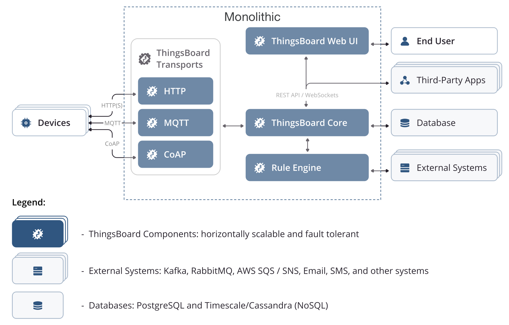
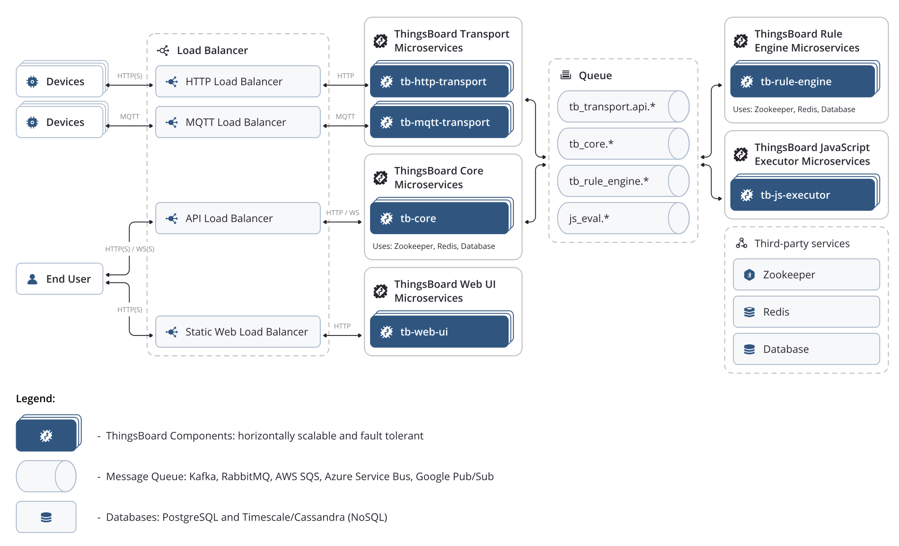
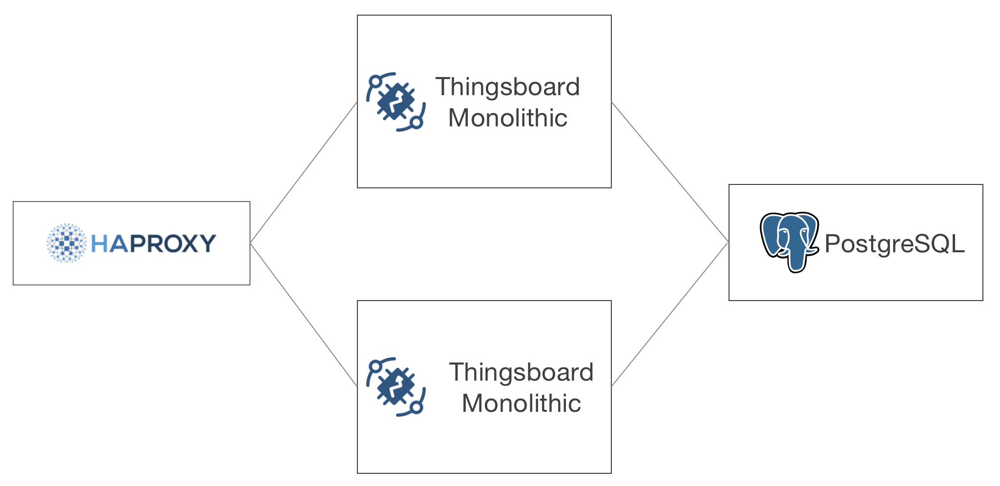
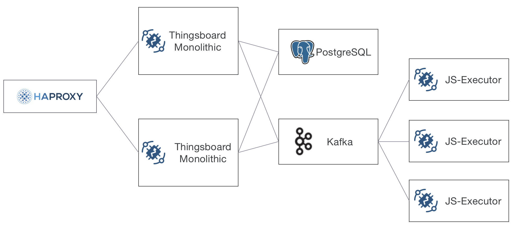
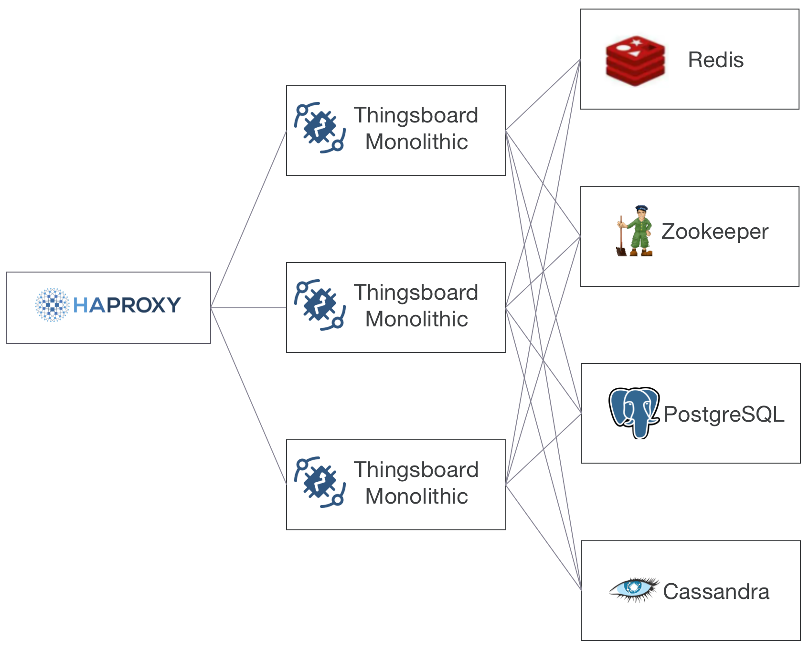
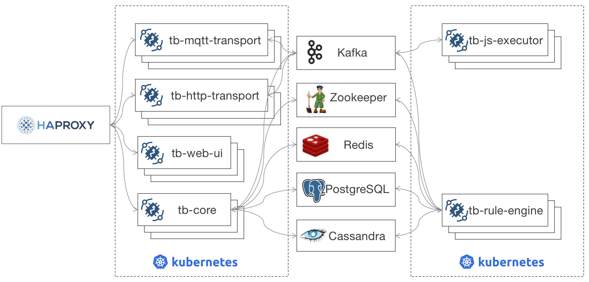

#### 环境准备

无

#### 描述

官方提供了两种架构，单片架构（Monolithic Architecture）以及微服务架构（Microservices Architecture）用来解决不同数据接入场景的需求：

- 单片架构  
- 微服务架构 

单片架构单独使用存在单点故障，但可以结合Haproxy达到高可用，微服务架构将服务划分为五类，分别是：UI服务、Core服务、RuleEngine服务、JsExecutor服务、Transport服务，Transport根据协议划分，分为Mqtt协议服务、Http协议服务、Coap协议服务，可以根据情况进行有选择的部署，甚至是可以和单片架构程序混合使用。（原因是通过配置项可以让单片架构程序变为Core服务程序或RuleEngine服务程序）。

##### 高可用场景一

- 较少设备 <=10000台
- 较少请求 <= 5000条消息/s、5000个数据点/s
- 较少规则链（脚本相关节点较少） 

可使用HA（主备模式）+单片架构程序方案达到高可用：

建议服务清单如下：

- 2台2核心4G内存，部署HAproxy+Keepalive+VIP
- 2台8核心16G内存，部署Thingsboard Monolithic
- 3台4核心16g内存，部署PostgreSQL+Etcd+patroni集群

如果有较多的脚本执行节点，可以变化为如下结构：

建议额外提供：
- 3台4核心8g内存，部署Zookeeper+Kafka集群
- 3台（或更多）2核心4g内存，部署脚本执行器Js-Executor

##### 高可用场景二

- 适量设备 <=50000台

- 适量请求 <= 20000条消息/s、20000个数据点/s

- 适量规则链请求
  

可使用HA（负载模式）+单片架构程序方案达到高可用

服务器建议如下：

- 2台2核心4G内存，部署HAproxy+Keepalive+VIP
- 3台8核心16G内存，部署Thingsboard Monolithic
- 3台2核心4g内存，部署Redis集群
- 3台2核心4G内存，部署Zookeeper集群
- 3台4核心8g内存，部署PostgreSQL+Etcd+patroni集群
- 3台4核心16G内存，部署Cassandra集群

如果有较多的脚本执行节点，可以变化为如下结构：

建议额外提供：

- 3台4核心8g内存，部署Kafka集群
- 5台（或更多）2核心4g内存，部署脚本执行器Js-Executor

##### 高可用场景三

- 适量设备 <=100000台
- 大量请求 > 20000条消息/s、20000个数据点/s
- 中量以及大量规则链请求

使用K8s+微服务进行集群部署：

暂时没有更好服务器配置建议，可参考官方。

#### TIPS

- 本文方案中的时序数据均为简单key-value数据，过长的value值需要重新进行评估。
- [Thingsboard架构](https://thingsboard.io/docs/reference/)
- [Thingsboard场景](https://thingsboard.io/docs/reference/iot-platform-deployment-scenarios/)

