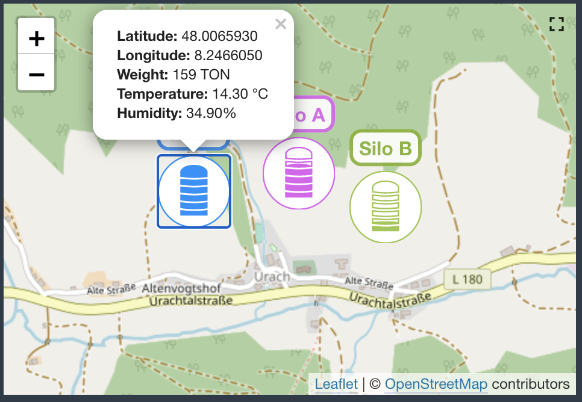
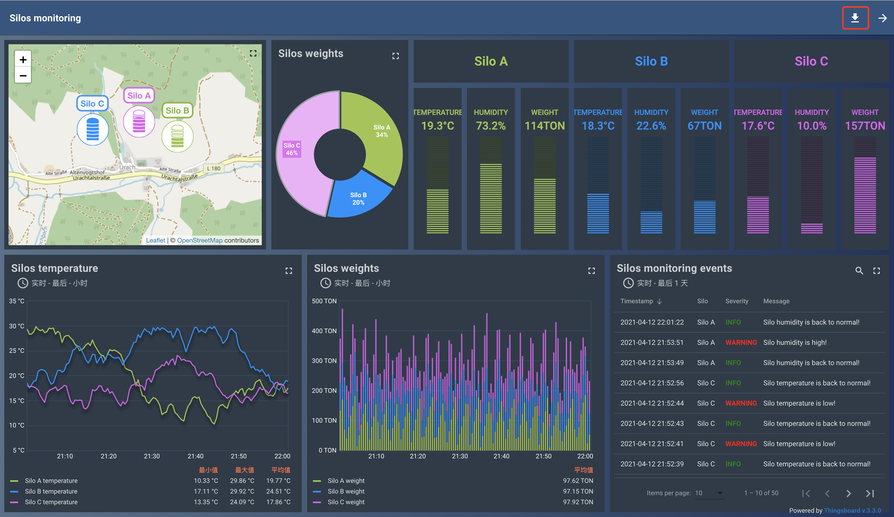

#### 环境准备

- 已经编译且能成功运行的代码环境，可参考前作
- IDE Idea或Eclipse，本文使用Idea
- Mqtt数据模拟器，[下载地址](//tod)
- 支持Html5的浏览器，本文使用Chrome

#### 描述

分析官方谷仓监控仪表盘，在本地环境实现。

#### 分析

访问地址：https://demo.thingsboard.io/dashboard/198c2b60-0edc-11e7-942c-bb0136cc33d0?publicId=963ab470-34c9-11e7-a7ce-bb0136cc33d0

组件：地图、饼图、静态组件、数字仪表、线性图、柱状图、表格

设备：Silo A、 Silo B、Silo C

设备属性：经纬度（Latitude、Longitude）、重量（Weight）、温度（Temperature）、湿度（Humidity）

告警：温度告警、湿度告警

所以，需要新建3个设备，每个设备包含5个属性，且配置Device Profile Alarm规则。

#### 资源

直接从官网中导出仪表盘 [silos_monitoring_no_banner](../file/silos_monitoring_no_banner.json)

#### 实现

//todo

#### TIPS

//todo