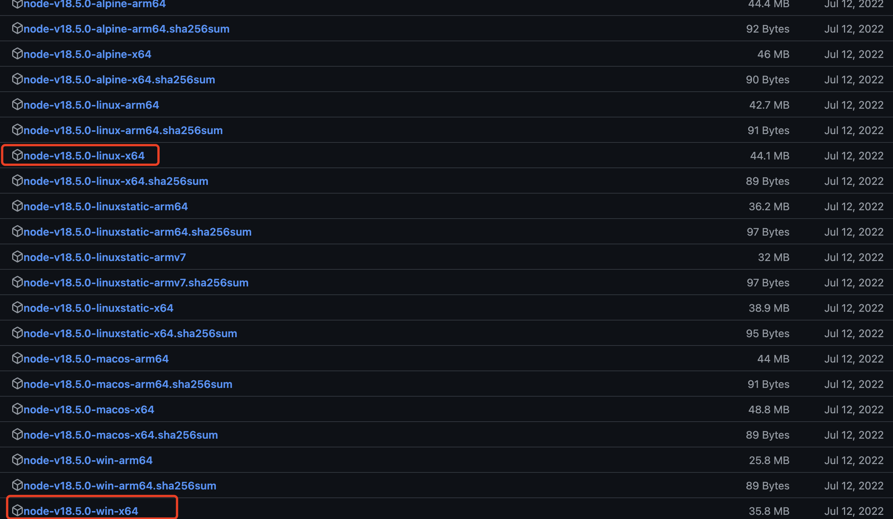

#### 问题

编译msa下的web-ui以及js-executor独立包失败，使用了pkg打包nodejs，pkg下载nodejs国内访问缓慢

#### 方法

直接在github上下载 https://github.com/vercel/pkg-fetch/releases/tag/v3.4



然后放在用户目录的`.pkg-cache/v3.4`下，linux环境下nodejs 18.5.0 linux版本位置和名称如下所示：
```
/Users/blackstar/.pkg-cache/v3.4/fetched-v18.5.0-linux-x64
```
