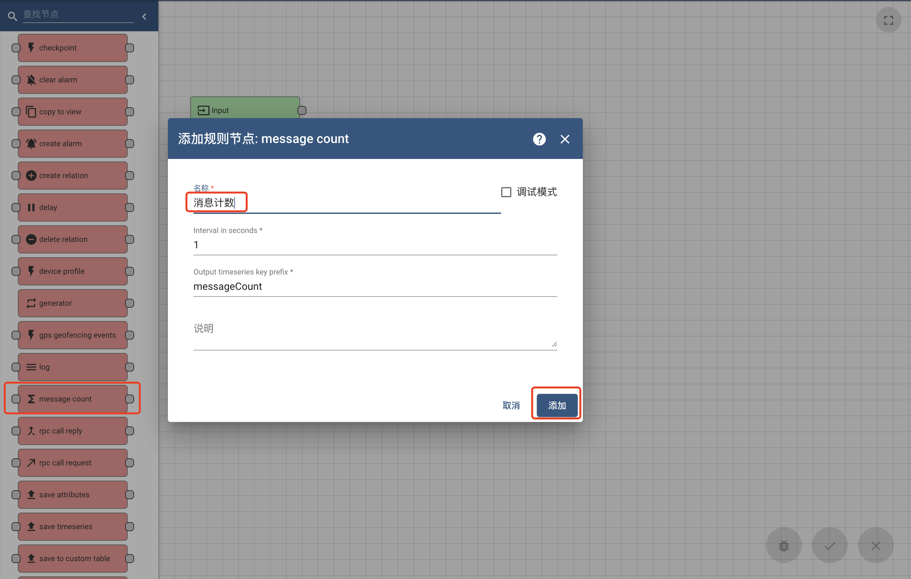

#### 环境准备

- 已经编译且能成功运行的代码环境，可参考前作。
- IDE Idea或Eclipse，本文使用Idea
- 支持Html5的浏览器，本文使用Chrome

#### 根规则链

每个租户都会创建一条名为`Root Rule Chain`(根规则链)的规则链，用来处理该租户下的设备数据

默认所有的设备数据都会先经过根规则链进行处理

#### 规则链创建

启动程序，使用`tenant@thingsboard.org`账号登录系统，进入规则链库页面，点击右上角`+`号，选择`创建新的规则链`

填写名称`我的规则`以及说明（不是必须），点击`添加`按钮

在规则链列表中查看`我的规则`是否存在

#### 规则链编辑
点击规则链`我的规则`,在右侧弹出页中点击`打开规则链`按钮

##### 节点增加
在左侧规则节点列表中拖拽节点`message count`,填写名称`消息计数`，点击`添加`按钮

将规则节点`input`和节点`message count`连接上，点击右下角`勾`进行保存。

##### 节点修改

双击面板中的节点`消息计数`（或单击节点，然后在节点右上角，点击笔形按钮）在右侧弹出页中可以进行修改，点击`勾`进行保存

节点修改后，必须点击右下角`勾`进行规则链的保存

##### 节点删除

点击面板中的节点`消息计数`，点击节点右上角`x`按钮，即可删除该节点

节点删除后，必须点击右下角`勾`进行规则链的保存

#### 规则链链接

规则链与规则链通过链接，可以将一条链的处理结果传输到另一条链继续处理，点击规则链`RootRoot Rule Chain`,

#### 规则链调试

#### TIPS
- 通常物联网平台都会具有规则引擎，规则引擎用途是进行实时数据的实时处理。

