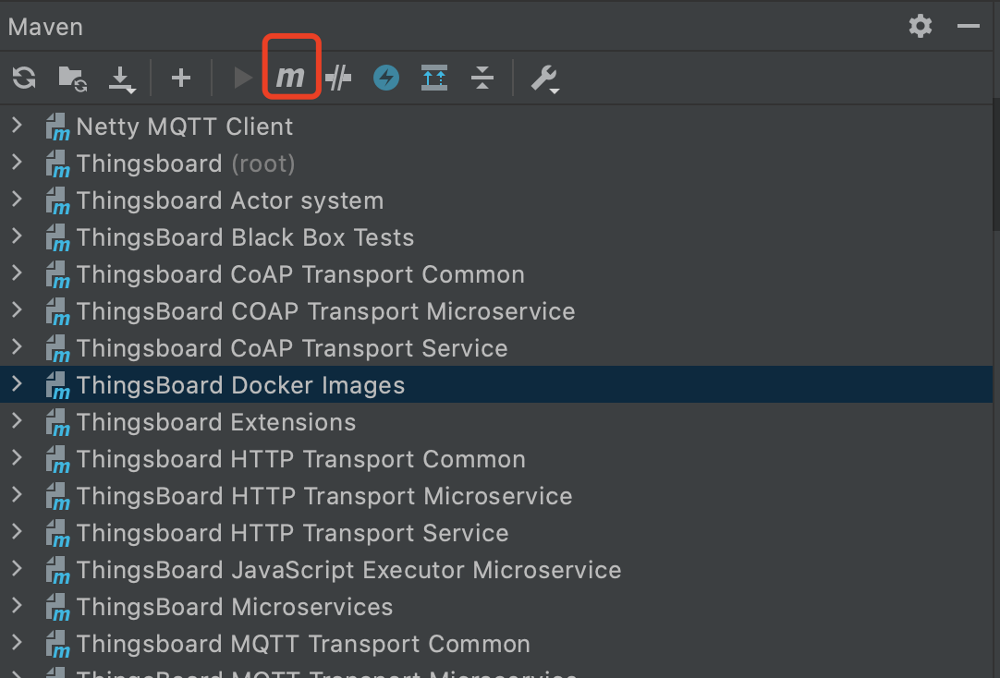

#### 环境准备

- 已经编译且能成功运行的代码环境，且后端已经开始正常运行 可参考前篇 [编译](../编译/编译.md) [运行](../运行/运行.md) [后端](后端.md)
- IDE Idea或Eclipse，本文使用Idea
- 支持Html5的浏览器，本文使用Chrome 

#### 调试
Thingsboard中通过maven初始化yarn+nodejs环境，并封装命令调用yarn进行前端文件的调试、编译和打包，因此可以通过maven命令进行调试，在idea右侧找到maven命令执行窗口

执行如下命令：
```
mvn compile -pl ui-ngx -Pyarn-start
```
控制台最终输出如下：
```
[INFO] chunk {runtime} runtime.js, runtime.js.map (runtime) 13.3 kB [entry] [rendered]
[INFO] chunk {scripts} scripts.js, scripts.js.map (scripts) 67.7 kB [entry] [rendered]
[INFO] chunk {styles} styles.js, styles.js.map (styles) 974 kB [initial] [rendered]
[INFO] chunk {tooltipster} tooltipster.js, tooltipster.js.map (tooltipster) 54.9 kB  [rendered]
[INFO] chunk {vendor} vendor.js, vendor.js.map (vendor) 10.2 MB [initial] [rendered]
[INFO] Date: 2021-03-08T15:16:01.353Z - Hash: 4dad613841bbdcc28e8b - Time: 98542ms
[INFO] ** Angular Live Development Server is listening on 0.0.0.0:4200, open your browser on http://localhost:4200/ **
[INFO] : Compiled successfully.
```
#### 验证
前端默认工作在4200端口，通过http://localhost:4200 访问页面，输入用户名`sysadmin@thingsboard.org`和密码`sysadmin`，成功登录系统为成功。

#### TIPS
- 调试启动较慢，请耐心等待。
- 注意确认后端是否能正常运行，如果没有修改配置，后端默认工作在8080端口
- 如果本机有安装maven环境，也可以直接在工程根目录下执行命令`mvn compile -pl ui-ngx -Pyarn-start`命令进行调试
- 如果本机有安装yarn+nodejs环境，也可以直接切换到ui-ngx/src目录下，使用命令`yarn start`进行调试。