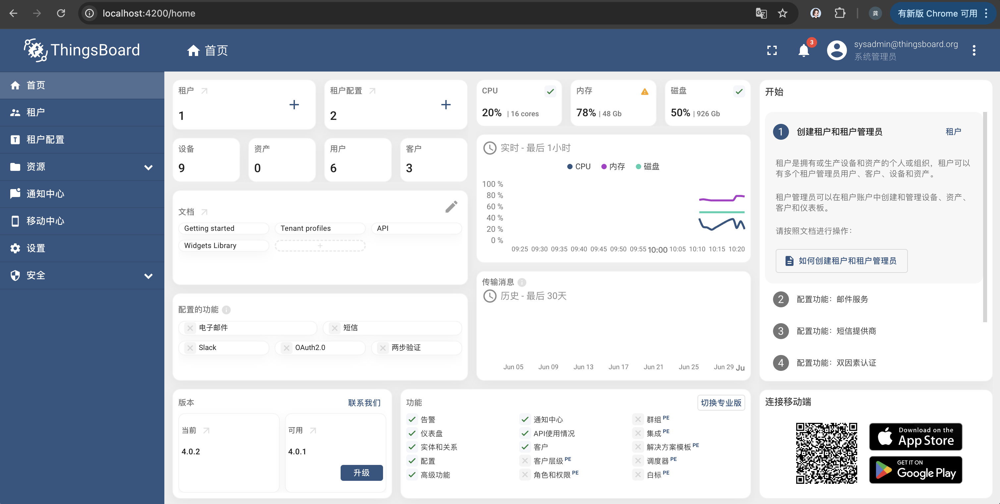

#### 环境准备

- 已经编译且能成功运行的代码环境，且后端已经开始正常运行 可参考前篇 [编译](../编译/编译_4.0.md) [运行](../运行/运行_4.0.md) [后端](后端_4.0.md)
- IDE Idea或Eclipse，本文使用Idea
- 支持Html5的浏览器，本文使用Chrome 

#### 调试
Thingsboard中通过maven初始化yarn+nodejs环境，并封装命令调用yarn进行前端文件的调试、编译和打包，因此可以通过maven命令进行调试，在idea右侧找到maven命令执行窗口

执行如下命令：
```
mvn compile -pl ui-ngx -Pyarn-start
```
控制台最终输出了类似如下：
```
[INFO] Scanning for projects...
[INFO] ------------------------------------------------------------------------
[INFO] Detecting the operating system and CPU architecture
[INFO] ------------------------------------------------------------------------
[INFO] os.detected.name: osx
[INFO] os.detected.arch: aarch_64
[INFO] os.detected.bitness: 64
[INFO] os.detected.version: 14.3
[INFO] os.detected.version.major: 14
[INFO] os.detected.version.minor: 3
[INFO] os.detected.classifier: osx-aarch_64
[INFO] 
[INFO] -----------------------< org.thingsboard:ui-ngx >-----------------------
[INFO] Building ThingsBoard Server UI 4.0.2
[INFO]   from pom.xml
[INFO] --------------------------------[ jar ]---------------------------------
[INFO] 
[INFO] --- frontend:1.12.0:install-node-and-yarn (install node and npm) @ ui-ngx ---
[INFO] Node v20.18.0 is already installed.
[INFO] Yarn 1.22.22 is already installed.
...
[INFO] NOTE: Raw file sizes do not reflect development server per-request transformations.
[INFO]   ➜  Local:   http://localhost:4200/
[INFO]   ➜  Network: http://192.168.31.19:4200/
[INFO]   ➜  Network: http://198.19.249.3:4200/
[INFO]   ➜  Network: http://192.168.215.0:4200/
[INFO] ❯ Changes detected. Rebuilding...
[INFO] ✔ Changes detected. Rebuilding...
[INFO] Initial chunk files                | Names                  |  Raw size
[INFO] main.js                            | main                   | 598.72 kB | 
[INFO] 
[INFO] Lazy chunk files                   | Names                  |  Raw size
[INFO] chunk-CWZMLFFF.js                  | -                      |  15.51 MB | 
[INFO] home-pages.module-XQVXLXLI.js      | home-pages-module      |   2.76 MB | 
[INFO] rulechain-page.module-5UJHAPRN.js  | rulechain-page-module  |   1.24 MB | 
[INFO] chunk-TUZMMLIW.js                  | -                      | 223.15 kB | 
[INFO] chunk-G7AN2EHK.js                  | -                      |  92.30 kB | 
[INFO] dashboard-pages.module-5HB4ARBK.js | dashboard-pages-module |   6.09 kB | 
[INFO] 
[INFO] Application bundle generation complete. [29.291 seconds]
```
#### 验证
前端默认工作在4200端口，通过http://localhost:4200 访问页面，输入用户名`sysadmin@thingsboard.org`和密码`sysadmin`，成功登录系统为成功。


#### TIPS
- 调试启动较慢，请耐心等待（这里吐槽下，前端编译调试技术栈有点落后了）。
- 注意确认后端是否能正常运行，如果没有修改配置，后端需要工作在8080端口
- 如果本机有安装maven环境，也可以直接在工程根目录下执行命令`mvn compile -pl ui-ngx -Pyarn-start`命令进行调试
- 如果本机有安装yarn+nodejs环境(4.0需要yarn版本1.22.22，node版本20.18.0)，也可以直接切换到ui-ngx/src目录下，使用命令`yarn start`进行调试。