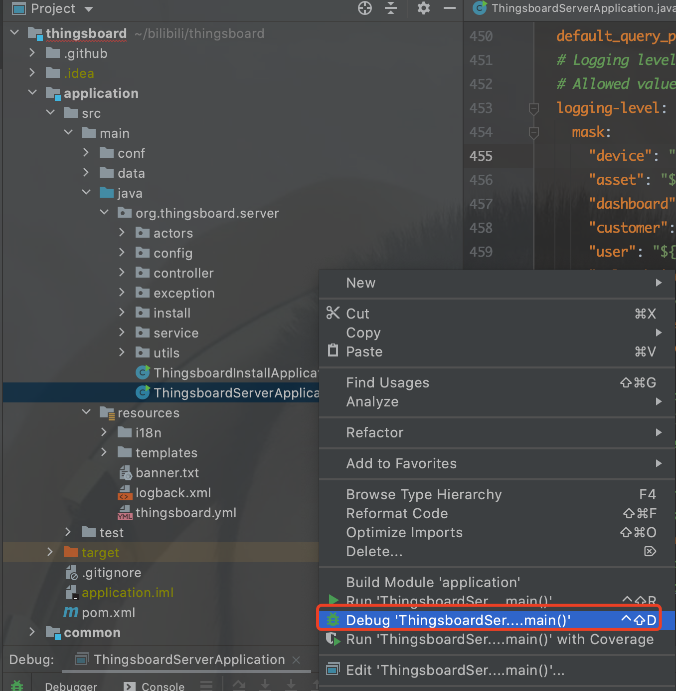
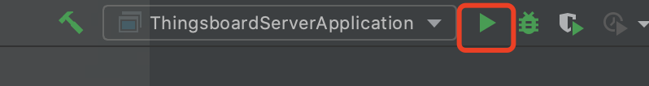

#### 环境准备
- 已经编译且能成功运行的代码环境，可参考前2篇 [编译](../编译/编译.md) [运行](../运行/运行.md)
- IDE Idea或Eclipse，本文使用Idea

#### 调试
在idea中调试后端非常简单，首次运行时，找到类`ThingsboardServerApplication`，右键点击选择菜单`Debug 'ThingsboardServerApplication main' `进行调试。

再次运行时，可以在最顶端找到``ThingsboardServerApplication``的debug按钮进行调试
。

#### TIPS
- 注意确认数据库是否能正常运行，本文使用PG12存储关系数据和时序数据
- 配置可以在文件thingsboard.yml中进行修改（需要有一定Spring Boot的基础）

