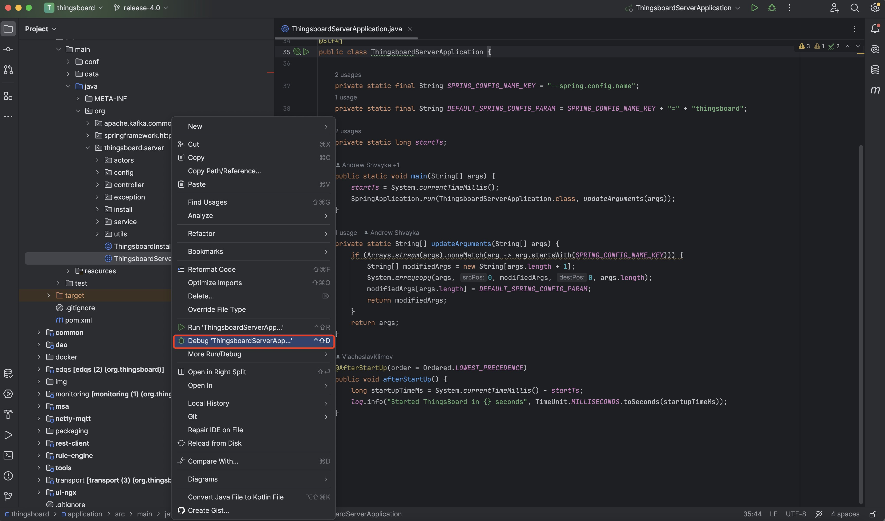

#### 环境准备
- 已经编译且能成功运行的代码环境，可参考前2篇 [编译](../编译/编译_4.0.md) [运行](../运行/运行_4.0.md)
- IDE Idea、Eclipse或其他，本文使用Idea

#### 调试
在idea中调试后端非常简单，首次运行时，找到类`ThingsboardServerApplication`，右键点击选择菜单`Debug 'ThingsboardServerApplication main' `进行调试。

调试启动时，控制台输出如下：
```
Connected to the target VM, address: '127.0.0.1:65206', transport: 'socket'
  _____ _     _                 ____                      _
 |_   _| |__ (_)_ __   __ _ ___| __ )  ___   __ _ _ __ __| |
   | | | '_ \| | '_ \ / _` / __|  _ \ / _ \ / _` | '__/ _` |
   | | | | | | | | | | (_| \__ \ |_) | (_) | (_| | | | (_| |
   |_| |_| |_|_|_| |_|\__, |___/____/ \___/ \__,_|_|  \__,_|
                      |___/

 ===========================================================
 ::  ::      
 ===========================================================

2025-07-01 10:10:17,954 [background-preinit] INFO  o.h.validator.internal.util.Version - HV000001: Hibernate Validator 8.0.1.Final
2025-07-01 10:10:17,993 [main] INFO  o.t.s.ThingsboardServerApplication - Starting ThingsboardServerApplication using Java 17.0.2 with PID 26953 (/Users/blackstar/github/thingsboard/application/target/classes started by blackstar in /Users/blackstar/github/thingsboard)
.....
2025-07-01 10:10:33,168 [main] INFO  o.t.s.ThingsboardServerApplication - Started ThingsBoard in 15 seconds
2025-07-01 10:10:33,285 [rule-dispatcher-0-7] INFO  o.t.s.d.s.i.s.SqlPartitioningRepository - Saving partition 1750896000000-1751500800000 for table lc_event
2025-07-01 10:10:33,616 [rule-dispatcher-0-4] INFO  c.d.oss.driver.api.core.uuid.Uuids - PID obtained through native call to getpid(): 26953
2025-07-01 10:10:34,104 [git-sync-43-thread-1] INFO  o.t.s.s.sync.DefaultGitSyncService - [gateways-dashboard] Initialized repository
2025-07-01 10:10:34,318 [git-sync-43-thread-1] INFO  o.t.s.d.resource.BaseResourceService - Updating system resource gateway-management-extension.js
2025-07-01 10:10:34,325 [git-sync-43-thread-1] INFO  org.owasp.validator.html.Policy - Attempting to load AntiSamy policy from an input stream.
2025-07-01 10:10:34,386 [git-sync-43-thread-1] WARN  org.owasp.validator.html.Policy - The directive "noopenerAndNoreferrerAnchors" is enabled by default, but disabled in this policy. It is recommended to leave it enabled to prevent reverse tabnabbing attacks.
2025-07-01 10:10:34,730 [NotificationExecutorService-0-8] INFO  o.t.s.d.s.i.s.SqlPartitioningRepository - Saving partition 1750896000000-1751500800000 for table notification
2025-07-01 10:10:34,773 [git-sync-43-thread-1] INFO  o.t.s.d.resource.BaseResourceService - Updating system resource gateways_dashboard.json
2025-07-01 10:10:34,777 [git-sync-43-thread-1] INFO  o.t.s.s.e.d.DashboardSyncService - Gateways dashboard sync completed
2025-07-01 10:10:34,818 [sql-log-1-thread-1] INFO  o.t.s.dao.sql.TbSqlBlockingQueue - Queue-0 [Events] queueSize [0] totalAdded [4] totalSaved [4] totalFailed [0]
2025-07-01 10:10:34,818 [sql-log-1-thread-1] INFO  o.t.s.dao.sql.TbSqlBlockingQueue - Queue-1 [Events] queueSize [0] totalAdded [6] totalSaved [6] totalFailed [0]
2025-07-01 10:10:34,818 [sql-log-1-thread-1] INFO  o.t.s.dao.sql.TbSqlBlockingQueue - Queue-2 [Events] queueSize [0] totalAdded [6] totalSaved [6] totalFailed [0]
2025-07-01 10:10:36,670 [sql-log-1-thread-1] INFO  o.t.s.dao.sql.TbSqlBlockingQueue - Queue-0 [TS] queueSize [0] totalAdded [8] totalSaved [8] totalFailed [0]
2025-07-01 10:10:36,670 [sql-log-1-thread-1] INFO  o.t.s.dao.sql.TbSqlBlockingQueue - Queue-2 [TS] queueSize [0] totalAdded [6] totalSaved [6] totalFailed [0]
2025-07-01 10:10:36,692 [sql-log-1-thread-1] INFO  o.t.s.dao.sql.TbSqlBlockingQueue - Queue-0 [TS Latest] queueSize [0] totalAdded [8] totalSaved [8] totalFailed [0]
2025-07-01 10:10:36,692 [sql-log-1-thread-1] INFO  o.t.s.dao.sql.TbSqlBlockingQueue - Queue-2 [TS Latest] queueSize [0] totalAdded [6] totalSaved [6] totalFailed [0]
```


再次运行时，可以在最顶端找到``ThingsboardServerApplication``的debug按钮进行调试。


#### TIPS
- 注意确认数据库是否能正常运行，4.0版本使用PG16存储关系数据和时序数据
- 配置可以在文件thingsboard.yml中进行修改（需要有一定的SpringBoot的基础）

