#### 环境准备

- 已经编译且能成功运行的代码环境，可参考前作。
- IDE Idea或Eclipse，本文使用Idea
- 支持Html5的浏览器，本文使用Chrome

#### 资产新建

这里的资产主要指的是与设备相关的聚合点，比如安装传感器的农田，工厂、地区，资产可以进行多级关联，官方一个示例图：
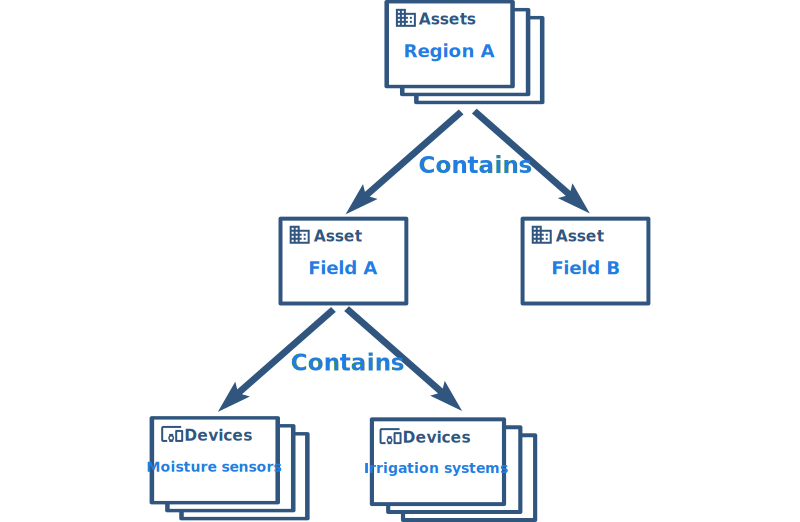
启动程序，使用`tenant@thingsboard.org`账号登录系统，点击左侧`资产`菜单，进入资产页面，点击右上角`+`号，选择`添加新资产`
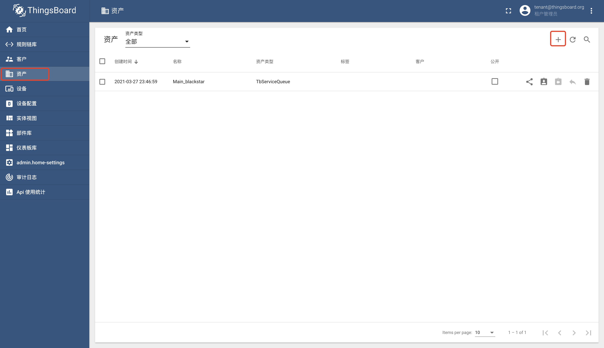
填写名称`我的资产`和类型`asset`，点击`添加`按钮进行保存
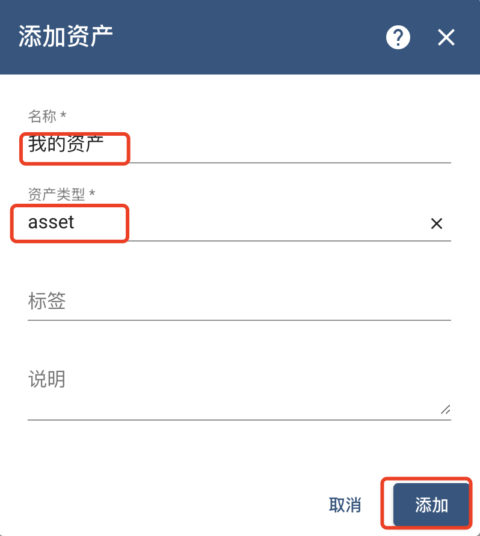
查看资产是否创建成功
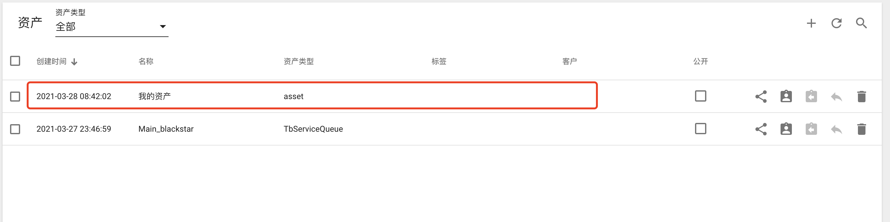

#### 资产详情
通过点击列表中资产，可以查看该资产的更详细信息，`详情`tab页可以进行资产的基本操作：**修改**、**删除**和**授权**
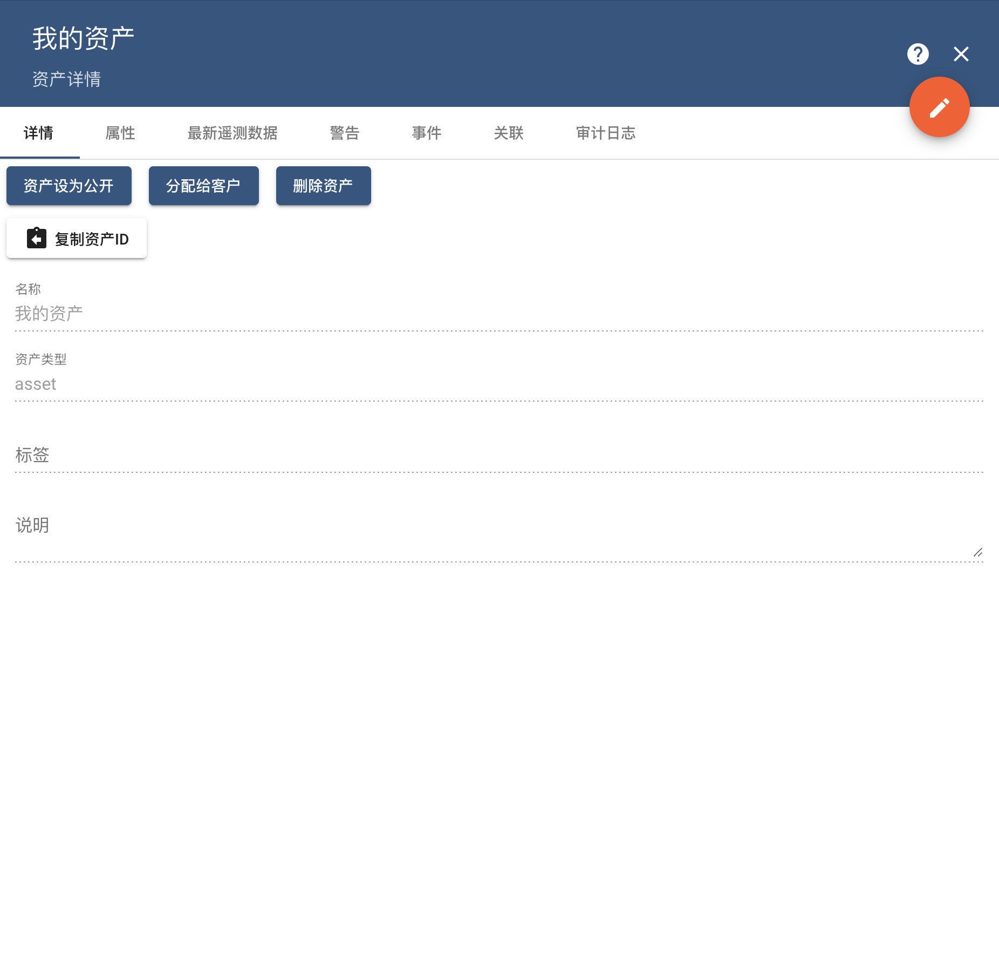

#### 属性操作
通过`属性`tab页，可以查看以及编辑`服务端属性`，用于后续**规则引擎**或**仪表盘**使用，点击`+`号
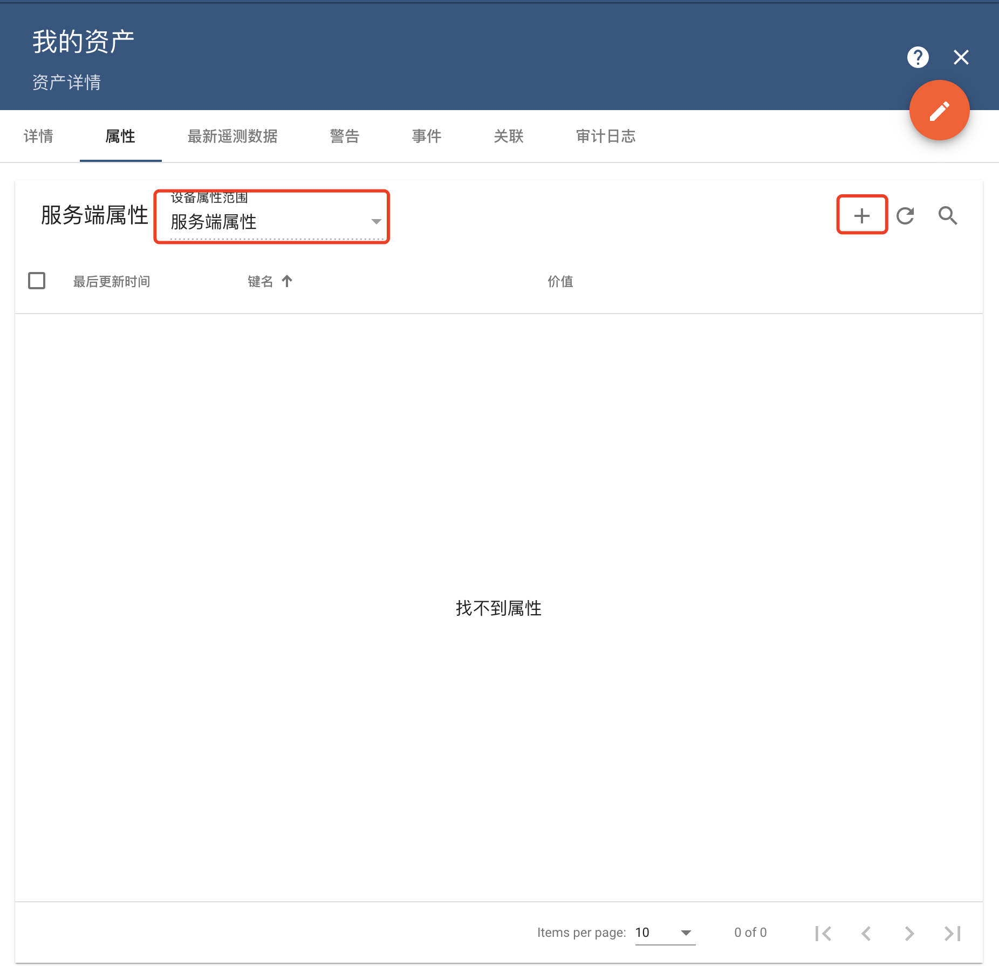
填写键名`xPos`、值类型`双精度小数`以及值`153.1234`，点击`添加`按钮进行保存
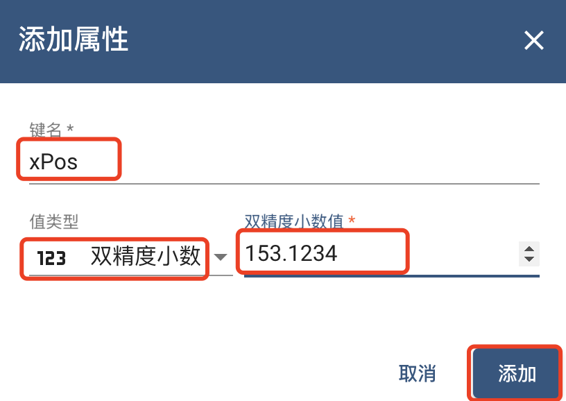
在资产属性列表中查看属性是否保存成功
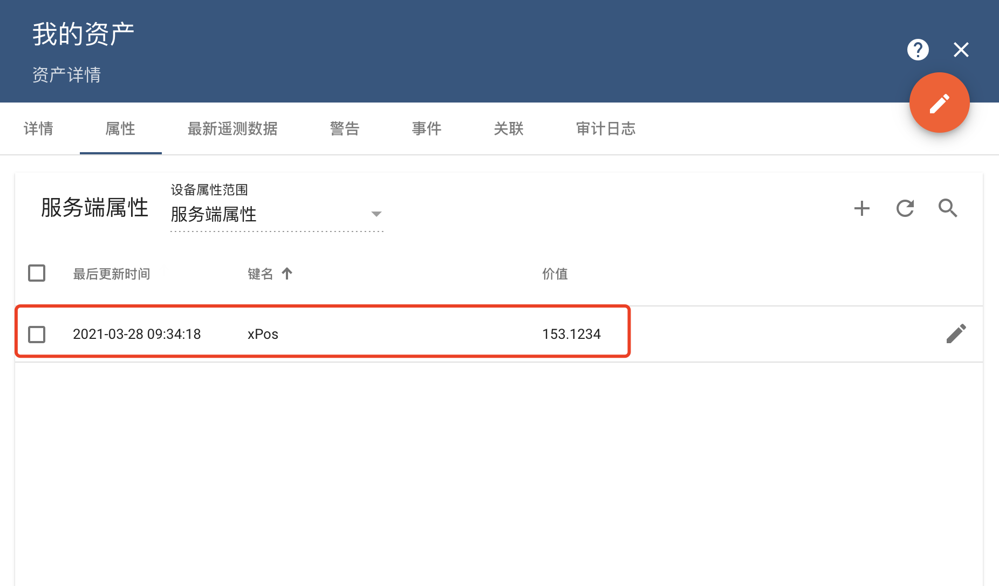
在资产属性列表中，还可以进行属性的`编辑`、`删除`
#### 关联操作
通过`关联`tab页，可以查看关联，可以是从当前实体（见TIPS）关联到其他实体的关系，也可以是从其他实体关联到当前实体的关系，也是后续**规则引擎**或**仪表盘**使用，点击`+`号
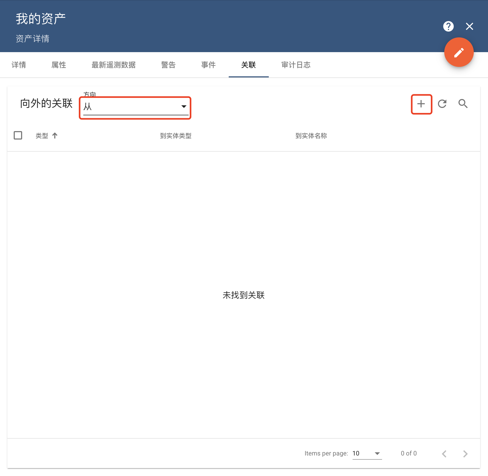
填写关联类型`Contains`、选择实体类型`Device`以及实体`Test Device A1`，点击`添加`按钮进行保存
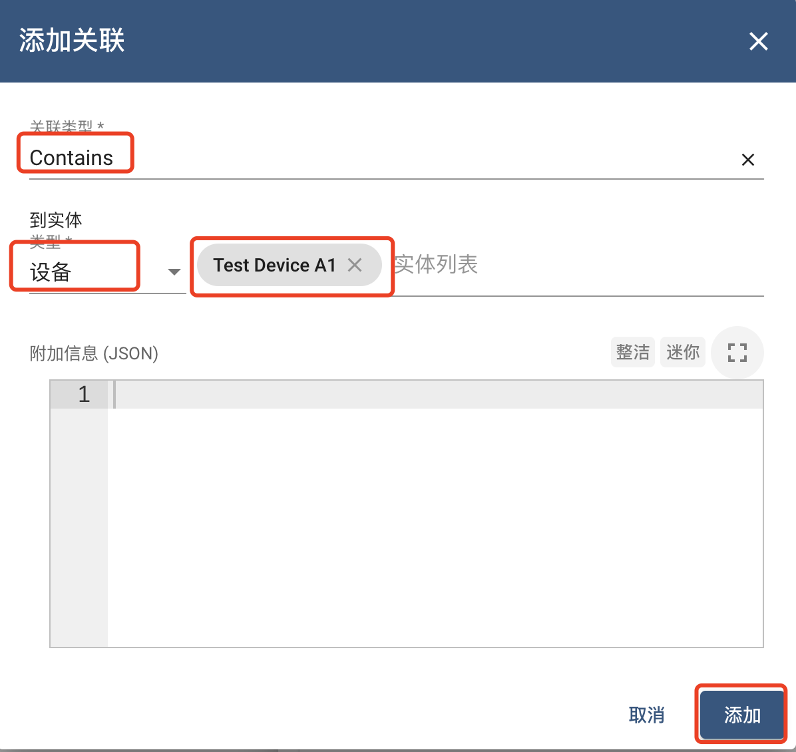
在资产关联列表中查看关联是否保存成功
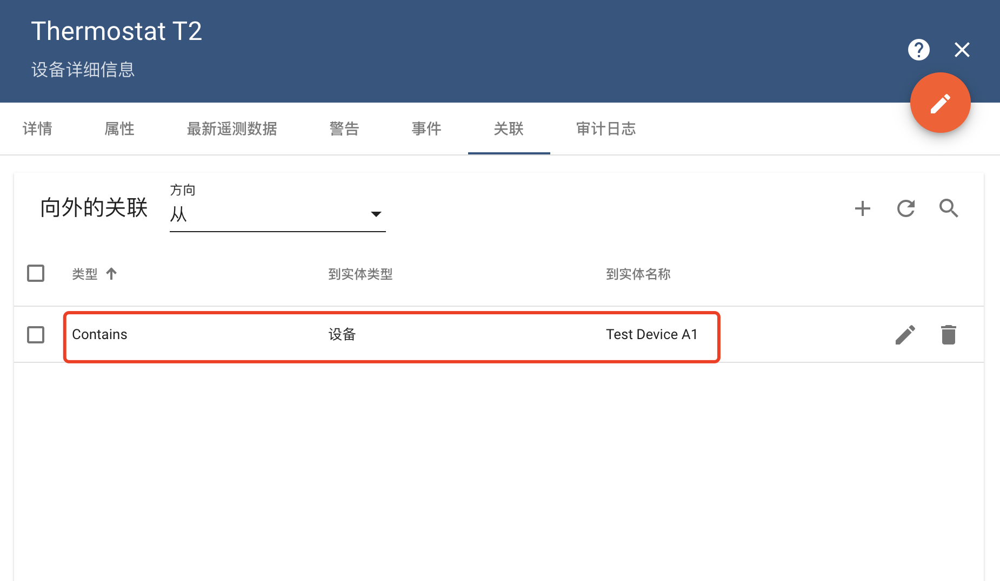
在资产关联列表中，还可以进行关联的`删除`

#### TIPS
- 资产与设备不同，资产不能直接上传时序数据，但可以通过关联获得时序数据。
- Thingsboard将**租户、客户、用户、设备、资产、警告、仪表盘、规则节点、规则链**都当作=实体进行管理，每种实体 均支持**属性**、**遥测数据**以及**关联**
- 官方文档：[实体与关联](https://thingsboard.io/docs/user-guide/entities-and-relations/)
- 属性分为客户端属性，服务端属性和共享属性，官方文档：[属性](https://thingsboard.io/docs/user-guide/attributes/)
- 在写文档时，**Thingsboard 3.2.2**完成了发布，提醒大家拉取代码进行编译时使用Jdk11